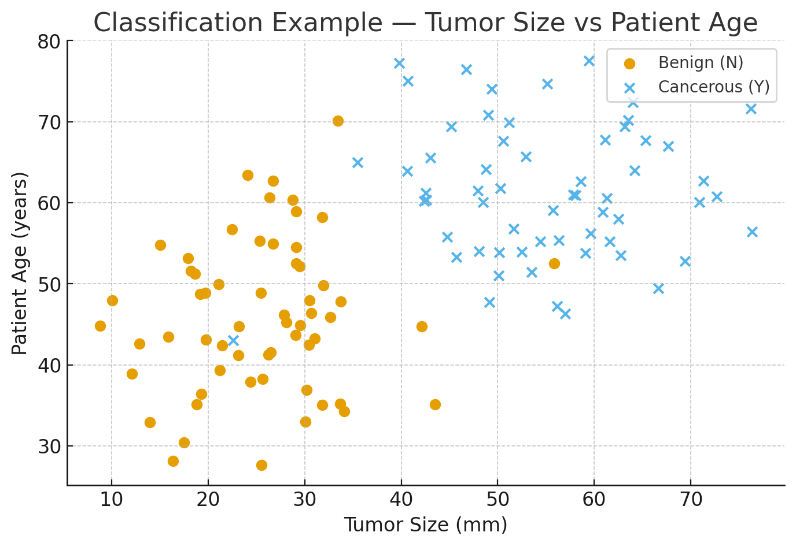

## **Supervised Learning**

Supervised learning is a type of machine learning where we are given a **dataset with both inputs (features) and correct outputs (labels)**.
The goal is to train a model so that it can **map inputs → outputs** accurately on new, unseen data.

* **Features (Independent variables)** → Inputs we use for prediction (columns A–O, Q–Z)
* **Target (Dependent variable)** → What we want to predict (e.g., column P)
* **Training data** → Examples with both features + labels
* **Model** → Learns the relationship between features and labels

---

## **Types of Supervised Learning Problems**

### **1. Regression**

We try to predict a **continuous value** (real number, no limit).
We map input variables to a continuous function.

* **Linear Regression** → Finds a straight-line relationship between input(s) and output
  Example: Predicting house price based on area, no. of bedrooms, location.

* **Polynomial Regression** → Fits a curve (non-linear) to data
  Example: Predicting sales that follow a seasonal trend.

📊 **Example 1:**
You have a dataset with columns:
`Area | No. of Bedrooms | Location Rating | Sell Price`
You try to predict `Sell Price` (continuous output) based on the other three.
This is a **regression problem**.

---

### **2. Classification**

We try to predict a **category (discrete value)**.
We group inputs into classes.

* **Binary Classification** → Only 2 classes
  Example: Cancerous tumor (Yes/No) based on tumor size, age, etc.

* **Multi-class Classification** → More than 2 classes
  Example: Predicting handwritten digit (0–9) from an image.

📊 **Example 2:**
Hospital dataset:
`Tumor Size (mm) | Age of Tumor | Patient Age | Cancerous (Y/N)`
We train a model to predict if a tumor is **Cancerous (Yes/No)** → **classification problem**.

---

## **Examples of Supervised Learning in Real Life**

### **1. Facial Recognition**

* **Input:** Reference image of a person (training data)
* **Task:** Identify whether a new camera image belongs to the same person.
* **How it works:**

  1. Extracts features from face (distance between eyes, nose shape, etc.)
  2. Converts these features into a numerical pattern (called embedding)
  3. Compares pattern with reference pattern
  4. If similarity is above a threshold → it classifies as “same person,” else “different person.”
* **Extension:** Emotion detection uses classification to group facial expressions into categories (happy, sad, angry, etc.)

---

### **2. Self-Driving Cars**

* **Input:** Continuous video feed from cameras, LiDAR, radar, GPS
* **Task:** Understand surroundings and make driving decisions.
* **How it works:**

  1. **Image classification:** Identify objects (car, pedestrian, signal light)
  2. **Object detection:** Find where objects are (bounding boxes)
  3. **Semantic segmentation:** Classify every pixel (road, lane, tree)
  4. **Path planning:** Model decides steering, speed, braking (regression + classification combined)

Essentially, the car converts real-world scenes into **patterns** (mathematical representations), classifies them, and makes predictions about safe driving paths.

---

