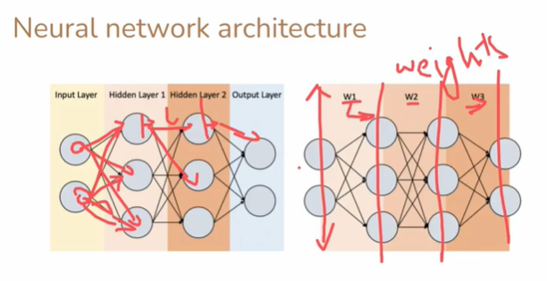
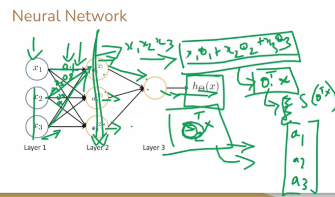

# What is Neural Network?

A **neural network** is a computational model inspired by the structure and functioning of the human brain. It is designed to recognize complex patterns and relationships in data through interconnected processing units called **neurons** or **nodes**. Neural networks form the foundation of **deep learning**, a subset of machine learning.

---

### 1. **Structure of a Neural Network**

A typical neural network consists of three types of layers:

```
Input Layer → Hidden Layer(s) → Output Layer
```

* **Input Layer:**
  Accepts raw data (numerical, image pixels, audio signals, etc.). Each neuron here represents one feature of the input data.

* **Hidden Layers:**
  Perform intermediate computations. Each neuron applies a mathematical transformation using a **weighted sum** of inputs and an **activation function** to introduce non-linearity.
  These layers learn abstract patterns (e.g., shapes, tones, words).

* **Output Layer:**
  Produces the final prediction or classification result (e.g., “cat” or “dog,” “positive” or “negative”).

---

### 2. **Mathematical Representation**

Each neuron operates as:

[
y = f\left(\sum_{i=1}^{n} w_i x_i + b\right)
]

Where:

* ( x_i ): input values
* ( w_i ): corresponding weights
* ( b ): bias term (adjusts the output along with weights)
* ( f ): activation function (e.g., sigmoid, ReLU, tanh)
* ( y ): output from the neuron

---

### 3. **Learning Process**

Neural networks learn by adjusting weights to minimize the difference between predicted and actual outputs. This process is called **training** and involves:

* **Forward Propagation:**
  Inputs move through layers to generate predictions.

* **Loss Function:**
  Measures the error (e.g., Mean Squared Error, Cross Entropy).

* **Backward Propagation (Backpropagation):**
  The algorithm calculates how much each neuron contributed to the error and updates weights using **gradient descent**.

---

### 4. **Example**

Suppose we build a neural network to recognize handwritten digits (0–9):

1. **Input Layer:** 784 neurons (for 28×28 pixel grayscale image).
2. **Hidden Layers:** 2–3 layers that extract edges, shapes, and digit patterns.
3. **Output Layer:** 10 neurons (one for each digit).
4. **Training:** The network adjusts weights based on thousands of labeled images until it correctly predicts digits.

---

### 5. **Applications**

Neural networks are widely applied in:

* **Speech Recognition:** Converting voice to text (e.g., Siri, Google Assistant).
* **Image Recognition:** Face identification, object detection, medical imaging.
* **Healthcare:** Disease prediction, drug discovery, personalized treatments.
* **Marketing:** Customer segmentation, recommendation systems, sales forecasting.
* **Finance:** Fraud detection, stock prediction, credit scoring.
* **Autonomous Systems:** Self-driving cars, robotics control, drone navigation.

---

### 6. **Types of Neural Networks**

| Type                                     | Description                                            | Example Application           |
| ---------------------------------------- | ------------------------------------------------------ | ----------------------------- |
| **Feedforward Neural Network (FNN)**     | Basic architecture; information flows in one direction | Simple classification         |
| **Convolutional Neural Network (CNN)**   | Uses convolution layers to detect spatial features     | Image and video recognition   |
| **Recurrent Neural Network (RNN)**       | Has feedback loops to handle sequential data           | Speech, language, time series |
| **Generative Adversarial Network (GAN)** | Two networks compete to generate realistic data        | Deepfakes, image generation   |
| **Transformer Network**                  | Uses self-attention for parallel sequence processing   | ChatGPT, language translation |

---

### 7. **Analogy with the Human Brain**

| Human Brain                 | Neural Network                        |
| --------------------------- | ------------------------------------- |
| Neurons                     | Artificial neurons (nodes)            |
| Synapses                    | Weights connecting nodes              |
| Learning through experience | Weight adjustment via backpropagation |
| Brain’s activation          | Activation functions (ReLU, Sigmoid)  |

---

### 8. **Visualization**

```
[Input Data]
     ↓
[Input Layer: x1, x2, x3, ...]
     ↓
[Hidden Layer 1: feature detection]
     ↓
[Hidden Layer 2: pattern recognition]
     ↓
[Output Layer: final decision/prediction]
```

---

### 9. **Key Advantages**

* Learns complex, non-linear relationships.
* Adapts and improves automatically with more data.
* Performs well in unstructured data (images, speech, text).

### 10. **Limitations**

* Requires large datasets and high computational power.
* Difficult to interpret (black-box nature).
* Susceptible to overfitting without regularization.

---

---

---

---

---

---

# Single Neuron Working with Two Inputs (x₁, x₂), Weights (θ₁, θ₂), and Sigmoid Activation Function

A **single neuron** (or node) is the basic computational unit of a neural network. It receives one or more **inputs**, multiplies them by **weights**, adds a **bias**, and then applies an **activation function** (e.g., sigmoid) to produce the **output**.

---

### 1. **Mathematical Model**

Given two inputs ( x_1 ) and ( x_2 ) with respective weights ( \theta_1 ) and ( \theta_2 ):

[
z = \theta_1 x_1 + \theta_2 x_2 + b
]

Then the neuron’s output ( y ) is:

[
y = f(z) = f(\theta_1 x_1 + \theta_2 x_2 + b)
]

where ( f ) is the **activation function** — here, the **sigmoid**.

---

### 2. **Sigmoid Activation Function**

The **sigmoid function** squashes the input value into a range between 0 and 1, making it useful for binary outputs (e.g., yes/no, 0/1):

[
f(z) = \frac{1}{1 + e^{-z}}
]

**Properties:**

* Output always between 0 and 1
* Smooth and differentiable (useful for gradient-based learning)
* As ( z \to +\infty ), ( f(z) \to 1 ); as ( z \to -\infty ), ( f(z) \to 0 )

---

### 3. **Step-by-Step Example**

Assume:

* ( x_1 = 0.5 )
* ( x_2 = 0.8 )
* ( \theta_1 = 0.4 )
* ( \theta_2 = 0.6 )
* ( b = 0.1 )

**Step 1:** Compute weighted sum
[
z = (0.4)(0.5) + (0.6)(0.8) + 0.1 = 0.2 + 0.48 + 0.1 = 0.78
]

**Step 2:** Apply sigmoid activation
[
y = \frac{1}{1 + e^{-0.78}} ≈ 0.685
]

So the neuron outputs **y = 0.685** (interpreted as a probability).

---

### 4. **Diagram (ASCII Representation)**

```
        x1 ----->(θ1=0.4)---\
                              \
                               [Σ]----> z = θ1x1 + θ2x2 + b
                              /
        x2 ----->(θ2=0.6)---/
                              \
                               [Activation f(z)=sigmoid(z)]
                                        ↓
                                    Output y
```

---

### 5. **Interpretation**

* Each **input (x₁, x₂)** represents a feature (like height, weight, pixel intensity).
* Each **weight (θ₁, θ₂)** determines how important that feature is.
* The **bias (b)** shifts the activation threshold.
* The **activation function (sigmoid)** introduces non-linearity, allowing the neuron to model complex relationships.

If the output ( y > 0.5 ), it might correspond to **class 1**, otherwise **class 0** — depending on the problem.

---

### 6. **General Formula for Multiple Inputs**

For ( n ) inputs:

[
y = f(\theta_1 x_1 + \theta_2 x_2 + \ldots + \theta_n x_n + b)
]

This formula defines one neuron’s computation, and multiple such neurons connected together form a **neural network**.

---

### 7. **Summary Table**

| Term       | Meaning              | Example Value |
| ---------- | -------------------- | ------------- |
| (x_1, x_2) | Input features       | 0.5, 0.8      |
| (θ_1, θ_2) | Weights              | 0.4, 0.6      |
| (b)        | Bias                 | 0.1           |
| (z)        | Weighted sum         | 0.78          |
| (f(z))     | Activation (sigmoid) | 0.685         |
| (y)        | Final neuron output  | 0.685         |

---

---

---

---

---

---

# Neural Network Architecture, Hidden Layers, and Weights

A **neural network architecture** defines the structural design of how neurons (nodes) are organized into layers and how these layers are connected through **weights**. It determines how data flows from the input to the output and how learning occurs through weight adjustments.

---

### 1. **Basic Architecture of a Neural Network**

A neural network typically has three main types of layers:

```
Input Layer → Hidden Layers → Output Layer
```

Each layer consists of **neurons**, and each connection between neurons carries a **weight** that controls the influence of one neuron on another.

---

### 2. **Layer Descriptions**

#### (a) Input Layer

* The **entry point** for data.
* Each neuron in this layer represents one input feature (like age, temperature, pixel value, etc.).
* No computation happens here; it only passes data to the next layer.

Example:
For an image of 28×28 pixels, there are **784 input neurons** (one for each pixel).

---

#### (b) Hidden Layers

* These layers perform computations by processing inputs through **weighted connections**.
* Each neuron takes a weighted sum of the outputs from the previous layer and applies an **activation function** to produce its own output.

**Formula:**

[
h_j = f\left(\sum_{i=1}^{n} w_{ij} x_i + b_j\right)
]

Where:

* ( w_{ij} ) = weight from neuron ( i ) (previous layer) to neuron ( j ) (current layer)
* ( b_j ) = bias for neuron ( j )
* ( f ) = activation function (ReLU, Sigmoid, Tanh, etc.)
* ( h_j ) = output of the j-th hidden neuron

Hidden layers allow the network to learn **non-linear** and **complex patterns** in data.
More hidden layers → deeper network → higher capacity for learning.

---

#### (c) Output Layer

* Produces the final prediction or classification result.
* The number of neurons here equals the number of possible output categories.

Example:

* Binary classification → 1 output neuron (using sigmoid)
* 3-class problem → 3 output neurons (using softmax)

---

### 3. **Neural Network Flow Diagram (Example)**

```
          [Input Layer]
          (x1, x2, x3)
                │
                ▼
      ┌─────────────────┐
      │   Hidden Layer 1│
      │ (neurons h1, h2)│
      └─────────────────┘
          │        │
          ▼        ▼
      ┌─────────────────┐
      │   Hidden Layer 2│
      │ (neurons h3, h4)│
      └─────────────────┘
                │
                ▼
          [Output Layer]
              (ŷ)
```

Each arrow represents a **weighted connection**, and every neuron in one layer connects to every neuron in the next layer.

---

### 4. **Weights**

**Weights (wᵢⱼ)** are numerical parameters that determine the **strength** and **direction** of the connection between two neurons.

* A **large positive weight** means the input strongly activates the next neuron.
* A **large negative weight** means the input inhibits the next neuron.
* A **small or near-zero weight** means little to no effect.

During training, the network **adjusts weights** to minimize prediction error using **backpropagation** and **gradient descent**.

**Example of weight matrix (for 3 inputs → 2 hidden neurons):**

| Connection | Weight |
| ---------- | ------ |
| x₁ → h₁    | w₁₁    |
| x₂ → h₁    | w₂₁    |
| x₃ → h₁    | w₃₁    |
| x₁ → h₂    | w₁₂    |
| x₂ → h₂    | w₂₂    |
| x₃ → h₂    | w₃₂    |

**Matrix Form:**

[
Z = W^T X + B
]

where
( X ) = [x₁, x₂, x₃]ᵗ,
( W ) = weight matrix,
( B ) = bias vector,
( Z ) = result before activation.

---

### 5. **Activation Function Role in Hidden Layers**

Hidden neurons apply a **non-linear activation function** to the weighted sum:

| Function    | Formula               | Range  | Common Use                   |
| ----------- | --------------------- | ------ | ---------------------------- |
| **Sigmoid** | ( f(z)=1/(1+e^{-z}) ) | (0,1)  | Binary output                |
| **Tanh**    | ( f(z)=\tanh(z) )     | (-1,1) | Centered outputs             |
| **ReLU**    | ( f(z)=\max(0,z) )    | [0,∞)  | Fast training, deep networks |

These functions allow the network to learn complex, curved decision boundaries instead of simple linear ones.

---

### 6. **Example of Feedforward Computation**

For a neural network with:

* 2 inputs (x₁, x₂)
* 1 hidden layer (2 neurons)
* 1 output neuron

**Step 1:** Weighted sums at hidden layer
[
h_1 = f(\theta_{11}x_1 + \theta_{21}x_2 + b_1)
]
[
h_2 = f(\theta_{12}x_1 + \theta_{22}x_2 + b_2)
]

**Step 2:** Output layer computation
[
y = f'(w_1 h_1 + w_2 h_2 + b_3)
]

---

### 7. **Depth and Complexity**

* **Shallow Network:** 1 hidden layer

  * Learns simple patterns.
  * Suitable for basic tasks like linear classification.

* **Deep Network:** Many hidden layers

  * Learns hierarchical representations.
  * Useful for image, speech, and natural language processing.

---

### 8. **Summary Table**

| Component           | Description                              | Mathematical Role                 |
| ------------------- | ---------------------------------------- | --------------------------------- |
| **Input Layer**     | Takes input features                     | ( x_i )                           |
| **Hidden Layer(s)** | Processes data via weights & activations | ( h_j = f(\sum w_{ij}x_i + b_j) ) |
| **Output Layer**    | Produces prediction                      | ( y = f'(\sum w_jh_j + b) )       |
| **Weights (w)**     | Connection strength                      | Learned parameters                |
| **Bias (b)**        | Shifts activation                        | Added per neuron                  |
| **Activation (f)**  | Non-linear transformation                | Sigmoid/ReLU/Tanh                 |

---

### 9. **Graphical Summary (Compact ASCII View)**

```
x1 ----\
        \
         (w11,w21)   [Hidden1]----\
x2 ----/             [Hidden2]----(w1,w2)---> [Output ŷ]
```

Each connection arrow corresponds to a **weight**, and each neuron applies an **activation function** on its weighted input sum.

---

---

---

---

---

---

# how the neural network works all step by step

### High-level summary (one-line)

A neural network learns a mapping from inputs to outputs by repeatedly performing a **forward pass** (compute outputs), measuring error with a **loss**, computing gradients with **backpropagation**, and **updating weights** via an optimizer — repeated over many examples (epochs) until performance is acceptable.

---

## Step-by-step detailed walkthrough

### 0) Problem & data

1. **Define task**: classification/regression; define inputs (X) and targets (Y).
2. **Prepare data**: clean, normalize/standardize features, encode labels (one-hot for multi-class), split into train/validation/test.
3. **Decide architecture**: number of layers, neurons per layer, activation functions, loss function, optimizer, learning rate, batch size, epochs.

---

### 1) Initialize parameters

* For each layer ( \ell ) with ( n_{\ell-1} ) inputs and ( n_{\ell} ) neurons, initialize:

  * Weight matrix ( W^{(\ell)} \in \mathbb{R}^{n_{\ell}\times n_{\ell-1}} ) (e.g., Xavier/He/random small values).
  * Bias vector ( b^{(\ell)} \in \mathbb{R}^{n_{\ell}} ) (often zeros).
* Example: Input layer size 2 → hidden layer size 2 → output size 1:
  ( W^{(1)}! \in! \mathbb{R}^{2\times2}, b^{(1)}\in\mathbb{R}^2; ; W^{(2)}\in\mathbb{R}^{1\times2}, b^{(2)}\in\mathbb{R}^1. )

---

### 2) Forward pass (compute predictions)

For a single training example (x):

For each layer (\ell = 1 \dots L):

* Compute linear pre-activation:
  [
  z^{(\ell)} = W^{(\ell)} a^{(\ell-1)} + b^{(\ell)}
  ]
  where (a^{(0)} = x).
* Apply activation:
  [
  a^{(\ell)} = f^{(\ell)}(z^{(\ell)})
  ]
  e.g., ReLU, sigmoid, tanh, or softmax at final layer.

Final output (prediction): (\hat{y} = a^{(L)}).

**Vectorized** for batch (X): (Z^{(\ell)} = W^{(\ell)}A^{(\ell-1)} + b^{(\ell)}\mathbf{1}^T).

---

### 3) Compute loss (measure error)

* Choose loss function depending on task:

  * Regression: MSE ( \mathcal{L}=\frac{1}{m}\sum(\hat{y}-y)^2 )
  * Binary classification: binary cross-entropy ( -\frac{1}{m}\sum [y\log\hat{y} + (1-y)\log(1-\hat{y})] )
  * Multi-class: categorical cross-entropy with softmax
* Compute scalar loss ( \mathcal{L}(\hat{y}, y) ).

---

### 4) Backpropagation (compute gradients)

Goal: compute (\frac{\partial \mathcal{L}}{\partial W^{(\ell)}}) and (\frac{\partial \mathcal{L}}{\partial b^{(\ell)}}) for all layers.

Working backward from output layer (L):

1. Compute error at output:
   [
   \delta^{(L)} = \frac{\partial \mathcal{L}}{\partial z^{(L)}} = \frac{\partial \mathcal{L}}{\partial a^{(L)}} \odot f'^{(L)}(z^{(L)})
   ]
   (where (\odot) is element-wise multiply, (f') is derivative of activation).
2. For preceding layers (\ell = L-1, \ldots, 1):
   [
   \delta^{(\ell)} = (W^{(\ell+1)})^T \delta^{(\ell+1)} \odot f'^{(\ell)}(z^{(\ell)})
   ]
3. Gradients:
   [
   \frac{\partial \mathcal{L}}{\partial W^{(\ell)}} = \delta^{(\ell)} (a^{(\ell-1)})^T
   ]
   [
   \frac{\partial \mathcal{L}}{\partial b^{(\ell)}} = \delta^{(\ell)} \quad (\text{summed over batch})
   ]

All above are vectorized over batch for efficiency.

---

### 5) Update parameters (optimizer step)

* Simple Gradient Descent:
  [
  W^{(\ell)} \leftarrow W^{(\ell)} - \eta \frac{\partial \mathcal{L}}{\partial W^{(\ell)}}
  ]
  [
  b^{(\ell)} \leftarrow b^{(\ell)} - \eta \frac{\partial \mathcal{L}}{\partial b^{(\ell)}}
  ]
  where (\eta) is the learning rate.
* Modern optimizers (Adam, RMSprop, Momentum) keep running averages of gradients and adapt step sizes — same idea, more robust.

---

### 6) Repeat: batches → epoch → many epochs

* Compute gradients and update for each batch (mini-batch SGD) or whole dataset (batch GD).
* One pass over dataset = 1 epoch. Repeat for many epochs until validation loss stops improving or early stopping triggers.

---

### 7) Regularization & practical techniques

* **Dropout**: randomly zero some hidden activations during training to prevent co-adaptation.
* **L2 (weight decay)**: add ( \lambda \sum W^2 ) to loss to penalize large weights.
* **Batch normalization**: normalize activations per mini-batch to speed up training & stabilize gradients.
* **Early stopping**: stop when validation loss does not improve.
* **Learning rate scheduling**: reduce (\eta) during training for fine-tuning.

---

### 8) Evaluation & deployment

* Evaluate final model on held-out test set: accuracy, precision/recall, ROC AUC, MSE, etc.
* If acceptable, export model weights & architecture for inference/deployment (on CPU, GPU, mobile).
* For inference, only forward pass is needed — no backprop.

---

## Numeric worked example (tiny network, one training sample)

Architecture: 2 inputs → 1 hidden layer (2 neurons, sigmoid) → 1 output (sigmoid).
Given single sample (x=[0.5, 0.8]^T), target (y=1). Use bias terms.

Parameters (example starting values):

* (W^{(1)}=\begin{bmatrix}0.4 & 0.6\ 0.1 & -0.2\end{bmatrix}), (b^{(1)}=\begin{bmatrix}0.1\0.0\end{bmatrix})
* (W^{(2)}=\begin{bmatrix}0.3 & -0.4\end{bmatrix}), (b^{(2)}=0.05)
* Activation: sigmoid ( \sigma(z)=\frac{1}{1+e^{-z}} ). Learning rate (\eta=0.5). Loss: binary cross-entropy.

**Forward pass:**

* Hidden pre-activations:
  ( z^{(1)} = W^{(1)} x + b^{(1)} = \begin{bmatrix}0.4\cdot0.5 + 0.6\cdot0.8 + 0.1 \ 0.1\cdot0.5 + (-0.2)\cdot0.8 + 0 \end{bmatrix} = \begin{bmatrix}0.78 \ -0.11\end{bmatrix} )
* Hidden activations: ( a^{(1)} = \sigma(z^{(1)}) \approx [0.685, 0.472] )
* Output pre-activation: ( z^{(2)} = W^{(2)} a^{(1)} + b^{(2)} = 0.3\cdot0.685 + (-0.4)\cdot0.472 + 0.05 \approx 0.2055 - 0.1888 + 0.05 = 0.0667 )
* Output activation: ( \hat{y} = \sigma(0.0667) \approx 0.5167 )

**Loss** (binary cross-entropy):
( \mathcal{L} = -[y\log\hat{y} + (1-y)\log(1-\hat{y})] = -\log(0.5167) \approx 0.66 )

**Backprop (outline):**

* Output layer error (for BCE with sigmoid): ( \delta^{(2)} = \hat{y}-y = 0.5167 - 1 = -0.4833 )
* Gradients for (W^{(2)}): ( \frac{\partial \mathcal{L}}{\partial W^{(2)}} = \delta^{(2)} (a^{(1)})^T = -0.4833 \cdot [0.685, 0.472] \approx [-0.331, -0.228] )
* Gradients for (b^{(2)}): ( \delta^{(2)} \approx -0.4833 )
* Backprop into hidden:
  ( \delta^{(1)} = (W^{(2)})^T \delta^{(2)} \odot \sigma'(z^{(1)}) )
  where ( \sigma'(z)=\sigma(z)(1-\sigma(z)) ).
  Compute ( (W^{(2)})^T\delta^{(2)} = [0.3, -0.4]^T \cdot (-0.4833) = [-0.14499, 0.19332] ).
  Derivatives: ( \sigma'(z^{(1)}) = [0.685(1-0.685), 0.472(1-0.472)] \approx [0.215, 0.249] ).
  So ( \delta^{(1)} \approx [-0.14499\cdot0.215, ; 0.19332\cdot0.249] \approx [-0.0312, ; 0.0482] ).
* Gradients for (W^{(1)}): ( \delta^{(1)} (x)^T ) → matrix approx:
  [
  \begin{bmatrix}-0.0312\0.0482\end{bmatrix}
  \begin{bmatrix}0.5 & 0.8\end{bmatrix}
  =====================================

  \begin{bmatrix}-0.0156 & -0.0250\ 0.0241 & 0.0386\end{bmatrix}
  ]
* Update weights (gradient descent, (\eta=0.5)):

  * ( W^{(2)} \leftarrow W^{(2)} - \eta \nabla W^{(2)} \approx [0.3, -0.4] - 0.5\cdot[-0.331, -0.228] = [0.3+0.1655, -0.4+0.114] = [0.4655, -0.286] )
  * And similarly update other weights/biases.

This single update moves the network closer to producing (\hat{y}=1) for this sample. Repeating across many samples/epochs further reduces loss.

---

## Algorithm pseudocode (mini-batch SGD)

```
initialize parameters W^(l), b^(l)
for epoch in 1..num_epochs:
  shuffle training data
  for batch X_batch, Y_batch in data:
    # Forward
    A[0] = X_batch
    for l in 1..L:
      Z[l] = W[l] @ A[l-1] + b[l]
      A[l] = activation_l(Z[l])
    # Compute loss over batch
    loss = Loss(A[L], Y_batch)
    # Backward
    dA = dLoss_dA(A[L], Y_batch)
    for l in L..1:
      dZ = dA * activation_prime(Z[l])
      dW[l] = (1/m) * dZ @ A[l-1].T
      db[l] = (1/m) * sum_columns(dZ)
      dA = W[l].T @ dZ
    # Update
    for l in 1..L:
      W[l] -= learning_rate * dW[l]
      b[l] -= learning_rate * db[l]
```

---

## Key intuition points (why it works)

* **Weights encode patterns**: connection strengths determine how features combine into higher-level features.
* **Non-linear activations** let networks approximate arbitrary functions (universal approximation).
* **Gradient descent + backprop** provides a tractable way to find good weights by following the loss gradient.
* **Depth** enables hierarchical feature learning (low-level → mid-level → high-level).

---

## Common variations & considerations

* **Batch size**: small batches add noise (can help generalization); large batches are stable and efficient.
* **Learning rate**: too large → divergence; too small → slow. Use schedulers or adaptive optimizers.
* **Initialization**: poor initialization causes vanishing/exploding gradients. Use Xavier/He.
* **Loss surface**: non-convex — training finds useful minima, not guaranteed global optimum.
* **Interpretability**: deep nets are often black boxes; use explainability tools (saliency maps, SHAP, LIME).

---

## Visual/ASCII summary of data flow (one forward + backprop update)

```
Input x  --> [Layer1: z1=W1*x+b1 , a1=f(z1)]
               ↓
            [Layer2: z2=W2*a1+b2 , a2=f(z2)=y_hat]
               ↓
            Loss L(y_hat, y)
               ↑
         Backprop computes gradients (dW2, db2, dW1, db1)
               ↑
         Update weights: W <- W - η * dW
```

---

## Final checklist to implement & run a NN

* [ ] Clean & normalize data
* [ ] Choose architecture & activations
* [ ] Initialize weights properly
* [ ] Choose loss & optimizer (Adam often a good default)
* [ ] Implement forward, loss, backprop, update (vectorized)
* [ ] Choose batch size, learning rate, epochs
* [ ] Monitor training/validation loss; apply early stopping or schedulers
* [ ] Test on unseen data; deploy if satisfactory

---

---

---

---

---

---



