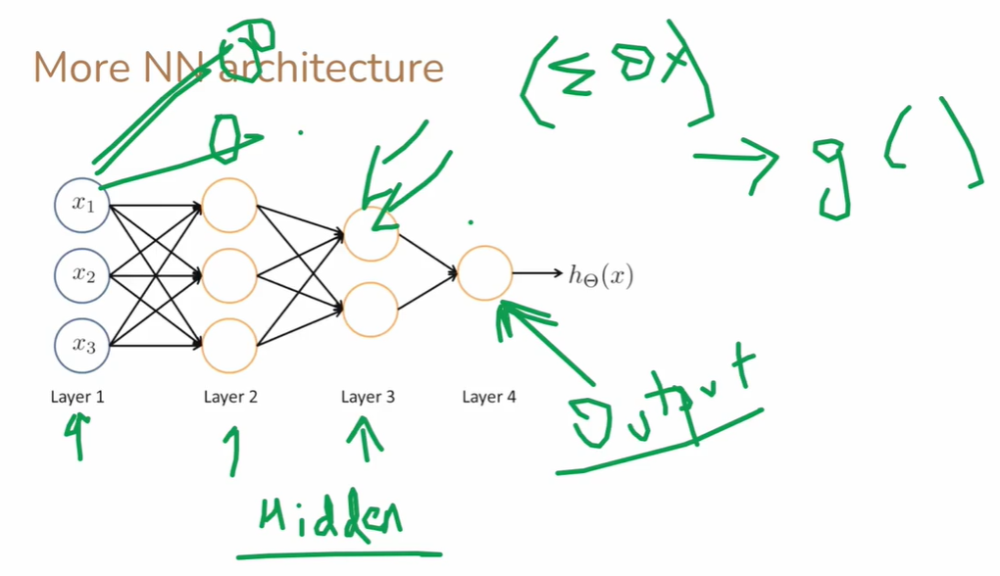

# Representation of a Neural Network

A neural network can be represented **graphically, mathematically, and structurally** to show how data flows through layers, how neurons are connected via weights, and how activations are computed.

---

### 1. **Graphical (Layered) Representation**

**Simple feedforward network:**

```
          Input Layer
        x1   x2   x3
         \    |    /
          \   |   /
          Hidden Layer 1
          h1   h2   h3
           \   |   /
            \  |  /
          Hidden Layer 2
            h4   h5
             \   /
              \ /
           Output Layer
                y
```

* **Nodes (circles)** represent **neurons**.
* **Lines/arrows** represent **weights (connections)**. Each line has a weight (w_{ij}).
* Data flows from **input → hidden layers → output** (feedforward).

---

### 2. **Mathematical Representation**

For a **single neuron**:

[
y = f\Big(\sum_{i=1}^{n} w_i x_i + b\Big)
]

For a **layer of neurons**, using vector/matrix notation:

[
\mathbf{z}^{(l)} = \mathbf{W}^{(l)} \mathbf{a}^{(l-1)} + \mathbf{b}^{(l)}
]
[
\mathbf{a}^{(l)} = f(\mathbf{z}^{(l)})
]

Where:

* ( \mathbf{a}^{(0)} = \mathbf{x} ) = input vector
* ( \mathbf{W}^{(l)} ) = weight matrix connecting layer (l-1) to (l)
* ( \mathbf{b}^{(l)} ) = bias vector for layer (l)
* ( f ) = activation function (sigmoid, ReLU, tanh)
* ( \mathbf{a}^{(l)} ) = output vector of layer (l)

---

### 3. **Network as a Weighted Graph**

* Nodes: neurons
* Edges: weights
* Each neuron computes:

[
\text{Output of neuron } j = f\Big(\sum_i w_{ij} x_i + b_j\Big)
]

* Entire network = directed graph with weighted edges, input nodes on one side, output nodes on the other.

**Example weight mapping (2 inputs → 2 hidden → 1 output):**

| From → To | Weight |
| --------- | ------ |
| x1 → h1   | w11    |
| x2 → h1   | w21    |
| x1 → h2   | w12    |
| x2 → h2   | w22    |
| h1 → y    | w31    |
| h2 → y    | w32    |

---

### 4. **ASCII Representation (Compact)**

```
Inputs: x1, x2
          │
          ▼
        [Hidden Layer]
      h1       h2
       │       │
       ▼       ▼
        [Output]
           y
```

Each arrow = weight (w_{ij}).
Each hidden/output node applies **activation function** on the weighted sum.

---

### 5. **Vectorized Representation**

For a mini-batch of inputs (X) (n samples × m features):

1. Hidden layer pre-activation:
   [
   Z^{(1)} = X W^{(1)} + B^{(1)}
   ]
2. Hidden layer activation:
   [
   A^{(1)} = f(Z^{(1)})
   ]
3. Output pre-activation:
   [
   Z^{(2)} = A^{(1)} W^{(2)} + B^{(2)}
   ]
4. Output activation:
   [
   \hat{Y} = f(Z^{(2)})
   ]

---

### 6. **Summary Table of Representation**

| Representation Type | Description                               | Example                      |
| ------------------- | ----------------------------------------- | ---------------------------- |
| Graphical/Diagram   | Nodes + weighted edges                    | Layered diagram with arrows  |
| Mathematical        | Equations for weighted sums & activations | ( y = f(\sum w_i x_i + b) )  |
| Vectorized/Matrix   | Efficient computation for batches         | ( Z = X W + B, A = f(Z) )    |
| Weighted Graph      | Directed graph                            | Nodes=neurons, Edges=weights |

---

### 7. **Key Points**

* **Neurons** = processing units
* **Weights** = connection strength
* **Biases** = shift the activation
* **Activation function** = introduces non-linearity
* **Layers** = input, hidden, output
* **Network** = composition of multiple layers & neurons forming complex mappings

---

---

---

---

---

---

# Model Structuring: Vector, Weights, Bias, Nodes (2 Inputs → 3 Hidden Neurons)

We will represent a simple **feedforward neural network layer** with:

* **Input layer**: 2 nodes (x_1, x_2)
* **Hidden layer**: 3 neurons (h_1, h_2, h_3)
* **Weights**: (w_{ij}) connecting input (x_i) to hidden (h_j)
* **Biases**: (b_1, b_2, b_3) for each hidden neuron

---

### 1. **Weight connections**

| Input → Hidden | Weight |
| -------------- | ------ |
| x1 → h1        | w11    |
| x1 → h2        | w12    |
| x1 → h3        | w13    |
| x2 → h1        | w21    |
| x2 → h2        | w22    |
| x2 → h3        | w23    |

---

### 2. **Vector Representation**

#### Input vector (vertical):

[
\mathbf{x} =
\begin{bmatrix}
x_1 \
x_2
\end{bmatrix}
]

#### Weight matrix (W) (2 inputs × 3 hidden neurons):

[
\mathbf{W} =
\begin{bmatrix}
w_{11} & w_{12} & w_{13} \
w_{21} & w_{22} & w_{23}
\end{bmatrix}
]

#### Bias vector (for hidden layer):

[
\mathbf{b} =
\begin{bmatrix}
b_1 \
b_2 \
b_3
\end{bmatrix}
]

---

### 3. **Hidden layer pre-activation (vector multiplication)**

1. **Forward pass formula:**
   [
   \mathbf{z} = W^T \mathbf{x} + \mathbf{b}
   ]

* ( \mathbf{x} ) is **2×1**,
* ( W^T ) is **3×2**,
* Result ( \mathbf{z} ) is **3×1**, giving the pre-activation of each hidden neuron.

2. **Component-wise expansion:**

[
\begin{bmatrix}
h_1 \
h_2 \
h_3
\end{bmatrix}_{\text{pre-activation}}
=====================================

\begin{bmatrix}
w_{11} & w_{21} \
w_{12} & w_{22} \
w_{13} & w_{23}
\end{bmatrix}
\begin{bmatrix}
x_1 \
x_2
\end{bmatrix}
+
\begin{bmatrix}
b_1 \
b_2 \
b_3
\end{bmatrix}
=============

\begin{bmatrix}
x_1 w_{11} + x_2 w_{21} + b_1 \
x_1 w_{12} + x_2 w_{22} + b_2 \
x_1 w_{13} + x_2 w_{23} + b_3
\end{bmatrix}
]

---

### 4. **Activation function application**

Each hidden neuron applies an activation (f):

[
\mathbf{h} =
f(\mathbf{z}) =
\begin{bmatrix}
f(x_1 w_{11} + x_2 w_{21} + b_1) \
f(x_1 w_{12} + x_2 w_{22} + b_2) \
f(x_1 w_{13} + x_2 w_{23} + b_3)
\end{bmatrix}
]

---

### 5. **Alternative representation (horizontal input vector)**

If input vector is **row vector**:
[
\mathbf{x} = [x_1, x_2] \quad (1×2)
]
Weight matrix for horizontal input:
[
\mathbf{W} =
\begin{bmatrix}
w_{11} & w_{12} & w_{13} \
w_{21} & w_{22} & w_{23}
\end{bmatrix} \quad (2×3)
]

Then:

[
\mathbf{h} = \mathbf{x} \cdot W + \mathbf{b} = [h_1, h_2, h_3]
]

---

### 6. **Vector multiplication intuition**

* Each **hidden neuron** receives a **linear combination of inputs** weighted by its corresponding column in (W).
* Using **matrix multiplication**, all neurons are computed simultaneously, efficient for computation.

---

### 7. **ASCII Diagram (2 inputs → 3 hidden neurons)**

```
x1 --- w11 ---\
               \
x2 --- w21 ----> h1 (with bias b1)
               /
x1 --- w12 ---\
               \
x2 --- w22 ----> h2 (with bias b2)
               /
x1 --- w13 ---\
               \
x2 --- w23 ----> h3 (with bias b3)
```

---

### 8. **Summary Table**

| Symbol | Size/Shape | Role                        |
| ------ | ---------- | --------------------------- |
| x      | 2×1        | Input features              |
| W      | 2×3        | Weights from input → hidden |
| b      | 3×1        | Bias for each hidden neuron |
| z      | 3×1        | Weighted sum pre-activation |
| h      | 3×1        | Output after activation     |

---

* **Forward pass formula (vertical input):**
  [
  \mathbf{h} = f(W^T \mathbf{x} + \mathbf{b})
  ]
* **Forward pass formula (horizontal input):**
  [
  \mathbf{h} = f(\mathbf{x} \cdot W + \mathbf{b})
  ]

This fully defines **layer one computation** in vectorized form.

---

---

---

---

---

---

# Neural Network Nomenclature and Logistic Model Representation

This explanation combines **biological analogy**, **logistic (sigmoid) model**, **vector/matrix representation**, and **forward computation** for a simple network.

---

## 1. **Biological Nomenclature**

| Term            | Biological Meaning                            | Neural Network Analogy                             |
| --------------- | --------------------------------------------- | -------------------------------------------------- |
| **Synapse**     | Connection between two neurons                | Weight (w_{ij}) connecting node i → j              |
| **Collector**   | Neuron dendrites collecting input signals     | Weighted sum (z_j = \sum_i w_{ij} x_i + b_j)       |
| **Activator**   | Neuron decides to fire or not                 | Activation function (a_j = f(z_j)) (e.g., sigmoid) |
| **Distributor** | Axon terminal sending signal to other neurons | Output from neuron forwarded to next layer         |
| **Axons**       | Fibers transmitting signal                    | Connections carrying activations to next layer     |

---

## 2. **Logistic Model (Sigmoid Activation)**

The **logistic function** (sigmoid) is commonly used in neural networks:

[
g(z) = \frac{1}{1 + e^{-z}}
]

* Input: ( z = \text{weighted sum + bias} )
* Output: ( g(z) \in (0,1) ) interpreted as probability

---

## 3. **Single Layer with Multiple Logistic Units**

Assume a **hidden layer** with 3 neurons (a_1, a_2, a_3), each taking 3 input nodes (x_1, x_2, x_3):

* **Input vector:**
  [
  \mathbf{x} = \begin{bmatrix} x_1 \ x_2 \ x_3 \end{bmatrix}
  ]

* **Weight vectors for each hidden neuron:**
  [
  \mathbf{w}*1 = \begin{bmatrix} w*{11} \ w_{21} \ w_{31} \end{bmatrix},\quad
  \mathbf{w}*2 = \begin{bmatrix} w*{12} \ w_{22} \ w_{32} \end{bmatrix},\quad
  \mathbf{w}*3 = \begin{bmatrix} w*{13} \ w_{23} \ w_{33} \end{bmatrix}
  ]

* **Bias for each hidden neuron:**
  [
  b_1, b_2, b_3
  ]

**Hidden neuron activations:**

[
a_1 = g(z_1) = g(\mathbf{w}*1^T \mathbf{x} + b_1) = g(w*{11} x_1 + w_{21} x_2 + w_{31} x_3 + b_1)
]

[
a_2 = g(z_2) = g(\mathbf{w}*2^T \mathbf{x} + b_2) = g(w*{12} x_1 + w_{22} x_2 + w_{32} x_3 + b_2)
]

[
a_3 = g(z_3) = g(\mathbf{w}*3^T \mathbf{x} + b_3) = g(w*{13} x_1 + w_{23} x_2 + w_{33} x_3 + b_3)
]

* **Vector representation of hidden layer outputs:**
  [
  \mathbf{a} =
  \begin{bmatrix} a_1 \ a_2 \ a_3 \end{bmatrix}
  = g(W^T \mathbf{x} + \mathbf{b})
  ]

Where ( W = \begin{bmatrix} w_{11} & w_{12} & w_{13} \ w_{21} & w_{22} & w_{23} \ w_{31} & w_{32} & w_{33} \end{bmatrix} ), ( \mathbf{b} = [b_1, b_2, b_3]^T ).

---

## 4. **Output Layer (Single Node)**

* **Weight vector for output neuron:**
  [
  \mathbf{v} = \begin{bmatrix} v_1 \ v_2 \ v_3 \end{bmatrix}, \quad \text{connecting hidden layer → output node}
  ]

* **Bias for output node:** (b_4)

* **Output computation:**
  [
  h_\theta(x) = g(\mathbf{v}^T \mathbf{a} + b_4) = g(v_1 a_1 + v_2 a_2 + v_3 a_3 + b_4)
  ]

* Here ( h_\theta(x) ) is the **final prediction** (probability).

---

## 5. **Forward Pass Summary**

1. **Input → hidden layer:**
   [
   \mathbf{a} = g(W^T \mathbf{x} + \mathbf{b})
   ]

2. **Hidden layer → output:**
   [
   h_\theta(x) = g(\mathbf{v}^T \mathbf{a} + b_4)
   ]

3. **All activations are logistic:** (a_i, h_\theta(x) \in (0,1))

---

## 6. **ASCII Diagram (3 inputs → 3 hidden → 1 output)**

```
Inputs: x1 x2 x3
   │  │  │
   ▼  ▼  ▼
Hidden Neurons: a1 a2 a3
   │   │   │
   ▼   ▼   ▼
Output Node: h_theta(x)
```

* Each arrow = **weight connection** ((w_{ij}) or (v_j))
* Hidden nodes = logistic activators (a_i = g(\sum w_{ij} x_j + b_i))
* Output node = logistic combination of hidden activations

---

## 7. **Vectorized Representation**

* **Input vector:** ( \mathbf{x} = [x_1, x_2, x_3]^T )

* **Hidden layer activations:** ( \mathbf{a} = g(W^T \mathbf{x} + \mathbf{b}) )

* **Output:** ( h_\theta(x) = g(\mathbf{v}^T \mathbf{a} + b_4) )

* This notation scales to **any number of inputs, hidden neurons, or outputs**.

---

## 8. **Summary of Components**

| Component     | Symbol | Role                                   |
| ------------- | ------ | -------------------------------------- |
| Input Node    | x_i    | Features from data                     |
| Weight        | w_ij   | Strength of connection input → hidden  |
| Hidden Node   | a_i    | Logistic activation (g(z_i))           |
| Bias          | b_i    | Shift pre-activation threshold         |
| Output Node   | hθ(x)  | Final prediction                       |
| Output Weight | v_i    | Strength of hidden → output connection |
| Activation    | g(z)   | Logistic function                      |

---

* **Stepwise forward computation:**

[
\begin{aligned}
a_1 &= g(w_{11} x_1 + w_{21} x_2 + w_{31} x_3 + b_1) \
a_2 &= g(w_{12} x_1 + w_{22} x_2 + w_{32} x_3 + b_2) \
a_3 &= g(w_{13} x_1 + w_{23} x_2 + w_{33} x_3 + b_3) \
h_\theta(x) &= g(v_1 a_1 + v_2 a_2 + v_3 a_3 + b_4)
\end{aligned}
]

This represents a **full forward pass of a small neural network** using logistic (sigmoid) activations.

---

---

---

---

---

---

# Neural Network Architecture with 4 Layers Before (h_\theta(x))

A **neural network** consists of layers where each layer has **two key components**:

1. **Computation component** – linear combination of inputs with weights + bias:
   [
   z^{(l)} = W^{(l)T} a^{(l-1)} + b^{(l)}
   ]

2. **Activation component** – non-linear function applied to (z^{(l)}):
   [
   a^{(l)} = f(z^{(l)})
   ]

---

## 1. **Network Setup**

Assume the network has:

* Input layer: (x_1, x_2, x_3) (3 inputs)
* Hidden layer 1: 4 neurons → (a_1^{(1)}, a_2^{(1)}, a_3^{(1)}, a_4^{(1)})
* Hidden layer 2: 3 neurons → (a_1^{(2)}, a_2^{(2)}, a_3^{(2)})
* Hidden layer 3: 3 neurons → (a_1^{(3)}, a_2^{(3)}, a_3^{(3)})
* Hidden layer 4: 2 neurons → (a_1^{(4)}, a_2^{(4)})
* Output layer: 1 neuron → (h_\theta(x))

---

## 2. **Layer-wise Computation and Activation**

### Layer 1 (Input → Hidden1)

[
z_1^{(1)} = w_{11}^{(1)} x_1 + w_{21}^{(1)} x_2 + w_{31}^{(1)} x_3 + b_1^{(1)},\quad
a_1^{(1)} = f(z_1^{(1)})
]
[
z_2^{(1)} = w_{12}^{(1)} x_1 + w_{22}^{(1)} x_2 + w_{32}^{(1)} x_3 + b_2^{(1)},\quad a_2^{(1)} = f(z_2^{(1)})
]
(similar for (a_3^{(1)}, a_4^{(1)}))

---

### Layer 2 (Hidden1 → Hidden2)

[
z_1^{(2)} = w_{11}^{(2)} a_1^{(1)} + w_{21}^{(2)} a_2^{(1)} + w_{31}^{(2)} a_3^{(1)} + w_{41}^{(2)} a_4^{(1)} + b_1^{(2)}
]
[
a_1^{(2)} = f(z_1^{(2)})
]
(similar for (a_2^{(2)}, a_3^{(2)}))

---

### Layer 3 (Hidden2 → Hidden3)

[
z_1^{(3)} = w_{11}^{(3)} a_1^{(2)} + w_{21}^{(3)} a_2^{(2)} + w_{31}^{(3)} a_3^{(2)} + b_1^{(3)}
]
[
a_1^{(3)} = f(z_1^{(3)})
]
(similar for (a_2^{(3)}, a_3^{(3)}))

---

### Layer 4 (Hidden3 → Hidden4)

[
z_1^{(4)} = w_{11}^{(4)} a_1^{(3)} + w_{21}^{(4)} a_2^{(3)} + w_{31}^{(4)} a_3^{(3)} + b_1^{(4)}
]
[
a_1^{(4)} = f(z_1^{(4)})
]
(similar for (a_2^{(4)}))

---

### Output Layer (Hidden4 → (h_\theta(x)))

[
z^{(5)} = v_1 a_1^{(4)} + v_2 a_2^{(4)} + b^{(5)}
]
[
h_\theta(x) = f(z^{(5)})
]

* Here, (h_\theta(x)) is the **final network output**.
* Each hidden/output neuron uses **activation function** (f) (e.g., sigmoid, ReLU).

---

## 3. **Vectorized Representation**

### Notation

* (a^{(0)} = x) (input vector)
* Weight matrices: (W^{(l)}) connecting layer (l-1) → (l)
* Bias vectors: (b^{(l)}) for each layer

### Forward Pass (Vector Form)

[
\begin{aligned}
a^{(1)} &= f(W^{(1)T} a^{(0)} + b^{(1)}) \
a^{(2)} &= f(W^{(2)T} a^{(1)} + b^{(2)}) \
a^{(3)} &= f(W^{(3)T} a^{(2)} + b^{(3)}) \
a^{(4)} &= f(W^{(4)T} a^{(3)} + b^{(4)}) \
h_\theta(x) &= f(v^T a^{(4)} + b^{(5)})
\end{aligned}
]

* Each layer has **computation component**: (z^{(l)} = W^{(l)T} a^{(l-1)} + b^{(l)})
* Each layer has **activation component**: (a^{(l)} = f(z^{(l)}))

---

## 4. **ASCII Diagram (4 Hidden Layers → Output)**

```
Input Layer: x1 x2 x3
     │  │  │
     ▼  ▼  ▼
Hidden Layer 1: a1 a2 a3 a4
     │   │   │   │
     ▼   ▼   ▼   ▼
Hidden Layer 2: a1 a2 a3
     │   │   │
     ▼   ▼   ▼
Hidden Layer 3: a1 a2 a3
     │   │   │
     ▼   ▼   ▼
Hidden Layer 4: a1 a2
     │   │
     ▼   ▼
Output Layer: h_theta(x)
```

* Each **arrow** represents a **weight** ((w_{ij}^{(l)}) or (v_i))
* Each node: **computation component** (weighted sum + bias) + **activation component** (apply (f))

---

## 5. **Key Points**

* **Actual layer = computation + activation**

  * ( z^{(l)} = W^{(l)T} a^{(l-1)} + b^{(l)} ) → linear computation
  * ( a^{(l)} = f(z^{(l)}) ) → non-linear activation
* Stacking multiple layers allows **hierarchical feature extraction**
* Output (h_\theta(x)) depends on all previous activations and weights

---


