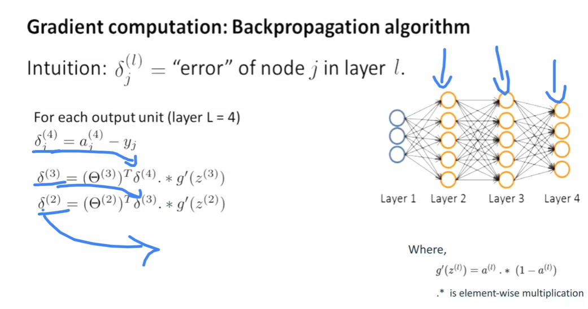

# Neural Network Learning Process

The **learning process** of a neural network is how it **adjusts its weights and biases** to correctly map inputs (X) to outputs (Y). It is performed iteratively using **forward pass, loss computation, backpropagation, and weight update**.

---

## 1. **Initialize the Network**

* Define network architecture: number of layers, neurons per layer, activation functions.
* Initialize **weights** (W^{(l)}) and **biases** (b^{(l)}) (random small values or using Xavier/He initialization).

Example:

* Input layer: 3 nodes
* Hidden layers: 2 layers (4 and 3 neurons)
* Output layer: 1 node

---

## 2. **Forward Propagation (Prediction)**

1. **Compute linear combination for each layer:**
   [
   z^{(l)} = W^{(l)T} a^{(l-1)} + b^{(l)}
   ]

2. **Apply activation function:**
   [
   a^{(l)} = f(z^{(l)})
   ]

3. **Output prediction:**
   [
   \hat{y} = h_\theta(x) = a^{(L)}
   ]

* Forward pass **propagates input through all layers**.
* Activations of one layer become inputs to the next.

---

## 3. **Loss Function (Error Measurement)**

* Compare predicted output (\hat{y}) with true label (y) using a **loss function**.

* Common losses:

  * **Regression:** Mean Squared Error (MSE)
    [
    \mathcal{L} = \frac{1}{m} \sum_{i=1}^{m} (\hat{y}_i - y_i)^2
    ]
  * **Classification:** Cross-Entropy
    [
    \mathcal{L} = -\frac{1}{m}\sum_i y_i \log \hat{y}_i + (1-y_i)\log(1-\hat{y}_i)
    ]

* Loss indicates **how far the network is from the correct output**.

---

## 4. **Backpropagation (Compute Gradients)**

* Goal: find **gradient of loss w.r.t weights and biases**
  [
  \frac{\partial \mathcal{L}}{\partial W^{(l)}}, \quad \frac{\partial \mathcal{L}}{\partial b^{(l)}}
  ]

### Steps:

1. **Compute output layer error:**
   [
   \delta^{(L)} = \frac{\partial \mathcal{L}}{\partial z^{(L)}} = (\hat{y} - y) \odot f'(z^{(L)})
   ]

2. **Propagate error backward through layers:**
   [
   \delta^{(l)} = (W^{(l+1)} \delta^{(l+1)}) \odot f'(z^{(l)})
   ]

3. **Compute gradients for weights and biases:**
   [
   \frac{\partial \mathcal{L}}{\partial W^{(l)}} = a^{(l-1)} (\delta^{(l)})^T
   ]
   [
   \frac{\partial \mathcal{L}}{\partial b^{(l)}} = \delta^{(l)}
   ]

* This uses the **chain rule** to efficiently compute gradients for all layers.

---

## 5. **Weight & Bias Update (Optimization)**

* Update weights using **Gradient Descent** (or variants like Adam, RMSProp):
  [
  W^{(l)} \leftarrow W^{(l)} - \eta \frac{\partial \mathcal{L}}{\partial W^{(l)}}
  ]
  [
  b^{(l)} \leftarrow b^{(l)} - \eta \frac{\partial \mathcal{L}}{\partial b^{(l)}}
  ]

* (\eta) = learning rate (step size).

* Repeat for **each mini-batch** (mini-batch gradient descent) or **whole dataset** (batch gradient descent).

---

## 6. **Iterative Learning**

* One complete pass over the training data = **1 epoch**
* Repeat for many epochs until:

  * Loss converges
  * Accuracy is satisfactory
  * Early stopping criteria met (to avoid overfitting)

---

## 7. **Regularization Techniques**

* **Dropout:** randomly deactivate neurons during training
* **L2 regularization (weight decay):** penalize large weights
* **Batch Normalization:** normalize activations for faster convergence

---

## 8. **Forward Pass Summary for Multi-Layer Network**

For a network with 4 hidden layers and 1 output:

[
\begin{aligned}
a^{(1)} &= f(W^{(1)T} x + b^{(1)}) \
a^{(2)} &= f(W^{(2)T} a^{(1)} + b^{(2)}) \
a^{(3)} &= f(W^{(3)T} a^{(2)} + b^{(3)}) \
a^{(4)} &= f(W^{(4)T} a^{(3)} + b^{(4)}) \
h_\theta(x) &= f(v^T a^{(4)} + b^{(5)})
\end{aligned}
]

* Compute **loss**: (\mathcal{L}(h_\theta(x), y))
* Compute **gradients via backprop**
* **Update weights & biases**

Repeat until convergence.

---

## 9. **Flow Diagram of Learning Process**

```
Input x
   │
   ▼
Forward Pass → Compute activations a^(l)
   │
   ▼
Compute Loss L(y, h_theta(x))
   │
   ▼
Backpropagation → Compute gradients dL/dW, dL/db
   │
   ▼
Weight & Bias Update (Gradient Descent)
   │
   ▼
Repeat for next batch/epoch
```

* Learning = **iterative refinement of weights** based on error feedback.
* Network “learns” patterns by **minimizing loss over training data**.

---

---

---

---

---

---

# Forward Propagation in Neural Network (Input → Hidden1 → Hidden2 → Output)

Forward propagation is the **process of passing input data through the network layers** to compute the output. Each layer has:

1. **Computation component (linear combination):**
   [
   z^{(l)} = \theta^{(l)T} a^{(l-1)} + b^{(l)}
   ]

2. **Activation component (non-linear):**
   [
   a^{(l)} = g(z^{(l)})
   ]

* (a^{(0)} = x) (input vector)
* (g()) = activation function (sigmoid, ReLU, etc.)
* Output: (h_\theta(x) = a^{(L)})

---

## 1. **Network Example**

* Input layer: 2 nodes (x_1, x_2)
* Hidden layer 1: 2 neurons (a_1^{(1)}, a_2^{(1)})
* Hidden layer 2: 2 neurons (a_1^{(2)}, a_2^{(2)})
* Output layer: 1 neuron (h_\theta(x))

Weights:

* Layer1: (\theta^{(1)} =
  \begin{bmatrix} \theta_{11}^{(1)} & \theta_{12}^{(1)} \ \theta_{21}^{(1)} & \theta_{22}^{(1)} \end{bmatrix})
* Layer2: (\theta^{(2)} =
  \begin{bmatrix} \theta_{11}^{(2)} & \theta_{12}^{(2)} \ \theta_{21}^{(2)} & \theta_{22}^{(2)} \end{bmatrix})
* Output: (\theta^{(3)} = [\theta_{1}^{(3)}, \theta_2^{(3)}]^T)

Biases: (b^{(1)}, b^{(2)}, b^{(3)})

---

## 2. **Forward Propagation Step-by-Step**

### **Step 1: Input → Hidden Layer 1**

Linear combination:

[
z_1^{(1)} = \theta_{11}^{(1)} x_1 + \theta_{21}^{(1)} x_2 + b_1^{(1)}
]
[
z_2^{(1)} = \theta_{12}^{(1)} x_1 + \theta_{22}^{(1)} x_2 + b_2^{(1)}
]

Activation:

[
a_1^{(1)} = g(z_1^{(1)}), \quad a_2^{(1)} = g(z_2^{(1)})
]

* (g()) could be **sigmoid**: (g(z) = \frac{1}{1 + e^{-z}})

---

### **Step 2: Hidden Layer 1 → Hidden Layer 2**

Linear combination:

[
z_1^{(2)} = \theta_{11}^{(2)} a_1^{(1)} + \theta_{21}^{(2)} a_2^{(1)} + b_1^{(2)}
]
[
z_2^{(2)} = \theta_{12}^{(2)} a_1^{(1)} + \theta_{22}^{(2)} a_2^{(1)} + b_2^{(2)}
]

Activation:

[
a_1^{(2)} = g(z_1^{(2)}), \quad a_2^{(2)} = g(z_2^{(2)})
]

---

### **Step 3: Hidden Layer 2 → Output Layer**

Linear combination:

[
z^{(3)} = \theta_1^{(3)} a_1^{(2)} + \theta_2^{(3)} a_2^{(2)} + b^{(3)}
]

Activation:

[
h_\theta(x) = g(z^{(3)})
]

* (h_\theta(x)) = final network output

---

## 3. **Vectorized Form**

### **Step 1:** Hidden Layer 1

[
a^{(0)} = x = \begin{bmatrix} x_1 \ x_2 \end{bmatrix}, \quad
z^{(1)} = \theta^{(1)T} a^{(0)} + b^{(1)}, \quad a^{(1)} = g(z^{(1)})
]

### **Step 2:** Hidden Layer 2

[
z^{(2)} = \theta^{(2)T} a^{(1)} + b^{(2)}, \quad a^{(2)} = g(z^{(2)})
]

### **Step 3:** Output Layer

[
z^{(3)} = \theta^{(3)T} a^{(2)} + b^{(3)}, \quad h_\theta(x) = g(z^{(3)})
]

* Each layer: **compute weighted sum + bias → apply activation**
* Output = forward propagation of input through network

---

## 4. **Example Numeric Calculation**

Assume:

[
x_1 = 0.5, x_2 = 0.8
]
(\theta^{(1)} = \begin{bmatrix} 0.2 & 0.4 \ 0.7 & 0.1 \end{bmatrix}, \quad b^{(1)} = [0.1, 0.2]^T)

**Hidden Layer 1:**

[
z_1^{(1)} = 0.2*0.5 + 0.7*0.8 + 0.1 = 0.2 + 0.56 + 0.1 = 0.86
]
[
a_1^{(1)} = g(0.86) \approx 0.702
]

[
z_2^{(1)} = 0.4*0.5 + 0.1*0.8 + 0.2 = 0.2 + 0.08 + 0.2 = 0.48
]
[
a_2^{(1)} = g(0.48) \approx 0.617
]

* Similar calculations continue for **Hidden Layer 2 → Output**

---

## 5. **Summary Table of Forward Propagation**

| Layer   | Inputs             | Weighted Sum (z)   | Activation (a = g(z)) |
| ------- | ------------------ | ------------------ | --------------------- |
| Hidden1 | x1, x2             | z1^{(1)}, z2^{(1)} | a1^{(1)}, a2^{(1)}    |
| Hidden2 | a1^{(1)}, a2^{(1)} | z1^{(2)}, z2^{(2)} | a1^{(2)}, a2^{(2)}    |
| Output  | a1^{(2)}, a2^{(2)} | z^{(3)}            | h_\theta(x)           |

---

* Forward propagation = **layerwise weighted sum + activation**
* Final output (h_\theta(x)) is ready for **loss computation** in learning.

---
---
---

# Backpropagation vs Forward Propagation

Neural networks have **two distinct processes**: **forward propagation** and **backpropagation**.

---

## 1. **Forward Propagation**

**Purpose:** Compute the output of the network given an input.

**When used:**

* **Training:** To calculate activations of each layer → used to compute **loss**
* **Prediction (Inference):** To compute output (h_\theta(x)) for new data

**Process (layerwise):**

1. Compute weighted sum:
   [
   z^{(l)} = W^{(l)T} a^{(l-1)} + b^{(l)}
   ]
2. Apply activation:
   [
   a^{(l)} = g(z^{(l)})
   ]
3. Repeat for all layers until output layer:
   [
   h_\theta(x) = a^{(L)}
   ]

**Key Points:**

* Forward pass is **data-driven** (propagates inputs through network).
* Used **during training and prediction**.
* Produces **activations (a^{(l)})** and **network output (h_\theta(x))**.

---

## 2. **Backpropagation**

**Purpose:** Compute **gradients of loss w.r.t weights and biases** to update network parameters.

**When used:**

* **Training only** (never used for prediction)
* Propagates **errors backward** from output to input layer

**Process (layerwise):**

1. Compute output error:
   [
   \delta^{(L)} = \frac{\partial \mathcal{L}}{\partial z^{(L)}} = (h_\theta(x) - y) \odot g'(z^{(L)})
   ]
2. Propagate error backward:
   [
   \delta^{(l)} = (W^{(l+1)} \delta^{(l+1)}) \odot g'(z^{(l)})
   ]
3. Compute gradients for weights/biases:
   [
   \frac{\partial \mathcal{L}}{\partial W^{(l)}} = a^{(l-1)} (\delta^{(l)})^T, \quad
   \frac{\partial \mathcal{L}}{\partial b^{(l)}} = \delta^{(l)}
   ]
4. Update weights/biases using gradient descent:
   [
   W^{(l)} \leftarrow W^{(l)} - \eta \frac{\partial \mathcal{L}}{\partial W^{(l)}}, \quad
   b^{(l)} \leftarrow b^{(l)} - \eta \frac{\partial \mathcal{L}}{\partial b^{(l)}}
   ]

**Key Points:**

* Backpropagation is **error-driven** (uses loss to update weights).
* Only used **during training**.
* Requires **activations from forward pass**.

---

## 3. **Forward vs Backward Summary Table**

| Feature          | Forward Propagation          | Backpropagation                          |
| ---------------- | ---------------------------- | ---------------------------------------- |
| Purpose          | Compute output/activations   | Compute gradients of loss                |
| Data Flow        | Input → Output               | Output → Input                           |
| Used For         | Prediction & training        | Training only                            |
| Components       | Weighted sum + activation    | Error propagation + gradient calculation |
| Involves Loss?   | No (except to compute later) | Yes (uses loss to calculate error)       |
| Updates Weights? | No                           | Yes                                      |

---

## 4. **Flow Diagram**

```
Forward Pass (for training or prediction)
Input x
   │
   ▼
Hidden Layers → Activations a^(l)
   │
   ▼
Output Layer → h_theta(x)
   │
   ▼
Compute Loss L(y, h_theta(x))   <-- only during training

Backpropagation (training only)
   │
   ▼
Compute output error delta^(L)
   │
   ▼
Propagate delta backwards through layers
   │
   ▼
Compute gradients dL/dW, dL/db
   │
   ▼
Update weights and biases
```

---

**Summary:**

* **Forward pass:** compute outputs → **used for both prediction and training**
* **Backward pass:** compute gradients using errors → **used only for training**
* Backpropagation requires **activations from forward pass** to propagate errors and update parameters.

---
---
---

# Gradient Computation in Backpropagation

Backpropagation computes the **gradients of the loss function** with respect to **weights and biases** using **errors ((\delta)) at each node**.

---

## 1. **Intuition: Node Error (\delta_j^{(l)})**

* (\delta_j^{(l)}) = "error" of neuron (j) in layer (l)
* Measures **how much that neuron contributed to the final output error**
* Enables **weight adjustment**: weights connected to high-error neurons are updated more.

---

## 2. **Output Layer Error**

For an output neuron (j) in **last layer L**:

[
\delta_j^{(L)} = a_j^{(L)} - y_j
]

* (a_j^{(L)}) = activation of output neuron (j)

* (y_j) = true label

* If **sigmoid activation** is used with cross-entropy loss, this is the **simplest form**.

* **Vector form:**
  [
  \delta^{(L)} = a^{(L)} - y
  ]

---

## 3. **Hidden Layer Error**

For a hidden neuron (j) in layer (l):

[
\delta_j^{(l)} = \left( \sum_k \delta_k^{(l+1)} \theta_{jk}^{(l)} \right) \cdot g'(z_j^{(l)})
]

* (\theta_{jk}^{(l)}) = weight from neuron (j) in layer (l) to neuron (k) in layer (l+1)
* (g'(z_j^{(l)})) = derivative of activation function at node (j)

**For sigmoid:**

[
g'(z_j^{(l)}) = a_j^{(l)} \cdot (1 - a_j^{(l)})
]

* So **elementwise multiplication** (Hadamard product) is used:
  [
  \delta^{(l)} = (\theta^{(l)} \delta^{(l+1)}) \odot (a^{(l)} \cdot (1 - a^{(l)}))
  ]

---

## 4. **Gradient for Weights and Biases**

* Once (\delta^{(l)}) is known:

[
\frac{\partial \mathcal{L}}{\partial \theta_{ij}^{(l)}} = a_i^{(l-1)} \cdot \delta_j^{(l)}
]
[
\frac{\partial \mathcal{L}}{\partial b_j^{(l)}} = \delta_j^{(l)}
]

* Update rules (Gradient Descent):

[
\theta_{ij}^{(l)} \leftarrow \theta_{ij}^{(l)} - \eta \frac{\partial \mathcal{L}}{\partial \theta_{ij}^{(l)}}
]
[
b_j^{(l)} \leftarrow b_j^{(l)} - \eta \delta_j^{(l)}
]

---

## 5. **Step-by-Step Backpropagation Algorithm**

1. **Forward pass:** compute (a^{(l)}) for all layers.
2. **Compute output error:**
   [
   \delta^{(L)} = a^{(L)} - y
   ]
3. **Backpropagate errors for hidden layers:**
   [
   \delta^{(l)} = (\theta^{(l)} \delta^{(l+1)}) \odot (a^{(l)} \cdot (1 - a^{(l)}))
   ]
4. **Compute gradients for weights and biases:**
   [
   \frac{\partial \mathcal{L}}{\partial \theta^{(l)}} = a^{(l-1)} (\delta^{(l)})^T
   ]
5. **Update parameters:**
   [
   \theta^{(l)} \leftarrow \theta^{(l)} - \eta \frac{\partial \mathcal{L}}{\partial \theta^{(l)}}, \quad b^{(l)} \leftarrow b^{(l)} - \eta \delta^{(l)}
   ]
6. Repeat for all layers from **output to input**.

---

## 6. **Example: 4-Layer Network**

* Layers: Input → Hidden1 → Hidden2 → Hidden3 → Output (Layer L=4)

* **Output layer error:**
  [
  \delta^{(4)} = a^{(4)} - y
  ]

* **Hidden layer 3 error:**
  [
  \delta^{(3)} = (\theta^{(3)} \delta^{(4)}) \odot (a^{(3)} \cdot (1 - a^{(3)}))
  ]

* **Hidden layer 2 error:**
  [
  \delta^{(2)} = (\theta^{(2)} \delta^{(3)}) \odot (a^{(2)} \cdot (1 - a^{(2)}))
  ]

* **Hidden layer 1 error:**
  [
  \delta^{(1)} = (\theta^{(1)} \delta^{(2)}) \odot (a^{(1)} \cdot (1 - a^{(1)}))
  ]

* Then compute **gradients** and update weights/biases accordingly.

---

**Key Takeaways:**

* (\delta_j^{(l)}) = "node error" at layer (l)
* Output layer error = **activation - true label**
* Hidden layer error = **weighted sum of next layer deltas × activation derivative**
* Sigmoid derivative: (g'(z) = a \cdot (1-a)) → elementwise multiplication
* Backpropagation = **error propagation + gradient computation** → only for training


