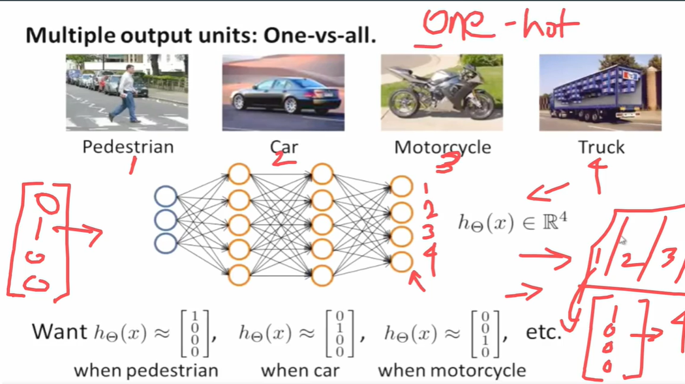

# Neural Networks in Classification Problems

Neural networks are widely used for **classification tasks**, where the goal is to assign input data (x) to **one of several categories** (classes).

---

## 1. **Problem Setup**

* Input: feature vector (x = [x_1, x_2, ..., x_n]^T)
* Output: **predicted class probabilities** (h_\theta(x))
* For **binary classification**: output layer has 1 neuron, using **sigmoid activation**:
  [
  h_\theta(x) = g(z) = \frac{1}{1 + e^{-z}} \in (0,1)
  ]
* For **multi-class classification**: output layer has **K neurons**, using **softmax activation**:
  [
  h_\theta(x)*j = \frac{e^{z_j}}{\sum*{k=1}^K e^{z_k}}, \quad j = 1,2,...,K
  ]

---

## 2. **Network Structure for Classification**

1. **Input layer:** represents features of data (numeric, encoded categorical, images flattened, etc.)
2. **Hidden layers:** extract complex patterns and non-linear relationships
3. **Output layer:**

   * Binary: 1 neuron → sigmoid
   * Multi-class: K neurons → softmax

**Example (binary classification):**

```
Input: x1, x2, x3
     │  │  │
     ▼  ▼  ▼
Hidden Layer1: a1, a2
     │   │
     ▼   ▼
Output Layer: h_theta(x)  (sigmoid)
```

* Forward propagation: compute activations layer by layer
* Backpropagation: compute gradients to update weights

---

## 3. **Loss Function**

* **Binary classification:** Binary Cross-Entropy Loss
  [
  \mathcal{L} = - \frac{1}{m} \sum_{i=1}^{m} \Big[ y_i \log h_\theta(x_i) + (1 - y_i) \log (1 - h_\theta(x_i)) \Big]
  ]

* **Multi-class classification:** Categorical Cross-Entropy Loss
  [
  \mathcal{L} = - \frac{1}{m} \sum_{i=1}^{m} \sum_{j=1}^{K} y_{ij} \log h_\theta(x_i)_j
  ]

* Loss guides **weight updates** through backpropagation.

---

## 4. **Prediction**

* After training, for a new input (x):

  * Compute forward pass → output (h_\theta(x))
  * **Binary:** if (h_\theta(x) > 0.5), predict class 1; else 0
  * **Multi-class:** predict class with maximum probability:
    [
    \hat{y} = \arg\max_j h_\theta(x)_j
    ]

---

## 5. **Example: Binary Classification**

**Network:** 2 inputs → 2 hidden neurons → 1 output neuron (sigmoid)

1. Input: (x = [0.6, 0.9]^T)
2. Forward propagation:

[
\begin{aligned}
z_1^{(1)} &= \theta_{11}^{(1)} x_1 + \theta_{21}^{(1)} x_2 + b_1^{(1)}, & a_1^{(1)} = g(z_1^{(1)}) \
z_2^{(1)} &= \theta_{12}^{(1)} x_1 + \theta_{22}^{(1)} x_2 + b_2^{(1)}, & a_2^{(1)} = g(z_2^{(1)}) \
z^{(2)} &= \theta_1^{(2)} a_1^{(1)} + \theta_2^{(2)} a_2^{(1)} + b^{(2)}, & h_\theta(x) = g(z^{(2)})
\end{aligned}
]

3. Suppose (h_\theta(x) = 0.87 \Rightarrow) predict **class 1**

---

## 6. **Key Steps to Use Neural Networks for Classification**

1. **Prepare Data:** normalize/encode features, split into train/test sets
2. **Define Architecture:** input → hidden layers → output layer (sigmoid/softmax)
3. **Initialize Weights and Biases** (randomly or using Xavier/He initialization)
4. **Forward Propagation:** compute activations layer by layer
5. **Compute Loss:** binary or categorical cross-entropy
6. **Backpropagation:** compute gradients and update weights
7. **Iterate over epochs:** repeat forward + backward passes until convergence
8. **Prediction:** use trained network to compute (h_\theta(x)) for new inputs
9. **Evaluation Metrics:** accuracy, precision, recall, F1-score, confusion matrix

---

## 7. **Advantages of Neural Networks in Classification**

* Can learn **complex, non-linear relationships**
* Works for **binary, multi-class, and multi-label problems**
* Can process **images, text, and sequential data** with appropriate architectures (CNN, RNN)

---

**Summary:**

* Forward propagation = compute probabilities
* Backpropagation = adjust weights based on error
* Output activation = **sigmoid** (binary) or **softmax** (multi-class)
* Loss function = guides learning
* Prediction = **argmax or threshold**

---
---
---

# Neural Network for 4-Class Classification (Pedestrian, Car, Motorcycle, Truck)

For a classification problem with **4 classes**, the network output (h_\theta(x)) is a **4-dimensional vector** representing probabilities of each class.

---

## 1. **Network Structure**

* **Input layer:** feature vector (x \in \mathbb{R}^n) (e.g., image features, sensor data)

* **Hidden layers:** 1 or more layers for feature extraction

* **Output layer:** 4 neurons (one per class)

  * Activation function: **softmax**
    [
    h_\theta(x) = [h_1, h_2, h_3, h_4]^T \in \mathbb{R}^4
    ]

* (h_j = ) probability of class (j)

---

## 2. **Output Representation**

Let classes be:

1. Pedestrian
2. Car
3. Motorcycle
4. Truck

* **One-hot encoding** for target (y):
  [
  y =
  \begin{cases}
  [1,0,0,0]^T & \text{Pedestrian} \
  [0,1,0,0]^T & \text{Car} \
  [0,0,1,0]^T & \text{Motorcycle} \
  [0,0,0,1]^T & \text{Truck}
  \end{cases}
  ]

* Neural network predicts **softmax probabilities**:
  [
  h_\theta(x) = g(z^{(L)}) = \text{softmax}(z) = \frac{e^{z_j}}{\sum_{k=1}^{4} e^{z_k}}, \quad j=1..4
  ]

* Example prediction:
  [
  h_\theta(x) = [0.02, 0.85, 0.10, 0.03]^T \Rightarrow \text{predicted class = Car}
  ]

---

## 3. **Forward Pass (Layer-wise)**

### **Step 1: Input → Hidden Layer 1**

[
z_1^{(1)} = \theta_{11}^{(1)} x_1 + ... + b_1^{(1)}, \quad a_1^{(1)} = g(z_1^{(1)})
]
(similar for all hidden neurons)

### **Step 2: Hidden Layer → Output Layer**

[
z^{(L)} = \theta^T a^{(L-1)} + b
]
[
h_\theta(x)*j = \frac{e^{z_j}}{\sum*{k=1}^4 e^{z_k}}, \quad j=1..4
]

* Each (h_j \in [0,1]), (\sum_{j=1}^{4} h_j = 1)

---

## 4. **Loss Function**

* Use **categorical cross-entropy**:
  [
  \mathcal{L} = - \sum_{j=1}^{4} y_j \log h_\theta(x)_j
  ]

* Example: if true label = Motorcycle, (y = [0,0,1,0]^T), and prediction (h_\theta(x) = [0.05, 0.10, 0.80, 0.05])

[
\mathcal{L} = - (0 \cdot \log 0.05 + 0 \cdot \log 0.10 + 1 \cdot \log 0.80 + 0 \cdot \log 0.05) = -\log(0.80) \approx 0.223
]

---

## 5. **Prediction & Class Representation**

| Predicted Vector (h_\theta(x)) | Predicted Class |
| ------------------------------ | --------------- |
| [0.90, 0.05, 0.03, 0.02]       | Pedestrian      |
| [0.02, 0.85, 0.10, 0.03]       | Car             |
| [0.05, 0.10, 0.80, 0.05]       | Motorcycle      |
| [0.03, 0.02, 0.05, 0.90]       | Truck           |

* **One-hot encoding** for target comparison during training:
  [
  y \in {[1,0,0,0], [0,1,0,0], [0,0,1,0], [0,0,0,1]}
  ]

---

## 6. **Summary**

1. Input (x \in \mathbb{R}^n)
2. Forward propagate through hidden layers → activations (a^{(l)})
3. Output layer: 4 neurons → **softmax** → (h_\theta(x) \in \mathbb{R}^4)
4. Compare (h_\theta(x)) with **one-hot encoded (y)** using categorical cross-entropy
5. Backpropagate error → update weights
6. During inference: **predicted class = argmax(h_\theta(x))**

* This is the **standard representation of multi-class classification in neural networks with one-hot encoding**.

---
---
---

# One-vs-All Neural Network for Multi-Class Classification

In **multi-class classification**, one approach is **one-vs-all (OvA)**, where **multiple output units** are used, one per class.

---

## 1. **Training Set Representation**

* Training examples:
  [
  (x^{(1)}, y^{(1)}), (x^{(2)}, y^{(2)}), \dots, (x^{(m)}, y^{(m)})
  ]
* (x^{(i)} \in \mathbb{R}^n) = feature vector for example (i)
* (y^{(i)} \in \mathbb{R}^K) = **one-hot encoded vector** representing class

**Example: 4 classes (Pedestrian, Car, Motorcycle, Truck)**

| Class      | One-hot Encoding (y^{(i)}) (vertical) |
| ---------- | ------------------------------------- |
| Pedestrian | ([1,0,0,0]^T)                         |
| Car        | ([0,1,0,0]^T)                         |
| Motorcycle | ([0,0,1,0]^T)                         |
| Truck      | ([0,0,0,1]^T)                         |

* Each training output (y^{(i)}) is a **column vector**.
* Total output units = **number of classes** (K).

---

## 2. **Network Output**

* Let network output for example (x^{(i)}) be:
  [
  h_\theta(x^{(i)}) =
  \begin{bmatrix} h_1 \ h_2 \ \vdots \ h_K \end{bmatrix} \in \mathbb{R}^K
  ]

* (h_j) = predicted probability that input belongs to class (j)

* Activation function at output layer: **sigmoid for one-vs-all**, or **softmax** if interpreting as probability distribution:
  [
  h_j = g(z_j) = \frac{1}{1 + e^{-z_j}} \quad \text{(sigmoid)}
  ]
  or
  [
  h_j = \frac{e^{z_j}}{\sum_{k=1}^K e^{z_k}} \quad \text{(softmax)}
  ]

---

## 3. **Forward Pass Example (One-vs-All)**

For 4 classes:

1. Input (x^{(i)} \in \mathbb{R}^n)
2. Hidden layers: compute activations (a^{(l)})
3. Output layer (4 units):
   [
   z^{(L)} = W^T a^{(L-1)} + b, \quad
   h_\theta(x^{(i)}) = [h_1, h_2, h_3, h_4]^T
   ]

* Example: (h_\theta(x^{(i)}) = [0.05, 0.85, 0.08, 0.02]^T \Rightarrow) predict class **Car**

---

## 4. **Loss Function (One-vs-All)**

* Use **sum of binary cross-entropies** (each output unit as a binary classifier):

[
J(\theta) = - \frac{1}{m} \sum_{i=1}^{m} \sum_{j=1}^{K} \Big[ y_j^{(i)} \log h_j(x^{(i)}) + (1 - y_j^{(i)}) \log (1 - h_j(x^{(i)})) \Big]
]

* Each output unit learns to **distinguish its class vs all other classes** → “one-vs-all”

---

## 5. **Training Steps**

1. Initialize weights (W^{(l)}) and biases (b^{(l)})
2. For each training example (x^{(i)}):

   * Forward propagate → compute (h_\theta(x^{(i)}))
   * Compute error (\delta^{(L)} = h_\theta(x^{(i)}) - y^{(i)})
   * Backpropagate error through hidden layers
   * Compute gradients → update weights and biases
3. Repeat for all examples (mini-batch or batch) and epochs

---

## 6. **Prediction**

* For new input (x):
  [
  h_\theta(x) = [h_1, h_2, h_3, h_4]^T
  ]
* Predict class:
  [
  \hat{y} = \arg\max_j h_j
  ]
* Output is **one-hot encoded** if needed:
  [
  \hat{y} = [0,1,0,0]^T \quad \text{(Car)}
  ]

---

## 7. **Representation**

```
Input x^(i) ---> Hidden Layers ---> Output Layer (4 units)
                                         │
                                         ▼
                          h_theta(x^(i)) = [h1, h2, h3, h4]^T
                                         │
                                         ▼
                     One-hot encoded target y^(i) = [0,1,0,0]^T
```

* Each output unit acts as a **binary classifier** for one class versus all others.

---

* This **one-vs-all approach with multiple output units** is standard for **multi-class neural network classification** with **one-hot encoded targets**.



