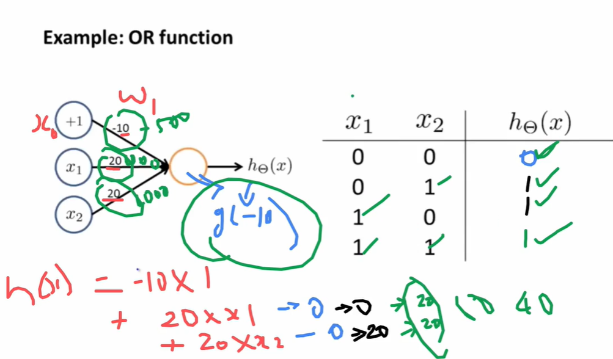

# Understanding Neural Network Weights

**Weights** are the core parameters of a neural network that determine **how input signals are transformed and propagated through the network**. They control the influence of one neuron on the next.

---

## 1. **Definition of Weights**

* Denoted as (\theta_{ij}^{(l)}) (or (W_{ij}^{(l)}))

  * (l) = layer number
  * (i) = neuron in previous layer ((l-1))
  * (j) = neuron in current layer (l)
* **Role:** scale the input from neuron (i) to neuron (j)

**Mathematical Form:**
[
z_j^{(l)} = \sum_{i} \theta_{ij}^{(l)} a_i^{(l-1)} + b_j^{(l)}
]

* (a_i^{(l-1)}) = activation of neuron (i) in previous layer

* (b_j^{(l)}) = bias of neuron (j) in layer (l)

* Weight (\theta_{ij}^{(l)}) determines how strongly **neuron i influences neuron j**.

---

## 2. **Vectorized Representation**

* If previous layer has (n) neurons and current layer has (m) neurons:
  [
  W^{(l)} \in \mathbb{R}^{n \times m}, \quad a^{(l-1)} \in \mathbb{R}^{n \times 1}, \quad b^{(l)} \in \mathbb{R}^{m \times 1}
  ]

* Linear combination:
  [
  z^{(l)} = W^{(l)T} a^{(l-1)} + b^{(l)}, \quad a^{(l)} = g(z^{(l)})
  ]

* Each **column of W** corresponds to weights feeding into one neuron in current layer.

* Each **row of W** corresponds to the weights from a neuron in the previous layer to all neurons in current layer.

---

## 3. **Interpretation of Weights**

1. **Magnitude:**

   * Large absolute value → neuron has **strong influence** on next layer
   * Small value → neuron has **weak influence**

2. **Sign:**

   * Positive → increases the activation of the next neuron
   * Negative → decreases the activation of the next neuron

3. **Learning:**

   * During training, **weights are updated** via gradient descent to **minimize loss**
   * Weights encode **patterns learned from data**

---

## 4. **Example: Simple 2x3 Layer**

* Input layer: 2 neurons ((x_1, x_2))
* Hidden layer: 3 neurons ((h_1, h_2, h_3))

Weight matrix (W^{(1)}) from input → hidden layer:

[
W^{(1)} =
\begin{bmatrix}
w_{11} & w_{12} & w_{13} \
w_{21} & w_{22} & w_{23}
\end{bmatrix}
]

* (w_{11}) = weight from (x_1) → (h_1)
* (w_{21}) = weight from (x_2) → (h_1)
* (w_{12}) = weight from (x_1) → (h_2)
* etc.

Hidden layer linear combination:

[
z_1 = w_{11} x_1 + w_{21} x_2 + b_1
]
[
z_2 = w_{12} x_1 + w_{22} x_2 + b_2
]
[
z_3 = w_{13} x_1 + w_{23} x_2 + b_3
]

* Activations: (a_j = g(z_j))

---

## 5. **Key Points**

* **Weights are trainable parameters** that the network learns from data
* They **modulate the influence** of inputs on outputs
* Represent **connections between neurons**
* Updated using **backpropagation + gradient descent**
* The set of all weights defines the **function the network represents**

---

* Understanding weights is essential to **interpret how a network transforms inputs into outputs**.

---
---
---

# OR Function Using Neural Network

A **neural network can implement the OR logical function** using a simple **single-layer perceptron**.

---

## 1. **OR Function Truth Table**

| x1 | x2 | OR(x1,x2) |
| -- | -- | --------- |
| 0  | 0  | 0         |
| 0  | 1  | 1         |
| 1  | 0  | 1         |
| 1  | 1  | 1         |

* Inputs: (x_1, x_2 \in {0,1})
* Output: (h(x) = x_1 \text{ OR } x_2)

---

## 2. **Single Neuron Model**

* **Inputs:** (x_1, x_2)
* **Weights:** (w_1, w_2)
* **Bias:** (b)
* **Activation Function:** Step or Sigmoid

[
h_\theta(x) = g(z) = g(w_1 x_1 + w_2 x_2 + b)
]

* Step function:
  [
  g(z) =
  \begin{cases}
  1 & z \ge 0 \
  0 & z < 0
  \end{cases}
  ]

* Sigmoid:
  [
  g(z) = \frac{1}{1 + e^{-z}} \quad \text{(threshold at 0.5)}
  ]

---

## 3. **Weight and Bias Selection (Example)**

* Let:
  [
  w_1 = 1, \quad w_2 = 1, \quad b = -0.5
  ]

* Then linear combination:
  [
  z = x_1 \cdot 1 + x_2 \cdot 1 - 0.5 = x_1 + x_2 - 0.5
  ]

* Step activation:

| x1 | x2 | z = x1+x2-0.5 | h(x)=g(z) |
| -- | -- | ------------- | --------- |
| 0  | 0  | -0.5          | 0         |
| 0  | 1  | 0.5           | 1         |
| 1  | 0  | 0.5           | 1         |
| 1  | 1  | 1.5           | 1         |

* Matches **OR function** perfectly.

---

## 4. **Sigmoid Activation Alternative**

* Sigmoid output:
  [
  h(x) = \frac{1}{1 + e^{-z}}
  ]

* Threshold at 0.5 → same OR behavior:

| x1 | x2 | z = x1+x2-0.5 | h(x) | Threshold 0.5 |
| -- | -- | ------------- | ---- | ------------- |
| 0  | 0  | -0.5          | 0.38 | 0             |
| 0  | 1  | 0.5           | 0.62 | 1             |
| 1  | 0  | 0.5           | 0.62 | 1             |
| 1  | 1  | 1.5           | 0.82 | 1             |

---

## 5. **Network Representation**

```
x1 ----\
        \
         [Neuron: weights w1,w2, bias b, activation g()]
        /
x2 ----/

Output h(x) = OR(x1,x2)
```

* Single-layer, single-neuron network is sufficient for **OR function**.

