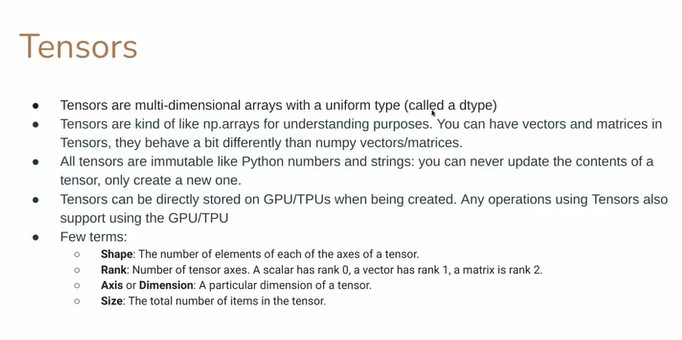
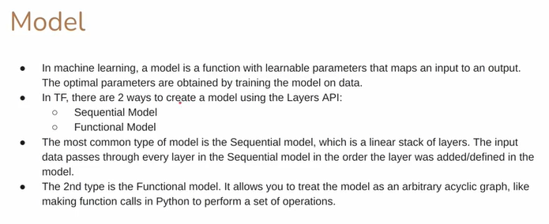
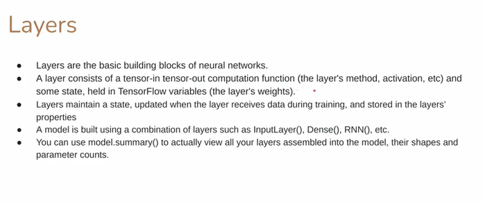
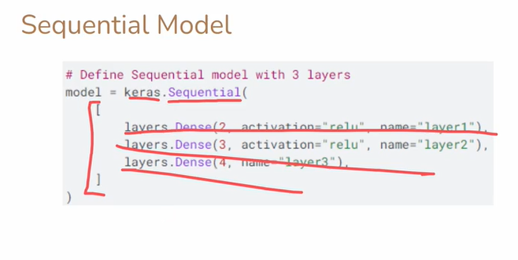
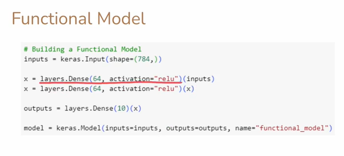
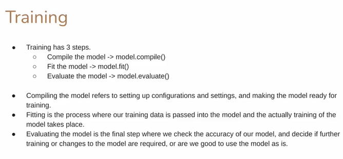

# Understanding **Tensors** in TensorFlow

Tensors are at the **core of everything in TensorFlow** — they are the **main data structure** that holds information and flows through your computation graph.
If you understand tensors well, you understand the foundation of deep learning computation.

---

## 1. **What Are Tensors?**

A **Tensor** is a **multidimensional array with a uniform data type** (all elements must be of the same type, like `float32`, `int64`, etc.).

They are conceptually similar to **NumPy arrays (`np.array`)**, but have **special properties** that make them compatible with **GPU and TPU acceleration** and **TensorFlow’s computation graph**.

### Example:

```python
import tensorflow as tf

# Create a 2D tensor
t = tf.constant([[1, 2, 3], [4, 5, 6]])
print(t)
```

**Output:**

```
tf.Tensor(
[[1 2 3]
 [4 5 6]], shape=(2, 3), dtype=int32)
```

---

## 2. **Tensor vs NumPy Array**

| Feature                                  | Tensor                                    | NumPy Array              |
| ---------------------------------------- | ----------------------------------------- | ------------------------ |
| **Library**                              | TensorFlow                                | NumPy                    |
| **Hardware Support**                     | Can run on CPU, GPU, TPU                  | CPU only                 |
| **Immutability**                         | Immutable (cannot change values in place) | Mutable                  |
| **Graph Execution**                      | Supports TensorFlow’s computation graph   | No graph execution       |
| **Autograd (Automatic Differentiation)** | Built-in via `tf.GradientTape()`          | Not available by default |

---

## 3. **Immutability of Tensors**

Once a tensor is created, **its values cannot be changed directly**.
If you want a modified tensor, TensorFlow creates a **new tensor** instead of editing the old one.

### Example:

```python
x = tf.constant([1, 2, 3])
y = x + 10  # creates a NEW tensor
print(x)    # original tensor unchanged
print(y)    # new tensor created
```

**Output:**

```
tf.Tensor([1 2 3], shape=(3,), dtype=int32)
tf.Tensor([11 12 13], shape=(3,), dtype=int32)
```

---

## 4. **Where Are Tensors Stored?**

Tensors can be stored and processed on **different types of hardware devices**:

| Device  | Description                        | Use Case                                                                       |
| ------- | ---------------------------------- | ------------------------------------------------------------------------------ |
| **CPU** | Central Processing Unit            | Default device for small computations                                          |
| **GPU** | Graphics Processing Unit           | Parallel processing for large tensor operations (matrix multiplications, CNNs) |
| **TPU** | Tensor Processing Unit (by Google) | Specialized chip for massive parallel TensorFlow workloads                     |

TensorFlow automatically decides the best device for your tensor operations, or you can manually assign one:

### Example:

```python
with tf.device('/GPU:0'):
    a = tf.constant([[1.0, 2.0], [3.0, 4.0]])
    b = tf.constant([[2.0, 0.0], [0.0, 2.0]])
    c = tf.matmul(a, b)
print(c)
```

If a GPU is available, TensorFlow will run the operation there automatically.

---

## 5. **Basic Terms About Tensors**

Let’s go through the most important tensor-related terms step by step:

---

### **a. Shape**

The **shape** of a tensor tells you **how many elements** it has along each dimension.

Example:

```python
t = tf.constant([[1, 2, 3],
                 [4, 5, 6]])
print(t.shape)
```

**Output:**

```
(2, 3)
```

This means the tensor has **2 rows** and **3 columns** → shape = `(2, 3)`.

---

### **b. Rank**

The **rank** of a tensor is the **number of dimensions (axes)** it has.

| Tensor Type   | Example                                 | Rank | Description                     |
| ------------- | --------------------------------------- | ---- | ------------------------------- |
| **Scalar**    | `tf.constant(5)`                        | 0    | Single number                   |
| **Vector**    | `tf.constant([1, 2, 3])`                | 1    | 1D list of numbers              |
| **Matrix**    | `tf.constant([[1, 2], [3, 4]])`         | 2    | 2D table                        |
| **3D Tensor** | `tf.constant([[[1], [2]], [[3], [4]]])` | 3    | Like a cube (stack of matrices) |

### Example:

```python
a = tf.constant(4)                      # scalar → rank 0
b = tf.constant([1, 2, 3])              # vector → rank 1
c = tf.constant([[1, 2], [3, 4]])       # matrix → rank 2
d = tf.constant([[[1], [2]], [[3], [4]]]) # 3D tensor → rank 3

print(tf.rank(a).numpy())
print(tf.rank(b).numpy())
print(tf.rank(c).numpy())
print(tf.rank(d).numpy())
```

**Output:**

```
0
1
2
3
```

---

### **c. Axis or Dimension**

An **axis** refers to a **specific dimension** of a tensor along which operations are performed.

For example, in a 2D tensor:

```
[[1, 2, 3],
 [4, 5, 6]]
```

* Axis **0** → rows (vertical direction)
* Axis **1** → columns (horizontal direction)

So:

```python
tf.reduce_sum(t, axis=0)  # sum over rows → gives column sums
tf.reduce_sum(t, axis=1)  # sum over columns → gives row sums
```

---

### **d. Size**

The **size** of a tensor is the **total number of elements** across all dimensions.

Example:

```python
t = tf.constant([[1, 2, 3], [4, 5, 6]])
print(tf.size(t).numpy())  # 2x3 = 6
```

**Output:**

```
6
```

---

## 6. **What Is a Vector in Tensors?**

A **vector** is a **rank-1 tensor**, meaning it has only **one axis** (like a line of numbers).

### Example:

```python
v = tf.constant([10, 20, 30, 40])
print(v.shape)   # (4,)
print(tf.rank(v))  # 1
```

### Visualization:

```
Scalar: 5                    → single value
Vector: [1, 2, 3]            → 1D line
Matrix:
[
 [1, 2],
 [3, 4]
]                            → 2D table
3D Tensor:
[
 [
  [1], [2]
 ],
 [
  [3], [4]
 ]
]                            → cube or stack of matrices
```

---

## 7. **TensorFlow Tensor Data Types**

Common tensor data types:

* `tf.float32`
* `tf.int32`
* `tf.bool`
* `tf.string`

Example:

```python
x = tf.constant([1.0, 2.0, 3.0], dtype=tf.float32)
print(x.dtype)
```

**Output:**

```
<dtype: 'float32'>
```

---

## 8. **Tensor Operations**

Tensors support all kinds of mathematical and logical operations, just like NumPy arrays:

```python
a = tf.constant([1, 2, 3])
b = tf.constant([10, 20, 30])

print(a + b)       # elementwise addition
print(a * b)       # elementwise multiplication
print(tf.matmul([[1, 2]], [[2], [3]]))  # matrix multiplication
```

TensorFlow ensures these operations are executed **efficiently** on the best available device (CPU, GPU, or TPU).

---

## 9. **Key Takeaways**

| Concept              | Meaning                                 | Example                           |
| -------------------- | --------------------------------------- | --------------------------------- |
| **Tensor**           | Multi-dimensional array                 | `tf.constant([[1,2],[3,4]])`      |
| **Shape**            | Number of elements along each dimension | `(2, 2)`                          |
| **Rank**             | Number of dimensions                    | 2                                 |
| **Axis**             | Specific dimension index                | `axis=0`, `axis=1`                |
| **Size**             | Total number of elements                | `tf.size(t)`                      |
| **Scalar**           | Rank 0 tensor                           | `tf.constant(5)`                  |
| **Vector**           | Rank 1 tensor                           | `tf.constant([1,2,3])`            |
| **Matrix**           | Rank 2 tensor                           | `tf.constant([[1,2],[3,4]])`      |
| **Immutability**     | Cannot change values after creation     | New tensor created for new values |
| **Device Placement** | Tensors can run on CPU/GPU/TPU          | `with tf.device('/GPU:0'):`       |

---

## 10. **In Summary**

* **Tensors = Data containers** used by TensorFlow for all computations.
* They can represent **scalars, vectors, matrices, and higher-dimensional data**.
* **Immutable** once created (operations produce new tensors).
* Stored and executed on **CPU, GPU, or TPU** automatically.
* Defined by **shape**, **rank**, **axis**, and **size**.
* They are the **core foundation** for deep learning models in TensorFlow.

---

---

---

---

---

---



# What is a Model in TensorFlow and Machine Learning

A **model** in machine learning is a **mathematical function with trainable parameters** that maps **input data (X)** to **predicted output (Y')**.
During training, the model learns the **best parameters (weights and biases)** that minimize the **difference between predictions and actual outputs (Y)** using a loss function and optimization algorithm.

---

## Example Idea

For example, a simple model that predicts house prices:

```
price = f(size, bedrooms, location) + error
```

Here:

* `f()` is the model (a function),
* “size”, “bedrooms”, “location” = inputs,
* “price” = output,
* the model learns how much each feature contributes to the price.

---

## In TensorFlow: Creating Models Using Layers API

TensorFlow provides two major APIs to create models:

---

### 1. Sequential Model (Linear Stack of Layers)

**Definition:**
A **Sequential model** is the simplest type of model — it’s just a stack of layers, where each layer’s output is directly fed as input to the next layer.

**Key Idea:**
Data flows **linearly** from the first layer to the last, **no branching or multiple inputs/outputs**.

**When to use:**

* When your model has **one input** and **one output**
* When the flow of layers is **strictly one after another**

**Code Example:**

```python
from tensorflow.keras import Sequential
from tensorflow.keras.layers import Dense

# Simple Sequential model
model = Sequential([
    Dense(16, activation='relu', input_shape=(4,)),  # Input + hidden layer
    Dense(8, activation='relu'),                     # Hidden layer
    Dense(1, activation='sigmoid')                   # Output layer
])

model.summary()
```

**Explanation:**

* The `Sequential` container holds the stack of layers.
* Each `Dense` layer is connected to the next.
* Data flows in a straight line → Input → Hidden → Output.

**Example Visualization:**

```
Input → [Dense(16)] → [Dense(8)] → [Dense(1)] → Output
```

---

### 2. Functional Model (Flexible, Graph-Based Model)

**Definition:**
The **Functional API** lets you build **complex architectures** such as:

* Multi-input or multi-output models
* Shared layers
* Models with non-linear topology (like graphs)

**Key Idea:**
You define **how data flows** between layers, using function-like connections.

**When to use:**

* When you need **multiple branches**, **shared layers**, or **custom architecture**
* For **research** or **non-linear model designs**

**Code Example:**

```python
from tensorflow.keras import Model, Input
from tensorflow.keras.layers import Dense

# Define input
inputs = Input(shape=(4,))

# Define path
x = Dense(16, activation='relu')(inputs)
x = Dense(8, activation='relu')(x)
outputs = Dense(1, activation='sigmoid')(x)

# Define model
model = Model(inputs=inputs, outputs=outputs)

model.summary()
```

**Explanation:**

* You explicitly define how each layer connects.
* It’s like writing a Python function graph:

  * `x = layer1(inputs)`
  * `x = layer2(x)`
  * etc.
* You can split or merge layers easily.

**Example Visualization:**

```
        Input
          |
      [Dense(16)]
          |
      [Dense(8)]
          |
      [Dense(1)]
          ↓
        Output
```

---

### Comparison: Sequential vs Functional

| Feature     | Sequential API            | Functional API                       |
| ----------- | ------------------------- | ------------------------------------ |
| Structure   | Linear (one input/output) | Flexible (multi-input/output, graph) |
| Syntax      | Simple list of layers     | Explicit connection of layers        |
| When to Use | Simple feedforward models | Complex/custom architectures         |
| Example Use | Basic MLPs, CNNs          | Residual networks, attention models  |

---

### 3. Model Components (Common to Both)

All models in TensorFlow/Keras share certain key parts:

| Component            | Purpose                                     |
| -------------------- | ------------------------------------------- |
| **Layers**           | Building blocks (Dense, Conv2D, LSTM, etc.) |
| **Weights & Biases** | Learnable parameters                        |
| **Loss Function**    | Measures prediction error                   |
| **Optimizer**        | Updates weights (e.g., Adam, SGD)           |
| **Metrics**          | Track performance (accuracy, etc.)          |
| **Compilation**      | `model.compile(optimizer, loss, metrics)`   |
| **Training**         | `model.fit(X_train, y_train)`               |
| **Evaluation**       | `model.evaluate(X_test, y_test)`            |
| **Prediction**       | `model.predict(X_new)`                      |

---

### Example: Model Workflow

```python
model.compile(optimizer='adam', loss='binary_crossentropy', metrics=['accuracy'])
model.fit(X_train, y_train, epochs=10, batch_size=32)
loss, acc = model.evaluate(X_test, y_test)
predictions = model.predict(X_new)
```

---

### Summary of Key Ideas

* **Model** = Function that maps input → output with learnable parameters.
* **Sequential API** = Linear, easy to use, limited flexibility.
* **Functional API** = Graph-based, powerful, suitable for advanced architectures.
* Both APIs use the **same core concepts** of layers, loss functions, optimizers, and metrics.
* TensorFlow manages computation efficiently across **CPU, GPU, or TPU**.

---

---

---

---

---

---



# layers:

Below is a thorough, teach-style deep dive into **layers** in TensorFlow / Keras — every important term and concept you mentioned, explained with concrete examples, small diagrams, and formulas so you can fully understand how layers work and how they fit into models.

---

## 1) What *is* a layer (high level)

A **layer** is a modular building block of a neural network that performs a **tensor-in → computation → tensor-out** transformation and (optionally) **holds state** (trainable parameters).
Think of a layer as a function `f` with internal memory:

```
output = f(input; parameters)
```

* **Input**: one or more tensors (usually batch-shaped: `(batch_size, ...)`).
* **Computation**: arithmetic ops (matmul, conv, elementwise ops), optional activation.
* **Output**: tensor(s) with defined shape and dtype.
* **State**: `tf.Variable` objects (weights, biases, running stats) that the layer owns.

---

## 2) Tensor in → Tensor out

* Layers accept **tensors** as input and return tensors as outputs.
* Convention: first dimension is **batch** (unknown at graph build time), e.g. shape `(None, height, width, channels)` or `(None, features)`.
* Example: a Dense layer accepts `(batch, input_dim)` and returns `(batch, units)`.

---

## 3) Computation function (what the layer *does*)

A layer defines a computation. For example, a Dense layer computes:

```
y = activation(x @ W + b)
```

where:

* `x` shape: `(batch, input_dim)`
* `W` (kernel) shape: `(input_dim, units)`
* `b` (bias) shape: `(units,)`
* `@` denotes matrix multiplication
* `activation` is a function like `relu`, `sigmoid`, `softmax`, etc.

For a Conv2D layer, the computation is convolution instead of matmul:

```
y = activation(conv2d(x, kernel) + bias)
```

---

## 4) Activation

* **Activation** is a nonlinearity applied after the linear part (e.g., `xW + b`).
* Common activations: `relu`, `sigmoid`, `tanh`, `softmax`, `linear`.
* Purpose: introduce nonlinearity so networks can model complex functions.
* Can be part of the layer (e.g., `Dense(..., activation='relu')`) or separate `tf.keras.layers.Activation('relu')`.

---

## 5) State & TF Variables (layer weights)

* **State** = parameters that persist across calls and get updated during training. Implemented using `tf.Variable`.
* Typical state items:

  * `kernel` / `weights` (trainable)
  * `bias` (trainable)
  * `moving_mean`, `moving_variance` (non-trainable in BatchNorm; updated during training)
* Variables are created via `self.add_weight(...)` inside a layer.

Example creation in a custom layer:

```python
class MyDense(tf.keras.layers.Layer):
    def build(self, input_shape):
        self.kernel = self.add_weight(
            name='kernel',
            shape=(input_shape[-1], self.units),
            initializer='glorot_uniform',
            trainable=True)
        self.bias = self.add_weight(
            name='bias',
            shape=(self.units,),
            initializer='zeros',
            trainable=True)
```

---

## 6) Layers maintain state; training updates it

* During training:

  1. Forward pass: layer uses current variables to compute outputs.
  2. Loss computed.
  3. Backward pass: gradients of loss w.r.t. variables are computed (via `tf.GradientTape` or `model.fit` internals).
  4. Optimizer updates variables (e.g., SGD, Adam).
* Some layers also update non-trainable state (e.g., `BatchNormalization` updates running mean/variance).

---

## 7) Layer properties you will commonly see

* `layer.name` — unique name in model.
* `layer.trainable` — boolean; if `False`, trainable variables are not updated.
* `layer.built` — whether layer has been built (weights created).
* `layer.weights` — list of all weights (trainable + non-trainable).
* `layer.trainable_weights` — subset of weights that are trainable.
* `layer.non_trainable_weights` — e.g., moving averages.
* `layer.dtype` — default dtype for computations.
* `layer.input_spec` — constraints on input shapes/dtypes.
* `layer.losses` — any losses registered by the layer (e.g., activity_regularizer).
* `layer.get_config()` / `from_config()` — serialization helpers.

---

## 8) Common layer methods (what you implement or use)

* `__init__(...)` — set configuration, hyperparameters (units, activation, etc.).
* `build(input_shape)` — create variables (`add_weight`) once input shape is known.
* `call(inputs, training=False)` — define forward computation. `training` flag used by some layers.
* `compute_output_shape(input_shape)` — (optional) compute output shape without running data.
* `get_config()` — for saving/serialization.

Example minimal custom layer:

```python
class MyLayer(tf.keras.layers.Layer):
    def __init__(self, units): 
        super().__init__()
        self.units = units

    def build(self, input_shape):
        self.w = self.add_weight(shape=(input_shape[-1], self.units), initializer='random_normal')

    def call(self, inputs):
        return tf.matmul(inputs, self.w)
```

---

## 9) Trainable vs Non-trainable variables

* **Trainable**: updated by optimizers (weights, biases).
* **Non-trainable**: updated by the layer logic (running stats) or fixed (e.g., embedding with `trainable=False`).
* `model.summary()` reports total params, trainable params, non-trainable params.

---

## 10) Layer types (short tour with purpose)

* **InputLayer / Input**

  * Declares shape and dtype for model input. Not typically trainable.
  * `tf.keras.Input(shape=(...))`

* **Dense (Fully Connected)**

  * Linear transform + optional activation.
  * Good for MLPs, last layers in classification/regression.

* **Conv2D / Conv1D / Conv3D**

  * Convolutional layers for spatial/temporal data (images, audio).
  * Hyperparams: `filters`, `kernel_size`, `strides`, `padding`.

* **Pooling (MaxPooling2D, AveragePooling2D)**

  * Downsampling spatial dimensions.

* **Flatten**

  * Converts multi-D to 1D vector for Dense layers.

* **Dropout**

  * Regularization: randomly zeroes units during training.

* **BatchNormalization**

  * Normalizes activations; has trainable `gamma` and `beta` and non-trainable `moving_mean/moving_var`.

* **Embedding**

  * Maps discrete tokens to dense vectors (used in NLP): `shape=(vocab_size, embedding_dim)`.

* **RNNs (SimpleRNN, LSTM, GRU)**

  * Sequence processing with optional statefulness. State = hidden states that may persist across batches if `stateful=True`.

* **TimeDistributed**

  * Applies a layer to every timestep in sequence data.

* **LayerNormalization, Activation, Lambda**

  * Misc utilities for normalization, activations or arbitrary custom ops.

---

## 11) Stateful vs Stateless layers (especially for RNNs)

* **Stateless** (default): RNN resets hidden state every batch. Inputs are independent across batches.
* **Stateful**: layer retains hidden states between batches (useful when batch is a continuation of sequence). Must manage sequence boundaries and `batch_size` fixed.

---

## 12) Weight initialization, regularization, constraints

* **Initializers**: how weights are initialized: `glorot_uniform`, `he_normal`, `random_normal`, zeros.
* **Regularizers**: add penalties to loss (L1, L2) applied to weights: `kernel_regularizer=tf.keras.regularizers.l2(1e-4)`.
* **Constraints**: force weights to obey constraints after updates (e.g., `max_norm`).
* These are provided when creating layer weights: `add_weight(..., initializer=..., regularizer=..., constraint=...)`.

---

## 13) Parameter count calculations (how model.summary derives numbers)

**Dense layer params**:

```
params = input_dim * units + units (if bias)
```

Example: `Dense(64)` with `input_dim=100` → `100*64 + 64 = 6464 params`.

**Conv2D params**:

```
params = (kernel_h * kernel_w * in_channels * filters) + filters (bias if present)
```

Example: `Conv2D(filters=32, kernel_size=(3,3), in_channels=3)` → `3*3*3*32 + 32 = 9248`.

**BatchNorm params** (per channel): `gamma` and `beta` are trainable (2 * channels). `moving_mean` and `moving_var` are non-trainable (2 * channels).

---

## 14) Forward pass and Backpropagation (how layer participates)

* **Forward pass**: inputs → layer computation (`call`) → outputs.
* **Loss computed**: using outputs and targets.
* **Backward pass**: `tf.GradientTape` or Keras engine computes gradients of loss w.r.t. each trainable variable stored in `trainable_weights`.
* **Update**: optimizer uses gradients to update the variables.

---

## 15) Layer reuse and weight sharing

* If you call the *same layer instance* multiple times, it **shares weights**:

```python
shared_dense = tf.keras.layers.Dense(32)
x1 = shared_dense(inputs1)
x2 = shared_dense(inputs2)  # same kernel & bias used
```

* If you create separate `Dense(32)` each time, weights are separate.

---

## 16) Layer serialization & config

* Layers implement `get_config()` so models and layers can be saved to JSON/config and re-created with `from_config`.
* Saves architecture + weights (weights saved separately in HDF5/TF SavedModel).

---

## 17) Useful layer attributes & API examples

Create a Dense layer and inspect properties:

```python
layer = tf.keras.layers.Dense(10, activation='relu', name='dense1')
x = tf.random.normal((4, 8))         # batch=4, input_dim=8
y = layer(x)                         # triggers build() and create weights
print(layer.built)                   # True
print(layer.weights)                 # [kernel, bias]
print(layer.trainable_weights)       # same as weights here
print(layer.output_shape)            # (None, 10)
```

Custom layer full example (with regularizer, constraint):

```python
class MyDense(tf.keras.layers.Layer):
    def __init__(self, units, kernel_regularizer=None, kernel_constraint=None):
        super().__init__()
        self.units = units
        self.kernel_regularizer = tf.keras.regularizers.get(kernel_regularizer)
        self.kernel_constraint = tf.keras.constraints.get(kernel_constraint)

    def build(self, input_shape):
        self.kernel = self.add_weight('kernel', shape=(input_shape[-1], self.units),
                                      initializer='glorot_uniform',
                                      regularizer=self.kernel_regularizer,
                                      constraint=self.kernel_constraint)
        self.bias = self.add_weight('bias', shape=(self.units,), initializer='zeros')

    def call(self, inputs):
        return tf.matmul(inputs, self.kernel) + self.bias
```

---

## 18) `model.summary()` — how to read it

`model.summary()` prints a table that includes:

* **Layer (type)** — name and class
* **Output shape** — shape of the output tensor for that layer (first dim is batch: `None` unless fixed)
* **Param #** — number of trainable + non-trainable params in that layer

At bottom:

* **Total params** = sum of all params
* **Trainable params** = subset optimized by optimizer
* **Non-trainable params** = e.g., running means, embeddings with `trainable=False`

Example:

```
Layer (type)                Output Shape              Param #
================================================================
dense1 (Dense)              (None, 64)               6464
dense2 (Dense)              (None, 10)               650
================================================================
Total params: 7,114
Trainable params: 7,114
Non-trainable params: 0
```

---

## 19) Misc important terms briefly explained

* **input_shape**: the shape of a single input sample excluding batch. Example: `input_shape=(28,28,1)`.
* **batch dimension**: first dimension of input; often `None` in definition to allow variable batch size.
* **dtype**: data type, e.g., `float32`, `int32`.
* **masking**: mechanism for sequences where some timesteps are padding; layers can support masks to ignore those timesteps.
* **supports_masking**: layer property indicating whether layer respects mask tensors.
* **activity_regularizer**: function applied to activations producing added loss (rare).
* **call(..., training=...)**: some layers behave differently during training vs inference (e.g., Dropout, BatchNorm).

---

## 20) Concrete walkthrough: Dense layer end-to-end

1. You define:

```python
layer = tf.keras.layers.Dense(32, activation='relu', input_shape=(100,))
```

2. On first call `layer.build(input_shape=(None,100))` creates:

   * `kernel` shape `(100,32)`
   * `bias` shape `(32,)`
3. Forward pass for one batch `x`:

   * compute `z = x @ kernel + bias`
   * `y = relu(z)`
4. During training:

   * compute loss `L(y, target)`
   * backprop to get `dL/dkernel`, `dL/dbias`
   * optimizer updates kernel & bias.

Parameter count: `100*32 + 32 = 3232`.

---

## 21) Summary checklist (short study guide)

* A **layer** = tensor-in → computation → tensor-out + optional state (tf.Variables).
* **Weights** are `tf.Variable`; created in `build()` via `add_weight`.
* `call()` implements forward computation.
* `trainable` controls whether weights are updated.
* `model.summary()` reports shapes and param counts.
* **Common layers**: Dense, Conv, Pooling, BatchNorm, Dropout, Embedding, RNNs.
* **Custom layers**: implement `__init__`, `build`, `call`, `get_config`.
* **Stateful RNNs** keep hidden state across batches; most layers are stateless.
* **Reusing a layer instance** shares weights; creating new instances makes new parameters.

---

If you want, I can:

* show parameter-count examples for Conv2D and LSTM with numbers,
* create a small network and print `model.summary()` with explanation for each line,
* or provide a complete annotated custom layer implementation (with regularizer, constraint, and get_config) — tell me which and I’ll produce it next.

---

---

---

---

---



# Creating a Sequential Model Using Keras

Let’s now break down **step-by-step** how to create a **Sequential model** in TensorFlow/Keras, what each **term, class, method, and parameter** means, and how **Dense** layers and **activation functions** fit into it — like teaching a full classroom from first principles.

---

## 1) What is a Sequential Model?

A **Sequential model** is a **linear stack of layers** — meaning the data flows **straight through each layer** in order, from input to output.

Think of it as:

```
Input → Layer 1 → Layer 2 → Layer 3 → Output
```

You use `tf.keras.Sequential()` to define it.

---

## 2) The Syntax

```python
from tensorflow.keras.models import Sequential
from tensorflow.keras.layers import Dense, Activation
```

* `Sequential` → the **container** that holds all layers in order.
* `Dense` → the **fully connected (dense)** layer where every neuron connects to all neurons in the next layer.
* `Activation` → adds a **nonlinear function** (like ReLU, Sigmoid, etc.) to introduce complexity to model the data.

---

## 3) The Typical Structure

```python
model = Sequential([
    Dense(16, input_shape=(4,), activation='relu'),
    Dense(8, activation='relu'),
    Dense(1, activation='sigmoid')
])
```

Let’s dissect **every single piece**.

---

## 4) Line-by-Line Breakdown

### ① `model = Sequential([...])`

* Creates a **model object**.
* It will hold layers in the order listed.
* Acts like a **pipeline** for data to pass through.
* Once created, you can add or remove layers or print a summary.

```python
model = Sequential()
```

You can also add layers later:

```python
model.add(Dense(16, activation='relu', input_shape=(4,)))
model.add(Dense(8, activation='relu'))
model.add(Dense(1, activation='sigmoid'))
```

---

### ② `Dense(16, input_shape=(4,), activation='relu')`

**Dense Layer** = Fully Connected Layer

Each neuron receives input from **all** neurons in the previous layer.

#### Parameters Explained:

| Parameter             | Meaning                                                                               |
| --------------------- | ------------------------------------------------------------------------------------- |
| **16**                | `units` = number of neurons in this layer                                             |
| **input_shape=(4,)**  | shape of input tensor (excluding batch size). For example, 4 features per data sample |
| **activation='relu'** | activation function used after the linear transformation                              |

#### Internally:

```
output = activation(input @ weights + bias)
```

* `input` → tensor of shape `(batch_size, 4)`
* `weights` → `(4, 16)`
* `bias` → `(16,)`
* `output` → `(batch_size, 16)`
* activation = ReLU (Rectified Linear Unit): `f(x) = max(0, x)`

---

### ③ `Dense(8, activation='relu')`

* Second hidden layer
* Takes the previous layer’s output as input
* 8 neurons, each connected to all 16 from before

Computation:

```
output = relu(previous_output @ W + b)
```

Where `W` has shape `(16, 8)` and `b` is `(8,)`

---

### ④ `Dense(1, activation='sigmoid')`

* **Output layer**
* One neuron (because maybe binary classification)
* `sigmoid` activation maps output to range (0, 1)
* Useful for probabilities:

  ```
  sigmoid(x) = 1 / (1 + exp(-x))
  ```
* So output shape = `(batch_size, 1)`

---

## 5) Summary Table of Layer Details

| Layer             | Input Shape | Output Shape | Activation | Parameters (Weights + Biases) |
| ----------------- | ----------- | ------------ | ---------- | ----------------------------- |
| Dense(16, relu)   | (4,)        | (16,)        | ReLU       | 4×16 + 16 = 80                |
| Dense(8, relu)    | (16,)       | (8,)         | ReLU       | 16×8 + 8 = 136                |
| Dense(1, sigmoid) | (8,)        | (1,)         | Sigmoid    | 8×1 + 1 = 9                   |

**Total Params = 80 + 136 + 9 = 225**

---

## 6) Activation Functions: What They Are and Why They Matter

Activation functions are what make neural networks **nonlinear**, allowing them to learn **complex** mappings.

| Activation  | Formula                     | Output Range     | Purpose                                |
| ----------- | --------------------------- | ---------------- | -------------------------------------- |
| **ReLU**    | `f(x) = max(0, x)`          | [0, ∞)           | Fast, prevents vanishing gradients     |
| **Sigmoid** | `1 / (1 + e^-x)`            | (0, 1)           | Probabilities in binary classification |
| **Tanh**    | `(e^x - e^-x)/(e^x + e^-x)` | (-1, 1)          | Centered nonlinear mapping             |
| **Softmax** | `e^(x_i) / Σ e^(x_j)`       | (0,1), sums to 1 | Multi-class probability distribution   |

You can specify them in two ways:

**Inside Dense:**

```python
Dense(16, activation='relu')
```

**Or as separate layer:**

```python
Dense(16)
Activation('relu')
```

Both are equivalent.

---

## 7) Viewing Model Architecture

Use:

```python
model.summary()
```

**Output Example:**

```
Model: "sequential"
_________________________________________________________________
 Layer (type)                Output Shape              Param #
=================================================================
 dense (Dense)               (None, 16)                80
 dense_1 (Dense)             (None, 8)                 136
 dense_2 (Dense)             (None, 1)                 9
=================================================================
Total params: 225
Trainable params: 225
Non-trainable params: 0
_________________________________________________________________
```

**Explanation:**

* `(None, 16)` → “None” = variable batch size
* “Param #” = number of trainable parameters (weights + biases)

---

## 8) Training the Model (optional next step)

After defining the model, we **compile** and **train** it.

```python
model.compile(
    optimizer='adam',                 # algorithm for updating weights
    loss='binary_crossentropy',       # what model tries to minimize
    metrics=['accuracy']              # what performance to track
)

model.fit(X_train, y_train, epochs=10, batch_size=32)
```

---

## 9) Conceptual Visualization

```
Input(4)
  ↓
Dense(16, ReLU)
  ↓
Dense(8, ReLU)
  ↓
Dense(1, Sigmoid)
  ↓
Output(1)
```

This pipeline transforms a 4-feature input vector into a single output value between 0 and 1.

---

## 10) Each Term in the Code — Summary Definition

| Code Term         | Meaning                                                    |
| ----------------- | ---------------------------------------------------------- |
| `Sequential()`    | Container that stacks layers linearly                      |
| `Dense()`         | Fully connected layer (core computation block)             |
| `units`           | Number of neurons in that layer                            |
| `input_shape`     | Expected shape of one sample (excluding batch size)        |
| `activation`      | Nonlinear function to apply after linear transformation    |
| `relu`, `sigmoid` | Specific activation function types                         |
| `model.add()`     | Adds layer to model sequentially                           |
| `model.summary()` | Prints model architecture, shape, parameter count          |
| `compile()`       | Configures model for training (loss, optimizer, metrics)   |
| `fit()`           | Starts training (forward pass + backpropagation + updates) |

---

## 11) Short Example (from scratch)

```python
import tensorflow as tf
from tensorflow.keras.models import Sequential
from tensorflow.keras.layers import Dense

# Step 1: Create Sequential model
model = Sequential()

# Step 2: Add layers
model.add(Dense(16, activation='relu', input_shape=(4,)))
model.add(Dense(8, activation='relu'))
model.add(Dense(1, activation='sigmoid'))

# Step 3: Compile
model.compile(optimizer='adam', loss='binary_crossentropy', metrics=['accuracy'])

# Step 4: Print model summary
model.summary()
```

---

## 12) Memory Hook: “Sequential Model Anatomy”

```
Sequential()
  ├── Dense(...) → weights, bias, activation
  ├── Dense(...) → weights, bias, activation
  └── Dense(...) → weights, bias, activation
```

Each Dense layer:

```
tensor_in  →  linear transform (Wx + b)  →  activation()  →  tensor_out
```

---

---

---

---

---

---



# Functional Model — Input, `layers.Dense`, Shape, Passing Function (`inputs`), and Advantages/Disadvantages (“Chunk Way”)

---

## 1) **Functional Model Overview**

The **Functional API** in TensorFlow/Keras is a flexible way to create models.
Instead of stacking layers linearly (like `Sequential`), you **connect layers like functions** to build a **computational graph** — hence the name *“chunk way”* (you build the model piece by piece).

Think of it as **defining a flow of data** from **input → transformations (layers) → output**.

---

## 2) **Input Layer (`Input()`)**

### Definition:

`Input()` defines the **entry point** (placeholder) of the data that will flow through the model.
It’s the symbolic start of your neural network graph.

### Syntax:

```python
from tensorflow.keras.layers import Input
inputs = Input(shape=(4,))
```

### Meaning:

* The input tensor’s **shape** (here `(4,)`) tells Keras:
  “Each training example has 4 features.”
* Batch size is automatically handled → input shape becomes `(None, 4)` internally.

### Analogy:

If the model is a pipeline, `Input()` is the **funnel** through which data enters.

---

## 3) **Dense Layers (`layers.Dense`)**

### Definition:

`Dense` layers are **fully connected neural layers**, where each neuron is connected to all neurons from the previous layer.

### Formula:

```
output = activation(Wx + b)
```

Where:

* `W` = layer weights
* `x` = input tensor
* `b` = bias
* `activation()` = nonlinear transformation (e.g. ReLU, sigmoid)

### Example:

```python
from tensorflow.keras.layers import Dense

x = Dense(16, activation='relu')(inputs)
```

### Explanation:

* You’re **calling** the layer like a **function**: `Dense(...)(inputs)`
* The first `Dense` layer takes `inputs` and computes output → stored in `x`
* This output (`x`) can now be passed to the next layer

---

## 4) **Shape in Functional Model**

Shape defines **how many numbers** each sample has and **how data flows** between layers.

### Example Shape Flow:

| Layer     | Input Shape | Output Shape |
| --------- | ----------- | ------------ |
| Input     | (4,)        | (4,)         |
| Dense(16) | (4,)        | (16,)        |
| Dense(8)  | (16,)       | (8,)         |
| Dense(1)  | (8,)        | (1,)         |

* The shape changes with each layer depending on the number of neurons (`units`).
* TensorFlow automatically infers the output shape from the input.

---

## 5) **Passing Function (`inputs`) — The "Chunk Way"**

In the functional approach, **each layer acts like a function** that takes a tensor and outputs another tensor.

You **pass the output of one layer as input to the next**.
That’s why it’s sometimes called the *chunk way* — you build the model step-by-step like a function pipeline.

### Example:

```python
from tensorflow.keras.layers import Input, Dense
from tensorflow.keras.models import Model

# Step 1: Define input
inputs = Input(shape=(4,))

# Step 2: Pass input to hidden layers
x = Dense(16, activation='relu')(inputs)  # Chunk 1
x = Dense(8, activation='relu')(x)        # Chunk 2

# Step 3: Define output layer
outputs = Dense(1, activation='sigmoid')(x)

# Step 4: Define model (connect first and last chunk)
model = Model(inputs=inputs, outputs=outputs)

model.summary()
```

### Explanation:

1. `inputs` — defines starting tensor
2. `Dense(...)(inputs)` — layer acts as a **function call**
3. Each line builds one “chunk” of computation
4. Finally, we join **first tensor (inputs)** and **last tensor (outputs)** into a complete model:

   ```python
   model = Model(inputs, outputs)
   ```

### Analogy:

Python-style function composition:

```python
def model_fn(x):
    x = layer1(x)
    x = layer2(x)
    return output_layer(x)
```

The Functional API mirrors this logic.

---

## 6) **Advantages of Functional (“Chunk Way”) Model**

| Advantage                             | Explanation                                                                                             |
| ------------------------------------- | ------------------------------------------------------------------------------------------------------- |
| **1. Flexible Architecture**          | You can create models with **multiple inputs/outputs**, **shared layers**, or **nonlinear topologies**. |
| **2. Graph-Like Structure**           | The entire model is a directed acyclic graph (DAG). Perfect for visualizing and debugging.              |
| **3. Reusable Components**            | You can reuse layers or outputs for new branches.                                                       |
| **4. Access to Intermediate Outputs** | You can extract any layer’s output easily for visualization or feature extraction.                      |
| **5. Supports Complex Models**        | Can create models like **ResNet**, **Inception**, **Siamese**, **Encoder-Decoder**, etc.                |
| **6. Explicit Input & Output**        | `Model(inputs, outputs)` makes the flow of data very clear.                                             |

---

## 7) **Disadvantages of Functional (“Chunk Way”) Model**

| Disadvantage                    | Explanation                                                                                                     |
| ------------------------------- | --------------------------------------------------------------------------------------------------------------- |
| **1. Slightly More Code**       | More verbose than Sequential for simple models.                                                                 |
| **2. More Conceptual Overhead** | Beginners might find the symbolic graph concept confusing.                                                      |
| **3. Fixed Graph Once Defined** | Once built, the computation graph is static; you can’t easily modify the flow dynamically (unlike subclassing). |
| **4. Manual Connection Needed** | You must explicitly connect input and output tensors — can be error-prone if layers mismatch.                   |

---

## 8) **When to Use the Functional API**

| Situation                                                       | Recommendation           |
| --------------------------------------------------------------- | ------------------------ |
| Simple linear stack of layers                                   | Use **Sequential** model |
| Model with **multiple inputs/outputs**                          | Use **Functional API**   |
| Need **layer reuse** (same weights in two paths)                | Functional               |
| Need **branching or merging** (skip connections, concatenation) | Functional               |
| Want to **inspect intermediate layers**                         | Functional               |

---

## 9) **Example Comparison**

### Sequential API:

```python
from tensorflow.keras.models import Sequential
from tensorflow.keras.layers import Dense

model = Sequential([
    Dense(16, activation='relu', input_shape=(4,)),
    Dense(8, activation='relu'),
    Dense(1, activation='sigmoid')
])
```

### Functional API (Chunk Way):

```python
from tensorflow.keras.layers import Input, Dense
from tensorflow.keras.models import Model

inputs = Input(shape=(4,))
x = Dense(16, activation='relu')(inputs)
x = Dense(8, activation='relu')(x)
outputs = Dense(1, activation='sigmoid')(x)

model = Model(inputs, outputs)
```

**Output:** Both produce the same neural network.
The only difference: Functional gives **greater flexibility** to extend.

---

## 10) **Visual Representation of Functional Model Flow**

```
Input(shape=(4,))
       │
       ▼
Dense(16, activation='relu')
       │
       ▼
Dense(8, activation='relu')
       │
       ▼
Dense(1, activation='sigmoid')
       │
       ▼
   Output (Prediction)
```

Each arrow shows the **passing of tensors** between layers — the essence of the “chunk way”.

---

## 11) **Key Takeaways**

* `Input()` defines **model’s entry point**.
* `Dense()` is a **fully connected layer** with trainable weights.
* `shape` defines the **dimensionality** of data at each step.
* Each layer behaves like a **function** that takes tensors in and outputs new tensors.
* You **connect** the first and last layers using:

  ```python
  model = Model(inputs, outputs)
  ```
* Functional API = “Chunk way” because you assemble your model **piece by piece**.

---

---

---

---

---

---



# Training a Model in TensorFlow / Keras — Detailed Explanation

(Compile → Fit → Evaluate)

---

## 1) **Overview of the Training Pipeline**

Training a neural network in TensorFlow/Keras typically involves **three major steps**:

1. **Compile the model** → define *how* the model will learn
2. **Fit the model** → train the model on data (adjust weights)
3. **Evaluate the model** → test how well it performs on unseen data

These three steps are always executed **in this order**.

---

## 2) **Step 1: Compiling the Model**

### Meaning:

Compiling a model means **configuring the model for training**.
It’s where you tell TensorFlow:

* What **loss function** to minimize
* Which **optimizer** to use
* Which **metrics** to track during training

Without compiling, the model **cannot start learning**.

---

### Syntax:

```python
model.compile(optimizer='adam', loss='binary_crossentropy', metrics=['accuracy'])
```

### Main Parameters of `compile()`:

| Parameter     | Purpose                                                            | Example                                                        |
| ------------- | ------------------------------------------------------------------ | -------------------------------------------------------------- |
| **optimizer** | Decides how the model’s weights are updated to minimize loss       | `'adam'`, `'sgd'`, `'rmsprop'`, etc.                           |
| **loss**      | Function that measures how far predictions are from actual targets | `'mse'`, `'binary_crossentropy'`, `'categorical_crossentropy'` |
| **metrics**   | Values monitored during training & evaluation                      | `'accuracy'`, `'mae'`, `'precision'`, `'recall'`               |

---

### Example:

```python
model.compile(
    optimizer='adam',
    loss='sparse_categorical_crossentropy',
    metrics=['accuracy']
)
```

### Explanation:

* **optimizer='adam'** → adaptive optimizer that tunes learning rates
* **loss='sparse_categorical_crossentropy'** → used for multi-class classification
* **metrics=['accuracy']** → reports training/test accuracy after each epoch

---

### Behind the Scenes:

When you call `compile()`, Keras:

1. Binds the **loss function** to the model’s output
2. Assigns the **optimizer algorithm**
3. Sets up **metrics tracking**
4. Prepares a **computational graph** for gradient descent

It’s like **setting up your car** before a race — choosing fuel (optimizer), goal (loss), and dashboard metrics (accuracy).

---

## 3) **Step 2: Fitting the Model (Training)**

### Meaning:

“Fitting” is the **actual training process** — the model sees data and learns to map inputs → outputs by adjusting weights to minimize the loss function.

### Syntax:

```python
history = model.fit(X_train, y_train, epochs=10, batch_size=32, validation_data=(X_val, y_val))
```

### Parameters:

| Parameter            | Description                                                                    |
| -------------------- | ------------------------------------------------------------------------------ |
| **X_train, y_train** | Training data and corresponding labels                                         |
| **epochs**           | How many times the entire dataset passes through the network                   |
| **batch_size**       | Number of samples per gradient update                                          |
| **validation_data**  | Optional; evaluates performance on unseen data during training                 |
| **verbose**          | Controls output display (0 = silent, 1 = progress bar, 2 = one line per epoch) |

---

### What Happens Internally:

For each **epoch**:

1. The training data is split into **batches**
2. Each batch is fed into the model
3. The model makes predictions → computes **loss**
4. The **optimizer** adjusts the weights to minimize loss
5. After each epoch, metrics (accuracy, loss) are logged
6. If `validation_data` is given, the model checks how it generalizes

---

### Example:

```python
history = model.fit(
    X_train, y_train,
    epochs=20,
    batch_size=32,
    validation_split=0.2
)
```

### Output Example:

```
Epoch 1/20
125/125 [==============================] - 1s 6ms/step - loss: 0.68 - accuracy: 0.55 - val_loss: 0.62 - val_accuracy: 0.68
Epoch 2/20
...
```

Here:

* `loss` and `accuracy` = training metrics
* `val_loss` and `val_accuracy` = validation metrics

---

### Returned Object — `history`

The `fit()` function returns a **History** object storing all training metrics:

```python
import matplotlib.pyplot as plt

plt.plot(history.history['accuracy'], label='train_acc')
plt.plot(history.history['val_accuracy'], label='val_acc')
plt.legend()
plt.show()
```

This helps visualize model performance over time.

---

## 4) **Step 3: Evaluating the Model**

### Meaning:

Once the model is trained, we test it on **unseen (test) data** to check how well it performs.

Evaluation gives you the **final loss and metric values**.

### Syntax:

```python
test_loss, test_acc = model.evaluate(X_test, y_test)
```

### Example Output:

```
32/32 [==============================] - 0s 3ms/step - loss: 0.45 - accuracy: 0.82
```

### Interpretation:

* The trained model achieved **82% accuracy** on unseen test data.
* You can use this to decide whether:

  * The model is performing well enough
  * More training or tuning is needed

---

### Optional: Making Predictions

After evaluation, you can use the model to make predictions:

```python
predictions = model.predict(X_new)
```

---

## 5) **Putting It All Together**

```python
from tensorflow.keras.models import Sequential
from tensorflow.keras.layers import Dense

# 1. Build the model
model = Sequential([
    Dense(16, activation='relu', input_shape=(4,)),
    Dense(8, activation='relu'),
    Dense(1, activation='sigmoid')
])

# 2. Compile
model.compile(optimizer='adam', loss='binary_crossentropy', metrics=['accuracy'])

# 3. Fit (Train)
history = model.fit(X_train, y_train, epochs=10, batch_size=32, validation_split=0.2)

# 4. Evaluate (Test)
loss, acc = model.evaluate(X_test, y_test)

print(f"Test Loss: {loss:.4f}, Test Accuracy: {acc:.4f}")
```

---

## 6) **Analogy Summary**

| Step         | What It Means                     | Analogy                                                |
| ------------ | --------------------------------- | ------------------------------------------------------ |
| **Compile**  | Set up the training configuration | Choosing your car’s engine, gear system, and dashboard |
| **Fit**      | Train the model on data           | Driving laps to improve performance                    |
| **Evaluate** | Test model performance            | Racing on a new track to check how good you’ve become  |

---

## 7) **Extra Notes**

* **Underfitting:** Model performs poorly on both training & test data → needs more training or complexity.
* **Overfitting:** Model performs well on training data but poorly on test data → needs regularization or more data.
* **Early Stopping:** Stop training when validation accuracy stops improving.
* **Model Saving:** After good performance, save it:

  ```python
  model.save('trained_model.h5')
  ```

---

## 8) **Summary Table**

| Step            | Function           | Purpose                               |
| --------------- | ------------------ | ------------------------------------- |
| **1. Compile**  | `model.compile()`  | Configure optimizer, loss, metrics    |
| **2. Fit**      | `model.fit()`      | Train model using training data       |
| **3. Evaluate** | `model.evaluate()` | Test model performance on unseen data |

---

---

---

---

---

---


