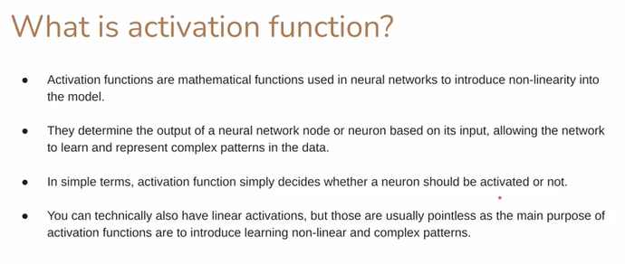
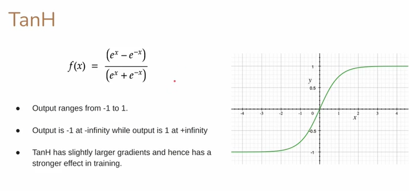

# Activation Functions — Detailed Explanation

---

## 1) **What is an Activation Function?**

An **activation function** is a **mathematical function applied to a neuron’s output** in a neural network.

It decides **how much signal should pass forward** and introduces **nonlinearity** to the network.

---

### Simple Analogy:

* Think of a neuron like a **gate**:

  * Input comes in → activation function decides whether the neuron **fires** (produces output) or not.
* Without activation functions, a neural network is just a **linear function**, no matter how many layers it has.

---

## 2) **Purpose of Activation Functions**

1. **Introduce Nonlinearity**

   * Real-world data is usually nonlinear.
   * Nonlinear activations allow neural networks to **learn complex patterns** like images, speech, and text.

2. **Control Output Range**

   * Some activations squash outputs to a specific range, like `[0, 1]` or `[-1, 1]`.

3. **Decide Neuron Activation**

   * Determines whether a neuron contributes to the final prediction.

4. **Enable Deep Learning**

   * Without activations, stacking layers is useless — multiple linear layers are equivalent to a single linear layer.

---

## 3) **Linear vs Nonlinear Activation**

### Linear:

```
f(x) = x
```

* Output = input
* No nonlinearity → network cannot learn complex patterns
* Rarely used in hidden layers

### Nonlinear (most commonly used):

* **ReLU**, **Sigmoid**, **Tanh**, **Softmax**, etc.
* Allows the network to approximate any function (universal function approximation).

---

## 4) **Common Activation Functions**

| Function                          | Formula                             | Output Range     | Use Case                                                        |
| --------------------------------- | ----------------------------------- | ---------------- | --------------------------------------------------------------- |
| **ReLU (Rectified Linear Unit)**  | `f(x) = max(0, x)`                  | [0, ∞)           | Hidden layers; efficient and reduces vanishing gradient problem |
| **Sigmoid**                       | `f(x) = 1 / (1 + e^-x)`             | (0, 1)           | Binary classification output layer (probabilities)              |
| **Tanh (Hyperbolic Tangent)**     | `f(x) = (e^x - e^-x)/(e^x + e^-x)`  | (-1, 1)          | Hidden layers; zero-centered output                             |
| **Softmax**                       | `f(x_i) = e^(x_i)/Σ e^(x_j)`        | (0,1), sums to 1 | Multi-class classification output layer                         |
| **Leaky ReLU**                    | `f(x) = x if x>0 else 0.01*x`       | (-∞, ∞)          | Variant of ReLU to avoid dead neurons                           |
| **ELU (Exponential Linear Unit)** | `f(x) = x if x>0 else α*(exp(x)-1)` | (-α, ∞)          | Smooth output, faster learning than ReLU in some cases          |

---

## 5) **How Activation Works in a Neuron**

For a single neuron:

```
output = activation(weighted_sum(input) + bias)
```

* `weighted_sum(input) + bias` → linear combination
* `activation()` → nonlinear transformation

Example:

```python
from tensorflow.keras.layers import Dense

Dense(16, activation='relu')  # Applies ReLU to the neuron output
```

* 16 neurons → each applies ReLU individually

---

## 6) **Why Not Use Linear Activation in Hidden Layers?**

* Stacking multiple linear layers = still linear
* No added complexity → cannot model real-world nonlinear patterns
* Activation functions like ReLU, Sigmoid, Tanh allow **learning of complex features**.

---

## 7) **Activation in Keras**

1. **Specified inside layer**:

```python
Dense(16, activation='relu')
```

2. **Separate layer**:

```python
from tensorflow.keras.layers import Activation, Dense

x = Dense(16)(input)
x = Activation('relu')(x)
```

Both methods are equivalent.

---

## 8) **Summary Table — Choosing Activation Functions**

| Layer Type         | Recommended Activation      |
| ------------------ | --------------------------- |
| Hidden Layers      | ReLU, Leaky ReLU, ELU, Tanh |
| Binary Output      | Sigmoid                     |
| Multi-class Output | Softmax                     |
| Regression Output  | Linear                      |

---

## 9) **Key Takeaways**

* Activation functions **decide if a neuron fires**.
* They introduce **nonlinearity**, making the network capable of learning complex patterns.
* Hidden layers almost always use **nonlinear activations**.
* Output layer activation depends on the **type of problem** (classification/regression).

---

---

---

---

---

---


# Sigmoid Activation Function — Detailed Explanation

---

## 1) **Definition**

The **sigmoid function** is a **nonlinear activation function** commonly used in neural networks, especially for **binary classification problems**.

Mathematical formula:

[
S(x) = \frac{1}{1 + e^{-x}}
]

Where:

* (x) = input to the neuron (weighted sum of inputs + bias)
* (S(x)) = output of the neuron after activation

---

## 2) **Properties**

1. **Output Range**: (0 < S(x) < 1)

   * For large negative inputs → output ≈ 0
   * For large positive inputs → output ≈ 1

2. **Monotonic**: Always increasing, never decreases

3. **S-Shaped Curve (Sigmoid Curve)**:

   * Centered at x = 0 → output = 0.5
   * Smooth, differentiable everywhere

4. **Nonlinearity**: Introduces nonlinearity into the network → enables learning complex patterns

5. **Derivative** (used in backpropagation):
   [
   S'(x) = S(x) \cdot (1 - S(x))
   ]

* Simple and efficient for computing gradients

---

## 3) **Graphical Representation**

```
Output
1 |                             *
  |                           *
0.8|                        *
  |                     *
0.5|---------*------------------ x
  |                 *
0.2|             *
  |          *
0 |       *
  +----------------------------- Input
       -∞          0          +∞
```

### Observations from Graph:

* Very small input → neuron nearly “off” (output ≈ 0)
* Input = 0 → neuron half-activated (output = 0.5)
* Very large input → neuron fully activated (output ≈ 1)

---

## 4) **How Sigmoid Works in a Neuron**

1. Compute weighted sum:
   [
   z = \sum w_i x_i + b
   ]

2. Pass it through sigmoid:
   [
   a = S(z) = \frac{1}{1 + e^{-z}}
   ]

3. Output (a) becomes the **input to the next layer** or **final prediction**.

---

### Example:

```python
from tensorflow.keras.layers import Dense
from tensorflow.keras.models import Sequential

model = Sequential([
    Dense(8, activation='sigmoid', input_shape=(4,)),
    Dense(1, activation='sigmoid')  # Output layer for binary classification
])
```

* Hidden layer: 8 neurons → each neuron uses sigmoid
* Output layer: single neuron → predicts probability (0-1)

---

## 5) **Use Cases**

1. **Binary Classification**

   * Example: Predict whether an email is spam (1) or not (0)
   * Output represents **probability** of class = 1

2. **Logistic Regression**

   * Sigmoid is the core function in logistic regression

3. **Probability Modeling**

   * Any task where output needs to be interpreted as probability

---

## 6) **Advantages of Sigmoid**

| Advantage                 | Explanation                                   |
| ------------------------- | --------------------------------------------- |
| Smooth and differentiable | Supports backpropagation for gradient descent |
| Output between 0 and 1    | Convenient for probability interpretation     |
| Nonlinear                 | Enables network to learn complex patterns     |
| Monotonic                 | Easy to understand and predictable            |

---

## 7) **Disadvantages of Sigmoid**

| Disadvantage                   | Explanation                                                                   |
| ------------------------------ | ----------------------------------------------------------------------------- |
| **Vanishing Gradient Problem** | For very large or small inputs, gradient (S'(x) \approx 0) → slow learning    |
| **Not Zero-Centered**          | Output always positive → can cause zig-zag weight updates during optimization |
| **Computationally Expensive**  | Compared to ReLU or Leaky ReLU                                                |

---

## 8) **Derivative (Important for Backpropagation)**

[
S'(x) = S(x) \cdot (1 - S(x))
]

* Maximum gradient at x = 0 → slope = 0.25
* Gradient decreases toward 0 as |x| increases → may slow training in deep networks

---

## 9) **Summary Table**

| Feature      | Sigmoid Activation                                       |
| ------------ | -------------------------------------------------------- |
| Formula      | (S(x) = 1 / (1 + e^{-x}))                                |
| Output Range | 0 to 1                                                   |
| Graph Shape  | S-shaped curve                                           |
| Use Case     | Binary classification, probability output                |
| Pros         | Smooth, differentiable, interpretable as probability     |
| Cons         | Vanishing gradients, not zero-centered, slower than ReLU |

---

## 10) **Key Takeaways**

* Sigmoid **maps any real number to (0,1)** → ideal for probabilities.
* Introduces **nonlinearity** → allows neural networks to learn complex patterns.
* Commonly used in **output layer of binary classifiers**.
* Less commonly used in hidden layers today (ReLU often preferred) due to **vanishing gradient problem**.

---



# Tanh Activation Function — Detailed Explanation

---

## 1) **Definition**

The **Tanh (Hyperbolic Tangent)** function is a **nonlinear activation function** used in neural networks.

Mathematical formula:

[
\tanh(x) = \frac{e^x - e^{-x}}{e^x + e^{-x}}
]

Where:

* (x) = input to the neuron (weighted sum of inputs + bias)
* Output = (\tanh(x)), which is the activated value passed to the next layer

---

## 2) **Properties of Tanh**

1. **Output Range:** (-1 < \tanh(x) < 1)

   * Very negative input → output ≈ -1
   * Input = 0 → output = 0
   * Very positive input → output ≈ 1

2. **Zero-Centered:**

   * Unlike Sigmoid (0 to 1), Tanh output is centered around 0
   * This helps **balance positive and negative signals** → faster convergence

3. **Monotonic:** Always increasing → preserves order of inputs

4. **S-Shaped Curve:** Smooth and differentiable

5. **Derivative:**
   [
   \tanh'(x) = 1 - \tanh^2(x)
   ]

* Maximum gradient at x = 0 → slope = 1
* Larger gradients than Sigmoid → avoids some vanishing gradient issues

---

## 3) **Graphical Representation**

```
Output
 1 |                             *
   |                           *
0.5|                        *
   |                     *
 0 |---------*------------------ x
   |                 *
-0.5|             *
   |          *
-1 |       *
   +----------------------------- Input
        -∞          0          +∞
```

### Observations from Graph:

* Inputs near 0 → output changes rapidly → strong gradient
* Inputs very large or very small → output saturates near -1 or 1
* Zero-centered output → can improve training efficiency

---

## 4) **How Tanh Works in a Neuron**

For a neuron:

1. Compute weighted sum:
   [
   z = \sum w_i x_i + b
   ]

2. Apply Tanh activation:
   [
   a = \tanh(z)
   ]

3. Pass (a) to next layer or output

### Example:

```python
from tensorflow.keras.models import Sequential
from tensorflow.keras.layers import Dense

model = Sequential([
    Dense(16, activation='tanh', input_shape=(4,)),
    Dense(8, activation='tanh'),
    Dense(1, activation='sigmoid')  # output layer for binary classification
])
```

* Hidden layers use Tanh → outputs between -1 and 1
* Output layer uses Sigmoid for probability prediction

---

## 5) **Advantages of Tanh**

| Advantage                        | Explanation                                                                |
| -------------------------------- | -------------------------------------------------------------------------- |
| **Zero-centered output**         | Positive & negative outputs balance weights → faster training than Sigmoid |
| **Nonlinear**                    | Can model complex patterns                                                 |
| **Larger gradient than Sigmoid** | Stronger effect during backpropagation, faster learning                    |
| **Smooth & differentiable**      | Supports gradient-based optimization                                       |

---

## 6) **Disadvantages of Tanh**

| Disadvantage                   | Explanation                                               |
| ------------------------------ | --------------------------------------------------------- |
| **Vanishing Gradient Problem** | For very large/small inputs, gradient ≈ 0 → slow learning |
| **Saturates at extremes**      | Can cause some neurons to stop updating                   |
| **Computationally expensive**  | Slightly slower than ReLU in large networks               |

---

## 7) **Derivative (Used in Backpropagation)**

[
\tanh'(x) = 1 - \tanh^2(x)
]

* Maximum slope at x = 0 → gradient = 1
* Saturated regions (-1 or 1) → gradient ≈ 0

This derivative is important for **gradient descent** during training.

---

## 8) **Comparison with Sigmoid**

| Feature            | Sigmoid                        | Tanh                           |
| ------------------ | ------------------------------ | ------------------------------ |
| Output Range       | 0 → 1                          | -1 → 1                         |
| Zero-Centered      | No                             | Yes                            |
| Gradient Magnitude | Smaller                        | Larger                         |
| Saturation         | Extreme                        | Extreme but zero-centered      |
| Use                | Output layer for probabilities | Hidden layers in many networks |

---

## 9) **Use Cases**

1. **Hidden Layers in Neural Networks**

   * Especially when zero-centered outputs are preferred
2. **Recurrent Neural Networks (RNNs)**

   * Tanh often used in LSTM/GRU hidden layers
3. **Feature Standardization**

   * Mapping features to range [-1, 1] helps network stability

---

## 10) **Summary Table**

| Feature       | Tanh Activation                                              |
| ------------- | ------------------------------------------------------------ |
| Formula       | ((e^x - e^{-x}) / (e^x + e^{-x}))                            |
| Output Range  | -1 to 1                                                      |
| Graph Shape   | S-shaped curve, zero-centered                                |
| Advantages    | Zero-centered, stronger gradient than sigmoid, nonlinear     |
| Disadvantages | Saturates at extremes → vanishing gradient, slower than ReLU |
| Use Case      | Hidden layers, RNNs, feature standardization                 |

---

## 11) **Key Takeaways**

* Tanh outputs are **zero-centered** → faster convergence than Sigmoid
* Nonlinear → can learn complex patterns
* Stronger gradient → better backpropagation than Sigmoid
* Still susceptible to **vanishing gradient** → ReLU preferred in very deep networks

---


# ReLU (Rectified Linear Unit) Activation Function — Detailed Explanation

---

## 1) **Definition**

**ReLU (Rectified Linear Unit)** is a **nonlinear activation function** widely used in modern neural networks, especially for hidden layers.

Mathematical formula:

[
\text{ReLU}(x) = \max(0, x)
]

Where:

* (x) = input to the neuron (weighted sum of inputs + bias)
* Output = (x) if (x > 0), otherwise 0

---

## 2) **Properties of ReLU**

1. **Output Range:** (0 \leq \text{ReLU}(x) < +\infty)

   * Negative inputs → output = 0
   * Positive inputs → output = input itself

2. **Nonlinearity:**

   * Introduces nonlinearity while remaining **simple and computationally efficient**

3. **Sparse Activation:**

   * Only a subset of neurons are activated (output > 0)
   * Helps improve **efficiency** and reduces computation

4. **Derivative:**
   [
   \text{ReLU}'(x) =
   \begin{cases}
   0 & x < 0 \
   1 & x > 0
   \end{cases}
   ]

* Simple derivative → efficient for gradient descent
* Note: gradient = 0 for negative inputs → “dead neurons” problem

---

## 3) **Graphical Representation**

```
Output
  |
  |          /
  |         /
  |        /
  |       /
  |      /
  |     /
  |    /
  |   /
  |  /
  | /
  |/
  +----------------- Input
 -∞               0              +∞
```

### Observations:

* For x < 0 → output = 0
* For x > 0 → output increases linearly
* Produces **sparse activations** → many neurons inactive, reducing computational cost

---

## 4) **How ReLU Works in a Neuron**

For a neuron:

1. Compute weighted sum:
   [
   z = \sum w_i x_i + b
   ]

2. Apply ReLU activation:
   [
   a = \text{ReLU}(z) = \max(0, z)
   ]

3. Pass (a) to the next layer

### Example:

```python
from tensorflow.keras.models import Sequential
from tensorflow.keras.layers import Dense

model = Sequential([
    Dense(16, activation='relu', input_shape=(4,)),
    Dense(8, activation='relu'),
    Dense(1, activation='sigmoid')  # output layer for binary classification
])
```

* Hidden layers: 16 and 8 neurons with ReLU
* Output layer: Sigmoid for probability

---

## 5) **Advantages of ReLU**

| Advantage                        | Explanation                                                             |
| -------------------------------- | ----------------------------------------------------------------------- |
| **Computationally Efficient**    | Simple function → no exponentials like Sigmoid/Tanh                     |
| **Nonlinear**                    | Can model complex patterns                                              |
| **Sparse Activation**            | Some neurons are inactive → reduces computation                         |
| **Mitigates Vanishing Gradient** | Gradient = 1 for positive inputs → faster convergence than Sigmoid/Tanh |
| **Widely Used**                  | Works well in deep networks and CNNs                                    |

---

## 6) **Disadvantages of ReLU**

| Disadvantage             | Explanation                                                                |
| ------------------------ | -------------------------------------------------------------------------- |
| **Dead Neurons Problem** | If a neuron always receives negative inputs → gradient = 0 → never updates |
| **Unbounded Output**     | Large positive values can grow without limit → may need normalization      |
| **Not Zero-Centered**    | Outputs ≥ 0 → can affect optimization slightly                             |

---

## 7) **Variants of ReLU**

| Variant                     | Formula                             | Purpose                                       |
| --------------------------- | ----------------------------------- | --------------------------------------------- |
| **Leaky ReLU**              | `f(x) = x if x>0 else 0.01*x`       | Prevent dead neurons                          |
| **Parametric ReLU (PReLU)** | `f(x) = x if x>0 else α*x`          | α is learnable parameter                      |
| **ELU**                     | `f(x) = x if x>0 else α*(exp(x)-1)` | Smooth negative output → better gradient flow |

---

## 8) **Comparison with Sigmoid & Tanh**

| Feature            | Sigmoid               | Tanh                                   | ReLU                                |
| ------------------ | --------------------- | -------------------------------------- | ----------------------------------- |
| Output Range       | 0 → 1                 | -1 → 1                                 | 0 → ∞                               |
| Zero-Centered      | No                    | Yes                                    | No                                  |
| Gradient Magnitude | Small                 | Moderate                               | Large (for x>0)                     |
| Saturation         | Yes                   | Yes                                    | No (x>0)                            |
| Efficiency         | Slow                  | Slow                                   | Fast                                |
| Use Case           | Output layer (binary) | Hidden layers (smaller networks, RNNs) | Hidden layers (CNNs, deep networks) |

---

## 9) **Why ReLU is Preferred in Deep Networks**

1. **Avoids vanishing gradient problem** → speeds up learning
2. **Simple and fast** → ideal for large-scale networks
3. **Enables sparse representation** → computationally efficient
4. Works well in **Convolutional Neural Networks (CNNs)** and **deep feedforward networks**

---

## 10) **Summary Table**

| Feature       | ReLU Activation                                               |
| ------------- | ------------------------------------------------------------- |
| Formula       | `ReLU(x) = max(0, x)`                                         |
| Output Range  | 0 → ∞                                                         |
| Graph Shape   | Linear for x>0, zero for x<0                                  |
| Advantages    | Fast, simple, sparse activation, mitigates vanishing gradient |
| Disadvantages | Dead neurons, unbounded output, not zero-centered             |
| Use Case      | Hidden layers in deep networks, CNNs, MLPs                    |

---

## 11) **Key Takeaways**

* ReLU is **most popular hidden layer activation** in modern networks
* Introduces **nonlinearity** and keeps computation simple
* Outputs 0 for negative inputs → sparsity
* Positive gradient for x>0 → faster learning
* Can use **Leaky ReLU** or **ELU** to fix dead neurons

---


# Advanced Activation Functions — Detailed Explanation

---

Activation functions play a crucial role in neural networks by introducing nonlinearity and controlling gradient flow. Beyond the classic Sigmoid, Tanh, and ReLU, several **modern variants** have been developed to overcome the limitations of ReLU and improve learning in deep networks.

---

## 1) **Leaky ReLU (LReLU)**

### Definition:

Leaky ReLU is a **variant of ReLU** that allows a small, non-zero gradient for negative inputs to prevent “dead neurons.”

[
f(x) =
\begin{cases}
x & x > 0 \
\alpha x & x \le 0
\end{cases}
]

* (\alpha) is a small positive constant (e.g., 0.01)

### Properties:

* **Output Range:** ((-∞, ∞))
* **Nonlinearity:** Yes
* **Gradient for x < 0:** (\alpha) (prevents dead neurons)

### Example in Keras:

```python
from tensorflow.keras.layers import LeakyReLU, Dense

Dense(16)(inputs)
x = LeakyReLU(alpha=0.01)(x)
```

**Pros:** Avoids dead neurons, keeps benefits of ReLU
**Cons:** Slightly more computational cost than ReLU

---

## 2) **Randomized Leaky ReLU (RReLU)**

### Definition:

RReLU is similar to Leaky ReLU but **randomizes the slope for negative inputs during training**.
[
f(x) =
\begin{cases}
x & x > 0 \
\alpha x & x \le 0, \quad \alpha \sim U(l,u)
\end{cases}
]

* (\alpha) is drawn from a uniform distribution (U(l, u)), e.g., (l=0.01, u=0.03)
* During testing, (\alpha) is averaged

### Properties:

* Introduces **stochastic behavior**, which can help **regularization**
* Prevents neurons from dying
* Slightly slower than Leaky ReLU

---

## 3) **Parametric ReLU (PReLU)**

### Definition:

Parametric ReLU learns the slope of the negative part during training:

[
f(x) =
\begin{cases}
x & x > 0 \
\alpha x & x \le 0
\end{cases}
]

* (\alpha) is a **trainable parameter** instead of a fixed constant

### Pros:

* Adaptive → the network decides the best negative slope
* Can improve accuracy in deep networks

### Example in Keras:

```python
from tensorflow.keras.layers import PReLU

x = PReLU()(Dense(16)(inputs))
```

---

## 4) **ELU (Exponential Linear Unit)**

### Definition:

ELU smooths the negative part of the ReLU:

[
f(x) =
\begin{cases}
x & x > 0 \
\alpha (e^x - 1) & x \le 0
\end{cases}
]

* Output range: ((-α, ∞))
* Gradient for negative values is nonzero → avoids dead neurons
* Helps **faster learning and better convergence**

---

## 5) **Swish**

### Definition:

Swish is a **smooth, non-monotonic activation** proposed by Google (used in EfficientNet):

[
f(x) = x \cdot \sigma(\beta x) = x \cdot \frac{1}{1 + e^{-\beta x}}
]

* (\beta) can be fixed (1) or trainable
* Output: Smooth curve, not zero-centered

### Properties:

* Non-monotonic → allows some negative inputs to pass
* Can outperform ReLU in very deep networks
* Slower to compute than ReLU due to sigmoid

### Example in Keras:

```python
from tensorflow.keras.activations import swish
Dense(16, activation=swish)(inputs)
```

---

## 6) **Mish**

### Definition:

Mish is another smooth, non-monotonic activation function:

[
f(x) = x \cdot \tanh(\ln(1 + e^x))
]

* Smooth and self-regularizing
* Often performs better than ReLU and Swish in some networks

### Properties:

* Non-monotonic
* Smooth → better gradient flow
* Slightly slower to compute

---

## 7) **Comparison Table**

| Activation     | Range   | Key Feature                                 | Use Case                                  |
| -------------- | ------- | ------------------------------------------- | ----------------------------------------- |
| **Leaky ReLU** | (-∞, ∞) | Small negative slope to avoid dead neurons  | Hidden layers in deep nets                |
| **RReLU**      | (-∞, ∞) | Random negative slope during training       | Regularization, prevent dead neurons      |
| **PReLU**      | (-∞, ∞) | Trainable negative slope                    | Deep networks needing adaptive behavior   |
| **ELU**        | (-α, ∞) | Smooth negative part, faster convergence    | Hidden layers, CNNs                       |
| **Swish**      | (-∞, ∞) | Smooth, non-monotonic                       | Deep networks (EfficientNet)              |
| **Mish**       | (-∞, ∞) | Smooth, non-monotonic, better gradient flow | Deep nets, state-of-the-art architectures |

---

## 8) **Key Takeaways**

* ReLU variants (Leaky, PReLU, RReLU) **fix dead neurons** problem
* ELU and Mish provide **smooth outputs for negative inputs** → better gradient flow
* Swish and Mish are **non-monotonic and smooth**, often outperform ReLU in very deep networks
* Choice depends on **network depth, data complexity, and computational cost**

---