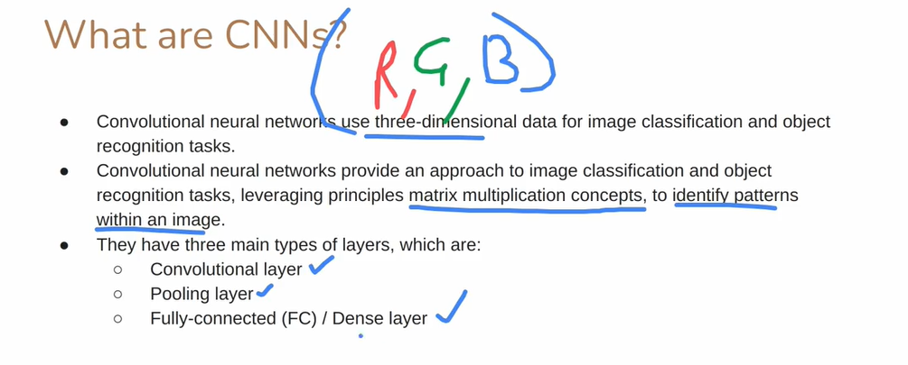
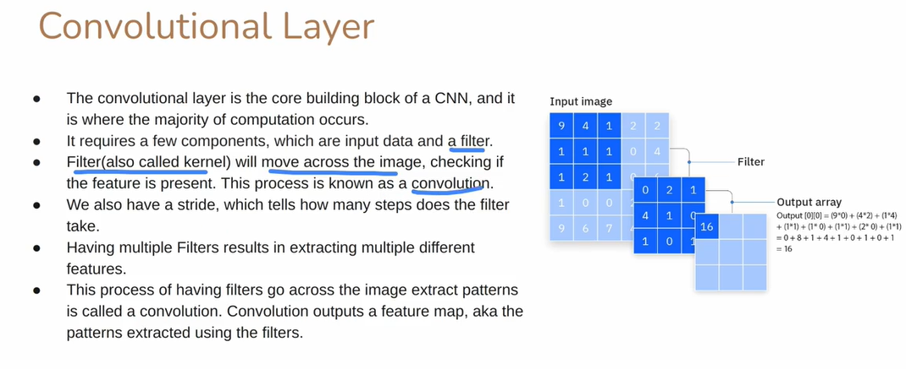
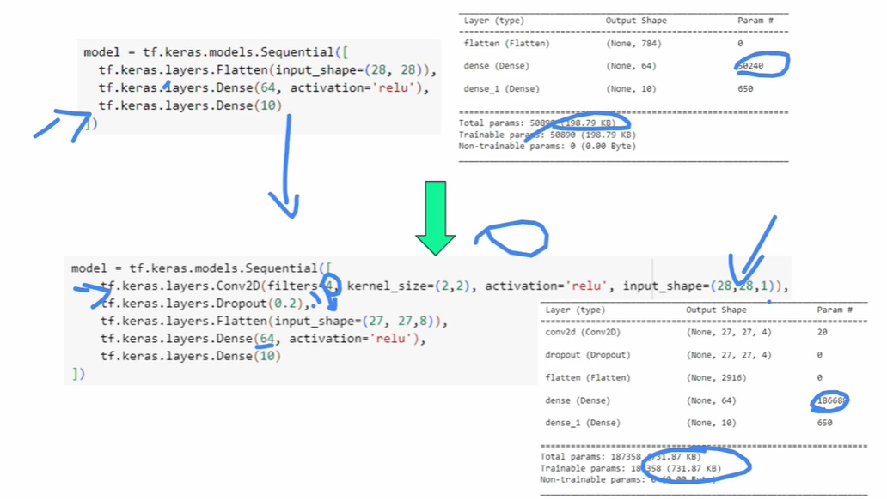

# Whats Convolutional Newral Networks

why ,how,where it is used

Convolutional Neural Networks (CNNs) are a class of deep neural networks specially designed to work with **grid-like data** — most commonly images. They automatically learn spatial hierarchies of features (edges → textures → parts → objects) by applying learnable filters (kernels) over the image. Below is a clear, step-by-step explanation, ASCII diagrams, formulas, examples, and a beginner glossary for any unfamiliar words.

---

WHAT & WHY (short)

* **What:** A CNN is a sequence of layers that apply convolutional filters to an image (or other grid data) to produce feature maps, optionally downsample them, and finally classify or localize objects using fully-connected layers or specialized heads.
* **Why:** Images have local spatial structure. CNNs exploit this with *local connectivity* and *parameter sharing*, making them far more efficient and effective than fully connected nets for vision tasks.
* **Where used:** Image classification, object detection, semantic/instance segmentation, image generation, video analysis, medical imaging, satellite imagery, and any task where spatial patterns matter.

---

HIGH-LEVEL ARCHITECTURE (the three canonical layer types)

1. **Convolutional layer** — learns filters that detect local patterns.
2. **Pooling layer** — downsamples feature maps (reduces spatial size, increases receptive field).
3. **Fully connected (Dense) layer** — at the end, combines learned features for classification/regression.

Typical pipeline:
Input image → [Conv → Activation → Pool] × N → Flatten → Dense → Output

---

ASCII DIAGRAMS (stepwise)

1. Input image (3 channels RGB) — 3D tensor: (H, W, C)

```
   IMAGE (H x W x 3)
   ┌────────────────────────────┐
   │ RRR RRR RRR ... (width W)  │  <- Red channel
   │ ...                        │
   │ GGG GGG GGG ...             │  <- Green channel
   │ ...                        │
   │ BBB BBB BBB ...             │  <- Blue channel
   └────────────────────────────┘
```

2. Convolution: small kernel slides over image to produce a feature map

```
         Kernel (3x3)             Sliding -> multiply & sum -> one pixel of feature map
        ┌───────┐
        │ k k k │
        │ k k k │   *  image patch
        │ k k k │
        └───────┘

Image patch (3x3)  -> conv -> single scalar
Repeat across image -> Feature map (H' x W')
```

3. Multiple filters → stack of feature maps (depth increases)

```
Input HxW x C   ---conv (F filters)-->  H' x W' x F (feature volume)
```

4. Pooling (e.g., max pool 2×2 stride 2) downsamples:

```
H' x W' x F  --maxpool 2x2-->  H'/2 x W'/2 x F
```

5. Many Conv+Pool blocks → Flatten → Dense → Softmax (for classification)

```
[Conv -> ReLU] x k
    ↓
[Pool]
    ↓
Flatten -> Dense -> Dense -> Softmax
```

---

CONVOLUTIONAL LAYER — detailed mechanics & formulas

* **Kernel / filter:** small matrix (K × K) with depth equal to input channels C. For RGB, a 3×3 filter has shape (3,3,3).
* **Number of filters (F):** determines output depth (feature maps). Each filter learns to detect one type of pattern.
* **Stride (S):** how many pixels the kernel moves each step horizontally/vertically.
* **Padding (P):** add zeros around image edges so output spatial size can be controlled.

Output size formula (per spatial dimension):
[
\text{out} = \left\lfloor \frac{\text{in} - K + 2P}{S} \right\rfloor + 1
]
Example: input 32, kernel 3, stride 1, padding 1 (same padding) → out = ((32 - 3 + 2)/1)+1 = 32.

**Parameters (learnable weights) for a conv layer:**
[
\text{params} = F \times (K \times K \times C) + F \quad(\text{bias per filter})
]
Example: input channels C=3, K=3, F=16 → params = 16*(3*3*3)+16 = 16*27+16 = 448.

**Why parameter sharing matters:** the same filter (same weights) is used at every spatial location → huge parameter savings vs dense layers and enables translation invariance.

---

POOLING LAYER — why and types

* **Why:** reduces spatial resolution (fewer computations), increases effective receptive field, provides small translation invariance.
* **Common types:**

  * **Max pooling:** takes max value in each patch (e.g., 2×2). Preserves strongest activation.
  * **Average pooling:** average value in the patch.
  * **Global pooling:** reduces each feature map to a single number (e.g., global average) — often used before final dense layers.
* **Effect:** spatial size halves for 2×2 stride 2 pooling; depth unchanged.

---

ACTIVATION FUNCTIONS

* After conv (linear) we apply nonlinearity (ReLU, Leaky ReLU, Swish, etc.) so network can model complex patterns.
* Typical block: `Conv -> BatchNorm (optional) -> ReLU -> Pool`.

---

RECEPTIVE FIELD (intuition)

* The receptive field of a neuron = region in the input that affects that neuron. Each successive conv/pool increases receptive field so deeper neurons “see” larger parts of the image (from edges to whole object).

---

EXAMPLE — tiny CNN with numbers

Input: 32×32×3 (CIFAR-style)

1. Conv1: 16 filters, 3×3, stride1, padding='same' → output 32×32×16
   params = 16*(3*3*3)+16 = 448
2. MaxPool 2×2 → 16×16×16
3. Conv2: 32 filters, 3×3 → 16×16×32 params = 32*(3*3*16)+32 = 4640
4. MaxPool → 8×8×32
5. Flatten → 8*8*32 = 2048 units
6. Dense 128 → params = 2048*128 + 128 = 262,272
7. Dense 10 (softmax) → params = 128*10 + 10 = 1,290

Observe: conv layers have far fewer params than fully connected, especially when input is large — this is one reason CNNs scale well.

---

TRAINING & LOSS (short)

* Same loop as other nets: forward pass → compute loss (e.g., cross-entropy) → backpropagate gradients → optimizer updates weights (SGD, Adam...). Convolutional layers learn filters by gradient descent just like dense layers.
* **Batch normalization** often used between conv and activation to stabilize/accelerate training.
* **Data augmentation** (random crop, flip, color jitter) is crucial for better generalization.

---

ADVANCED VARIANTS & EFFICIENT DESIGNS (brief)

* **Dilated (atrous) convolutions:** widen receptive field without increasing params by inserting gaps in kernel.
* **Depthwise separable convolutions:** (MobileNet) factorize conv into depthwise + pointwise conv to reduce computation.
* **Residual connections (ResNet):** skip connections that ease training of very deep nets.
* **Transposed convolutions (deconv):** upsampling for generative / segmentation tasks.
* **Fully Convolutional Networks (FCN):** for segmentation—replace FC layers with convolutional heads to produce per-pixel outputs.

---

COMMON ARCHITECTURES (historical to modern)

* **LeNet-5:** early small CNN for digits.
* **AlexNet (2012):** deeper, used ReLU and GPUs — revived CNN research.
* **VGG:** simple, stacked 3×3 convs.
* **ResNet:** introduced residual connections — enabled very deep nets.
* **Inception / EfficientNet / MobileNet:** architecture and scaling improvements for accuracy/efficiency.

---

WHERE CNNs ARE USED (concrete examples)

* **Image classification:** “What object is in this image?” (ImageNet)
* **Object detection:** find and classify multiple objects with bounding boxes (YOLO, Faster R-CNN)
* **Semantic segmentation:** label every pixel (U-Net, DeepLab)
* **Instance segmentation:** detect & segment each instance (Mask R-CNN)
* **Pose estimation, optical flow, super-resolution, denoising, style transfer**
* **Medical imaging:** tumor detection, segmentation
* **Remote sensing:** satellite image analysis
* **Video tasks:** action recognition, tracking (with 3D convs or 2D conv + temporal modules)

---

COMPUTATIONAL NOTES

* Convolutions are heavy on linear algebra — implemented efficiently on GPUs/TPUs.
* Memory and FLOPs grow with image size, number of filters, and depth. Use pooling/stride/efficient convs to manage cost.

---

PRACTICAL TIPS

* Begin with small kernel sizes (3×3) stacked — proven effective (VGG style).
* Use batch normalization and ReLU for stable training.
* Use data augmentation to reduce overfitting.
* For image tasks, prefer CNNs over plain dense nets.
* Use pretrained models and transfer learning when data is limited (fine-tune last layers).

---

GLOSSARY — UNCOMMON / NEW WORDS (beginner-friendly)

* **Kernel / Filter:** a small weight matrix that scans the image to detect patterns (edges, corners, textures).
* **Feature map / Activation map:** the output produced by applying a filter across the image — it highlights where the filter’s pattern appears.
* **Stride:** step size when sliding the kernel. Larger stride → smaller output spatial size.
* **Padding:** adding zeros around borders so filters can be applied at edges; "same" padding keeps output size equal to input size.
* **Receptive field:** the area of the input image a particular neuron “sees.” Deeper layers have larger receptive fields.
* **Parameter sharing:** same kernel used at every spatial location; saves parameters and gives translation invariance.
* **Translation invariance:** model’s ability to detect an object regardless of where it appears in the image.
* **Pooling:** downsampling operation (max or average) that reduces spatial size and keeps important info.
* **Dilated (atrous) convolution:** convolution with holes to expand receptive field without extra parameters.
* **Depthwise separable convolution:** splits convolution into spatial (depthwise) and cross-channel (pointwise) parts to reduce compute.
* **Batch normalization:** normalizes activations across a batch to stabilize and accelerate training.
* **Residual (skip) connection:** a shortcut that adds input to output of a block, helping train very deep networks.
* **Logits:** raw scores from final layer before softmax; not probabilities.
* **Softmax:** converts logits into probabilities that sum to 1 for multi-class classification.
* **Cross-entropy:** loss that measures difference between predicted probabilities and true labels.
* **Downsampling vs Upsampling:** reducing vs increasing spatial resolution (pooling/strided conv vs transposed conv).
* **Fully Convolutional:** networks that use only convolutions (no dense layers) so output can be spatial maps (used in segmentation).
* **Transfer learning:** reusing a model pre-trained on a large dataset and fine-tuning it for your task.

---

SHORT SUMMARY (one-line)
CNNs are specialized neural nets that detect spatial patterns using small, shared filters and pooling, making them the dominant tool for image and other grid-structured data tasks — efficient, translation-aware, and scalable to complex vision problems.

---

---

---

---

---



# Convolutional layer:

* the convolutionallayer is the core building block of a CNN and it where the majority of computation occurs
* it requres a few components which are inoput data and a filter
  -filter also called kernel will move across the image , checking if the feature is present. this process is knon as a convolution
  -we also have a stride which tells how many steps does the filter take.
* having multiple filters results in extracting multiple different features
* this process of having filters go across the image extract pattens is called a convolution. convolution outputs afeature map, aka the pattens extracted using the filters
  explain with detailed ascii diagram too

---

## Short summary (one-sentence)

A **convolutional layer** slides small learnable filters (kernels) across an input tensor (image or feature volume), computes dot-products at each location to produce **feature maps**, and by sharing the same filter weights across space it efficiently detects the same pattern anywhere in the image.

---

## Key components — plain language

* **Input**: a 3D array (height `H` × width `W` × channels `C`). Example: a color image 32×32×3.
* **Filter / Kernel**: a small 3D weight block (K×K×C) that "looks for" a pattern. Each filter produces one 2D feature map.
* **Number of filters (F)**: how many different patterns the layer will learn; output depth = `F`.
* **Stride (S)**: how many pixels the kernel moves each step horizontally/vertically.
* **Padding (P)**: zeros added around the input borders so the kernel can cover edges; controls output size.
* **Bias**: one scalar per filter added after dot-product.
* **Activation**: nonlinear function (ReLU, etc.) applied after convolution + bias.

---

## Output shape formula (spatial dims)

For one spatial dimension (height or width):

[
\text{out_size} = \left\lfloor\frac{\text{in_size} - K + 2P}{S}\right\rfloor + 1
]

So full output shape = `(H_out, W_out, F)`.

---

## Parameter count (learnable weights)

For a conv layer with kernel size K, input channels C, and F filters:

[
\text{params} = F \times (K \times K \times C) ;+; F\quad(\text{biases})
]

Example: 3×3 kernel, C=3, F=16 → params = 16×(3×3×3) + 16 = 16×27 + 16 = 448.

---

## How a single convolution value is computed — numeric example (step-by-step)

Input patch (3×3) and kernel (3×3) — single-channel example to keep arithmetic easy:

```
Input patch          Kernel (filter)
[ 1  2  0 ]          [ 0  1  0 ]
[ 0 -1  3 ]    dot   [ 1  0 -1 ]  -> elementwise multiply and sum
[ 2  1  1 ]          [ 0 -1  1 ]
```

Compute elementwise product and sum:

```
1*0 + 2*1 + 0*0
+ 0*1 + (-1)*0 + 3*(-1)
+ 2*0 + 1*(-1) + 1*1
= 0 + 2 + 0 + 0 + 0 -3 + 0 -1 +1 = -1
```

Then add the filter bias `b` (say `b = 0.5`) → `-1 + 0.5 = -0.5`. Then apply activation (e.g., ReLU): `max(0, -0.5) = 0.0`.

This single scalar becomes one pixel in the output feature map at the position corresponding to where the kernel was placed.

---

## ASCII diagram — sliding kernel across an image (single channel, stride 1, no padding)

Input 5×5, kernel 3×3 → output 3×3 (positions where kernel fully fits):

```
Input (5x5)
[ a b c d e ]
[ f g h i j ]
[ k l m n o ]
[ p q r s t ]
[ u v w x y ]

Place 3x3 kernel at top-left -> multiply with:
[ a b c ]
[ f g h ]
[ k l m ]   -> sum(products) = output(0,0)

Then slide one step right (stride=1):
[ b c d ]
[ g h i ]
[ l m n ]   -> output(0,1)

...and so on, until output is:
Output (3x3)
[ o00 o01 o02 ]
[ o10 o11 o12 ]
[ o20 o21 o22 ]
```

If stride = 2, kernel jumps two pixels each time and output size shrinks accordingly.

---

## Multi-channel (RGB) convolution — why kernels are 3D

For RGB input (H×W×3) and a 3×3 kernel, the kernel shape is 3×3×3. At each spatial location, you do elementwise multiply-and-sum across **all channels**, then add bias → one scalar for that filter at that location. Repeat for every spatial position and for every filter.

ASCII sketch:

```
Input: H x W x 3  (three stacked 2D layers: R, G, B)
Kernel: 3x3x3      (one 3x3 for R, one 3x3 for G, one 3x3 for B)
At each position: sum( R_patch * K_R ) + sum( G_patch * K_G ) + sum( B_patch * K_B ) + bias -> scalar
Repeat -> 2D feature map
Stack F feature maps -> H_out x W_out x F
```

---

## Parameter sharing & translation equivariance — why convs are efficient

* **Parameter sharing**: the same kernel weights are used across all spatial locations. This dramatically reduces parameters vs a dense connection to every pixel.
* **Translation equivariance**: if the input shifts, the output shifts similarly — a filter detecting an edge will find the edge wherever it appears.

---

## Computational cost (rough)

Number of multiply-adds ≈ `H_out × W_out × K^2 × C × F`.
This grows with input size, kernel size, channels, and filters, which is why smaller kernels (3×3) and fewer channels/filters in early layers are common design choices.

---

## Common hyperparameters & variants (quick)

* **Kernel size**: 1×1, 3×3, 5×5 are common. 3×3 often used repeatedly.
* **Stride (S)**: 1 (dense sampling) or >1 (downsampling).
* **Padding**: `valid` (no pad) or `same` (pad so output dims ≈ input dims).
* **Dilation**: spaced-out kernel elements to enlarge receptive field without extra params.
* **Groups / Depthwise separable conv**: split channels into groups to reduce compute (used in MobileNet).
* **Bias**: often present; sometimes removed when BatchNorm follows the conv.
* **BatchNorm + ReLU**: common pattern `Conv → BatchNorm → ReLU`.

---

## Pseudocode (simple, single-filter conv, stride=1, no padding)

```python
# Input: in_img[H][W][C], Kernel: K[Ksize][Ksize][C], bias b
H_out = H - Ksize + 1
W_out = W - Ksize + 1
out = zeros(H_out, W_out)
for y in range(H_out):
    for x in range(W_out):
        s = 0.0
        for ky in range(Ksize):
            for kx in range(Ksize):
                for c in range(C):
                    s += in_img[y+ky][x+kx][c] * Kernel[ky][kx][c]
        out[y][x] = activation(s + b)
```

(Real implementations vectorize this massively and run on GPUs for speed.)

---

## Visual intuition — feature hierarchy

* Early conv filters learn *low-level* features (edges, colors, textures).
* Mid layers learn *parts* (corners, motifs).
* Deep layers learn *semantic* concepts (faces, wheels).
  This is why stacking conv layers builds hierarchical understanding.

---

## Small worked example (numeric) — parameter count & shape

Input: 32×32×3, conv layer: K=3, F=16, stride=1, padding='same'

* Output shape: 32×32×16
* Params = 16 × (3×3×3) + 16 = 16×27 + 16 = 448
  So one conv layer here has 448 learnable numbers — tiny compared to a dense layer that would connect all 32×32×3 = 3072 inputs to, say, 128 units (3072×128 ≈ 393,216 params).

---

## Where convolutional layers appear inside a Conv block (typical)

```
[Conv2D (KxK, F)] -> [BatchNormalization (optional)] -> [Activation (ReLU)] -> [Pooling (optional)]
```

Repeat blocks, then `Flatten` → one or more `Dense` layers → `Softmax` (for classification).

---

## Glossary — beginner-friendly definitions (all “uncommon” words explained)

* **Kernel / Filter**: a small block of weights that scans the image to detect a pattern (like "vertical edge").
* **Feature map**: the 2D output produced after sliding a filter across the input; it highlights where that filter's pattern appears.
* **Stride**: how many pixels the filter jumps each time it moves. Stride 1 = slide one pixel; stride 2 = jump two pixels (faster, coarser).
* **Padding**: adding zeros around the image border so filters can center on the edges; `same` keeps output size same as input.
* **Channels**: depth dimension of an image/feature volume (3 for RGB). Each channel is a separate layer of pixels.
* **Bias**: a single number added to every position of a filter’s output before activation (helps shift activation).
* **Activation**: a nonlinear function (ReLU, sigmoid, tanh) applied after convolution to allow complex mappings.
* **Receptive field**: the input-region size that a single output neuron "sees" — grows with layer depth.
* **Parameter sharing**: using the same filter weights across the whole image (saves parameters).
* **Translation equivariance**: property that a shift in input causes corresponding shift in output (detection moves with object).
* **Dilation (Atrous conv)**: spreads kernel entries apart, enlarging the receptive field without extra weights.
* **Depthwise separable convolution**: factorizes convolution into spatial (per-channel) + pointwise (1×1) steps to cut computations.
* **Batch Normalization**: normalizes layer outputs across the batch to stabilize and accelerate training.
* **Pooling**: downsampling operation (max or average) that reduces spatial size and keeps strongest signals.
* **Logits**: raw scores from the final linear layer before applying softmax to get probabilities.
* **Softmax**: function that converts logits into probabilities that sum to 1 across classes.
* **FLOPs**: floating-point operations — a measure of compute cost (roughly the number of multiply-adds).
* **Group convolution**: splitting channels into groups so different groups are convolved separately (reduces computation).
* **Pointwise convolution (1×1)**: a 1×1 kernel that mixes information across channels without looking at neighbors spatially.

---

---

---

---

---


# Polling layer:

You meant **Pooling layer** (commonly mis-typed “polling”) — here’s a complete, beginner-friendly, deeply-explained guide with ASCII diagrams, numeric examples, pros/cons, pseudocode, and a glossary of every uncommon word at the end.

---

## Short plain definition

A **pooling layer** (a.k.a. downsampling layer) is a **weight-free** operation in CNNs that slides a small window over each feature map and **aggregates** the values inside that window (e.g., by taking the maximum or the average). The result is a smaller feature map that retains the most important information while reducing spatial size, computation, and parameters downstream.

---

## Why pooling is used

* **Reduces spatial dimensions** → fewer computations and less memory for later layers.
* **Provides translation/shift invariance** — small shifts in the input often produce similar pooled outputs.
* **Controls overfitting** by reducing the number of active units.
* **Highlights important signals** (max pooling preserves strong activations).

---

## Main types of pooling

1. **Max pooling** — output = maximum value inside the window.
2. **Average pooling** — output = average (mean) of values in the window.
3. **Global pooling** (special case) — reduce entire feature map to a single number per channel (global max or global average).
4. (Less common) **L2 pooling**, **stochastic pooling**, **fractional pooling** — variants with specific uses.

---

## How pooling is applied (parameters)

* **Window / kernel size (K × K)** — size of the local patch (e.g., 2×2, 3×3).
* **Stride (S)** — how many pixels the window moves each step. Common: S = K (non-overlapping).
* **Padding** — often pooling uses `valid` (no padding), but `same` padding is possible in some frameworks.
* **Channels** — pooling operates **per channel**; it does not mix channels. For input H×W×C, each of the C channels is pooled independently, producing H_out×W_out×C.

**Output size formula (per spatial dim):**
[
\text{out_size} = \left\lfloor \frac{\text{in_size} - K + 2P}{S} \right\rfloor + 1
]

---

## Numeric example — 4×4 input, 2×2 window, stride=2 (no padding)

Input single channel (4×4):

```
[ 1   2   3   4 ]
[ 5   6   7   8 ]
[ 9  10  11  12 ]
[13  14  15  16 ]
```

### Max pooling (2×2, stride 2)

Slide 2×2 windows (non-overlapping) → produce 2×2 output:

* window1 (top-left): [1,2,5,6] → max = 6
* window2 (top-right): [3,4,7,8] → max = 8
* window3 (bottom-left): [9,10,13,14] → max = 14
* window4 (bottom-right): [11,12,15,16] → max = 16

Output:

```
[ 6   8 ]
[14  16 ]
```

### Average pooling (2×2, stride 2)

* window1 avg = (1+2+5+6)/4 = 3.5
* window2 avg = (3+4+7+8)/4 = 5.5
* window3 avg = (9+10+13+14)/4 = 11.5
* window4 avg = (11+12+15+16)/4 = 13.5

Output:

```
[  3.5   5.5 ]
[ 11.5  13.5 ]
```

ASCII sliding view (max pooling):

```
Input 4x4:
[ a  b  c  d ]
[ e  f  g  h ]
[ i  j  k  l ]
[ m  n  o  p ]

Windows (2x2, stride2) -> outputs
Top-left  -> max(a,b,e,f)
Top-right -> max(c,d,g,h)
Bot-left  -> max(i,j,m,n)
Bot-right -> max(k,l,o,p)

Output 2x2:
[ max(a,b,e,f)   max(c,d,g,h) ]
[ max(i,j,m,n)   max(k,l,o,p) ]
```

---

## ASCII diagram showing sliding and reduction (stride=1, padding=valid)

If stride = 1 and kernel = 3×3 on 5×5 input → output 3×3:

```
Input 5x5:
[ a b c d e ]
[ f g h i j ]
[ k l m n o ]
[ p q r s t ]
[ u v w x y ]

Kernel 3x3 placed at top-left covers:
[ a b c ]
[ f g h ]
[ k l m ]   -> aggregated -> output(0,0)

Slide right by 1:
[ b c d ]
[ g h i ]
[ l m n ]   -> output(0,1)

...until you fill a 3x3 output:
Output 3x3:
[ o00 o01 o02 ]
[ o10 o11 o12 ]
[ o20 o21 o22 ]
```

---

## Pseudocode (max pooling, single channel)

```
function max_pool(in, K, S):
    H, W = shape(in)
    H_out = floor((H - K) / S) + 1
    W_out = floor((W - K) / S) + 1
    out = zeros(H_out, W_out)
    for y in 0..H_out-1:
        for x in 0..W_out-1:
            y0 = y * S
            x0 = x * S
            window = in[y0:y0+K, x0:x0+K]
            out[y,x] = max(window)
    return out
```

(Real implementations vectorize & run on GPU.)

---

## Effects on network behavior

**Pros**

* Reduces spatial size → fewer parameters for later dense layers; cheaper compute.
* Adds robustness to small translations (shift invariance).
* Acts as a simple form of feature selection (max) or smoothing (avg).

**Cons**

* Loses precise spatial information (location & fine detail).
* Max pooling can be aggressive — may drop subtle but important signals.
* Pooling choices can lead to aliasing or information loss; sometimes replaced by strided convolutions or learned downsampling layers.

**Modern practice**

* Many modern architectures use `stride` in convolution (strided conv) instead of pooling, or combine pooling with learnable layers.
* `Global Average Pooling` is commonly used to replace dense layers at the end (e.g., reduce H×W×C → 1×1×C by averaging each feature map), which reduces params and tends to generalize well.

---

## Where pooling is applied

* After convolution + activation blocks to progressively reduce spatial size and increase receptive field.
* In encoder parts of segmentation/autoencoders, often paired with upsampling or transposed convs on the decoder side.
* Global pooling used right before classification head in many modern CNNs.

---

## Visual intuition — what pooling does to a feature map

* **Max pooling**: keeps the strongest activations (like picking the most confident detector response).
* **Average pooling**: smooths and summarizes local neighborhoods (keeps average trend).

Imagine feature map highlights edges. Max pooling keeps the strongest edge response in the window, while average pooling keeps the average edge strength.

---

## Common hyperparameters & choices

* Kernel 2×2, stride 2 (very common) — halves H and W.
* Kernel 3×3, stride 2 — slightly more overlap and smoother reduction.
* Overlapping pooling (stride < kernel) can preserve more info.
* GlobalAvgPool vs GlobalMaxPool — global average is popular to replace final dense layers.

---

## Common pitfalls / tips

* If you need precise localization (e.g., segmentation, keypoint detection), aggressive pooling can harm performance. Use smaller pooling or strided convs thoughtfully, or use skip connections (U-Net).
* When switching from pooling to strided conv, ensure receptive field logic and feature scaling are considered.
* Watch output shapes carefully — pooling reduces H/W; adjust subsequent layers accordingly.

---

## Quick summary table

| Operation   | Effect on window                 | Behavior                   | Typical use                |
| ----------- | -------------------------------- | -------------------------- | -------------------------- |
| Max Pool    | max value                        | keeps strongest activation | Preserve distinct features |
| Avg Pool    | average value                    | smooths feature map        | Smoothing / downsample     |
| Global Pool | reduce to one number per channel | collapse spatial dimension | Replace FC, reduce params  |

---

## Glossary — every uncommon/new word explained (beginner-friendly)

* **Pooling / Downsampling:** Reducing spatial resolution (height & width) of a feature map to make data smaller and cheaper to process.
* **Kernel / Window / Filter (in pooling):** The small rectangular patch (e.g., 2×2, 3×3) that we examine inside the feature map to compute an aggregate (max or average). In pooling, this kernel has **no learnable weights**.
* **Stride:** How many pixels we move the window each step. Stride 1 slides one pixel; stride 2 jumps two pixels.
* **Padding:** Adding zeros around the border so the window can cover edges. Usually pooling uses `valid` (no padding).
* **Feature map / Activation map:** 2D output created by a filter; pooling operates independently on each feature map (channel).
* **Translation equivariance / Invariance:** Equivariance: if input shifts, output shifts similarly. Pooling increases invariance: the exact small shift in input may not change pooled output much.
* **Receptive field:** The region of the input image that affects a particular activation after layers of convolution/pooling. Pooling increases receptive field size effectively.
* **Global pooling:** Collapses the entire spatial size of a feature map to one number per channel (global average or max) — often used before classification.
* **Overlapping pooling:** When stride < kernel size, windows overlap and reduce information loss.
* **Aliasing:** Distortion that occurs if you downsample without proper care — important in signal processing and can appear with pooling.
* **Strided convolution:** An alternative to pooling where a convolution uses stride >1 to downsample and **learns** how to combine values (unlike pooling which uses a fixed aggregator).
* **Activation (nonlinearity):** Function (e.g., ReLU) applied after conv/pooling to add non-linear mapping. Pooling itself is an aggregation, often followed by activation in the block.

---

---

---

---

---


**Short overview (one sentence)**
Data enters as an input tensor (an image or vector) → several *Conv* blocks (convolution → activation → optional pooling) extract hierarchical features → spatial maps are flattened into a vector → one or more **fully connected (Dense)** layers combine those features → final output layer gives scores or probabilities.

---

## Flow diagram (high level)

```
Input (H x W x C) 
     │
     ▼
[Conv2D + Activation]  → produces Feature Maps (H1 x W1 x F1)
     │
     ▼
[Pooling]              → downsamples (H1/2 x W1/2 x F1)
     │
     ▼
[Conv2D + Activation]  → Feature Maps (H2 x W2 x F2)
     │
     ▼
[Pooling]              → downsamples (H2/2 x W2/2 x F2)
     │
     ▼
... (repeat conv+pool blocks as needed) ...
     │
     ▼
Flatten  (→ 1D vector length = Hf * Wf * Ff)
     │
     ▼
Dense (fully connected) layers (e.g., 128 units)  → nonlinear transforms
     │
     ▼
Output layer (e.g., 10 logits for 10 classes) → Softmax → probabilities
```

---

## Detailed ASCII pipeline with an example (numbers included)

Assume an input color image 32×32×3 (H=32, W=32, C=3). Build a tiny CNN:

```
INPUT:  32 x 32 x 3

Conv1:  3x3 kernel, 16 filters, stride=1, padding='same' 
  -> OUTPUT: 32 x 32 x 16          (feature maps)

Pool1:  2x2 max pooling, stride=2
  -> OUTPUT: 16 x 16 x 16

Conv2:  3x3 kernel, 32 filters, stride=1, padding='same'
  -> OUTPUT: 16 x 16 x 32

Pool2:  2x2 max pooling, stride=2
  -> OUTPUT: 8 x 8 x 32

Flatten:
  -> 8 * 8 * 32 = 2048  (1D vector)

Dense1: fully connected 128 units (ReLU)
  -> vector of length 128

Output Dense: 10 units (logits) 
  -> 10 scores → apply Softmax → 10 probabilities
```

---

## What happens inside each block (step-by-step explanation)

### 1) Input

* An **image** is a 3-dimensional tensor: height × width × channels (H×W×C).
* For grayscale images C=1, for RGB C=3. For vectors (non-image), you can use 1D convs or treat vector as (N_features,) and use Dense layers.

### 2) Convolutional layer (Conv2D) — local pattern detector

* A single **filter (kernel)** is a small 3×3×C block of weights. The filter is *learned* during training.
* The filter slides (convolves) across the image: at each position multiply corresponding elements and sum → one scalar. Doing this for all positions produces a **feature map**.
* Multiple filters → multiple feature maps stacked into a volume (H_out × W_out × F).
* Important hyperparameters: kernel size K, number of filters F, stride S, padding P.
* **Example math** (output spatial size for one dimension):
  [
  \text{out} = \left\lfloor\frac{\text{in} - K + 2P}{S}\right\rfloor + 1
  ]

### 3) Activation

* A nonlinearity (commonly ReLU) applied elementwise to feature maps so stack of linear operations becomes capable of modeling complex functions.

### 4) Pooling (downsampling)

* Pooling reduces H and W (not channels): e.g., 2×2 max pool with stride 2 halves each spatial dimension.
* Pooling is **weight-free**: it aggregates (max or average) values in each window.
* Purpose: reduce computation, increase shift-invariance, enlarge receptive field.

### 5) Repeat conv+pool blocks

* Early convs learn low-level features (edges), deeper convs learn higher-level features (parts, objects).
* Stacking increases **receptive field** (how much of original image a single activation depends on).

### 6) Flatten

* Convert final Hf × Wf × Ff volume into a 1D vector of length `Hf * Wf * Ff` so it can be fed to Dense layers.

### 7) Dense (Fully Connected) layers

* Each Dense layer computes `y = activation(W·x + b)` where W is a matrix and x is the input vector.
* Dense layers combine all the features to make final decisions (classification, regression).

### 8) Output layer + Softmax

* Output Dense produces **logits** (raw scores). Softmax turns logits into probabilities:
  [
  p_i = \frac{e^{z_i}}{\sum_j e^{z_j}}
  ]
* The predicted class = argmax of the probabilities.

---

## Numeric parameter-count example (so you remember how many weights exist)

Using the example above:

* **Conv1** params = F * (K*K*C) + F(bias)
  = 16 * (3*3*3) + 16 = 16*27 + 16 = 432 + 16 = **448**

* **Conv2** params = 32 * (3*3*16) + 32 = 32 * 144 + 32 = 4608 + 32 = **4640**

* **Dense1** params = input_dim * units + units
  = 2048 * 128 + 128 = 262,144 + 128 = **262,272**

* **Output Dense** params = 128 * 10 + 10 = **1,290**

Total parameters ≈ 448 + 4640 + 262,272 + 1,290 ≈ **268,650** (most params live in Dense layers; convs are compact).

---

## Visualizing convolution + pooling with small numeric ASCII (toy example)

Input single-channel 5×5:

```
5x5 INPUT:
[ 1  2  3  4  5 ]
[ 6  7  8  9 10 ]
[11 12 13 14 15 ]
[16 17 18 19 20 ]
[21 22 23 24 25 ]
```

Kernel 3×3 (one filter), stride=1, no padding:

```
K = [ 1 0 -1
      1 0 -1
      1 0 -1 ]
```

Place K at top-left:

* patch = [1 2 3; 6 7 8; 11 12 13]
* elementwise multiply & sum -> yields output(0,0)

Slide right one step -> compute output(0,1), and so on. Result is a 3×3 feature map.

Then apply 2×2 max-pool (stride=2) on that 3×3 → roughly 1×1 or 2×2 depending on padding/stride choices. That pooling selects the strongest responses preserved from the conv output.

---

## Why this design works (intuitions you’ll remember)

* **Locality:** image pixels are correlated with nearby pixels → small kernels capture local features effectively.
* **Parameter sharing:** same filter across the image detects the same feature anywhere → translation equivariance.
* **Hierarchical features:** stacking convs builds from edges → textures → parts → objects.
* **Downsampling (pooling):** reduces computational cost and makes detection robust to small shifts.
* **Dense layers:** combine many learned features to make global decisions.

---

## End-to-end forward pass (one-sentence recap)

Input image → conv filters produce local feature maps → activations introduce nonlinearity → pooling reduces spatial size and retains strong features → repeated blocks increase abstraction → flatten to a vector → dense layers combine features → final layer produces logits → softmax → predicted probabilities.

---

## Beginner-friendly glossary (every uncommon/new word explained)

* **Tensor**: a multi-dimensional array (scalars = 0-D, vectors = 1-D, images = 3-D H×W×C).
* **Filter / Kernel**: a small learnable weight block (e.g., 3×3×C) that “looks for” a pattern in the input.
* **Feature map**: the 2-D result of sliding a filter across the input — highlights where the pattern occurs.
* **Channel**: the depth dimension of data (R/G/B channels in images or feature channels in conv outputs).
* **Stride**: how many pixels the kernel moves on each step. Larger stride → more downsampling.
* **Padding**: zeros added around input edges so filters can be applied at borders; `'same'` keeps output size equal to input.
* **Receptive field**: the area of the original input that influences a particular neuron in a deeper layer.
* **Pooling (downsampling)**: windowed aggregation (max or average) that reduces spatial dimensions and keeps strongest/average signals.
* **Flatten**: convert a 3-D volume into a 1-D vector so Dense layers can process it.
* **Dense (fully connected) layer**: each output unit connects to every input value; computes `activation(W·x + b)`.
* **Logits**: raw scores from the last linear layer (before softmax).
* **Softmax**: function that turns logits into probabilities that sum to 1.
* **Activation function**: nonlinearity like ReLU, Sigmoid, Tanh that is applied elementwise to allow modeling non-linear relationships.
* **Bias**: a per-filter (or per-neuron) scalar added after linear combination to shift activation.
* **Parameter sharing**: technique where the same weights (filter) are used at every spatial location; saves parameters.
* **Translation equivariance**: property that when input shifts, output feature maps shift similarly — useful for detecting objects anywhere.
* **Strided convolution**: convolution with stride>1 that downsamples and is a learnable alternative to pooling.
* **Depthwise separable convolution**: factorized conv that reduces computation by splitting spatial and cross-channel mixing (used in mobile/efficient nets).
* **Batch normalization**: layer that normalizes activations across a batch to stabilize training.
* **Overfitting**: model learns training noise, performs poorly on unseen data; mitigated by data augmentation, regularization, dropout.
* **Parameter (weight) count**: number of learnable numbers in the model; Dense layers usually dominate this count.

---

---

---

---

---



# You can copy-paste the code and run it (assumes `tensorflow` installed). Example uses MNIST-shaped images `(28, 28, 1)` — change `input_shape` if your data differ.

```python
# -------------------------
# Example: convert Dense net -> small CNN (MNIST-style)
# -------------------------
import tensorflow as tf
from tensorflow.keras import layers, models

# --- Original simple dense (for comparison) ---
dense_model = models.Sequential([
    layers.Flatten(input_shape=(28, 28, 1)),   # flatten 2D image to vector length 784
    layers.Dense(128, activation='relu'),     # hidden dense layer with ReLU activation
    layers.Dense(10)                          # output logits (10 classes)
])
dense_model.summary()

# --- Converted Convolutional Neural Network ---
cnn_model = models.Sequential([
    # 1) First conv block: learns local features (edges, textures)
    layers.Conv2D(
        filters=32,            # number of filters (output depth)
        kernel_size=(3, 3),    # filter (kernel) spatial size
        strides=(1, 1),        # how many pixels the kernel moves each step
        padding='same',        # 'same' pads input so output has same HxW
        activation='relu',     # activation applied after conv
        input_shape=(28, 28, 1), # expected input shape (H, W, C)
        kernel_initializer='glorot_uniform', # initializer for weights
        use_bias=True,         # include bias term per filter
        name='conv1'
    ),

    # 2) Second conv block: deeper features
    layers.Conv2D(
        filters=64,
        kernel_size=3,         # you can pass int -> interpreted as (3,3)
        strides=1,
        padding='same',
        activation='relu',
        kernel_initializer='he_normal',
        name='conv2'
    ),

    # 3) Downsample via max-pooling to reduce spatial size & computation
    layers.MaxPooling2D(pool_size=(2, 2), strides=2, name='pool1'),

    # 4) Optional regularization to reduce overfitting
    layers.Dropout(0.25, name='dropout1'),

    # 5) Another conv layer to increase semantic depth
    layers.Conv2D(filters=128, kernel_size=(3,3), padding='same', activation='relu', name='conv3'),

    # 6) Pool again to reduce spatial dims
    layers.MaxPooling2D(pool_size=2, name='pool2'),

    # 7) Flatten the 3D feature maps to 1D vector for Dense layers
    layers.Flatten(name='flatten'),

    # 8) Dense (fully connected) layer to combine features
    layers.Dense(128, activation='relu', name='fc1'),

    # 9) Optional dropout before final classification
    layers.Dropout(0.5, name='dropout2'),

    # 10) Final logits layer (one unit per class)
    layers.Dense(10, name='logits')
])

cnn_model.summary()

# --- Compile & (optionally) run training (example) ---
cnn_model.compile(
    optimizer=tf.keras.optimizers.Adam(learning_rate=1e-3),
    loss=tf.keras.losses.SparseCategoricalCrossentropy(from_logits=True),
    metrics=['accuracy']
)

# Example: to train, assuming you have x_train,y_train prepared and normalized:
# history = cnn_model.fit(x_train, y_train, epochs=5, batch_size=64, validation_split=0.1)
```

---

Explanations — **line by line** and *why we wrote each line*

**Top imports**

* `import tensorflow as tf` — brings in TensorFlow.
* `from tensorflow.keras import layers, models` — convenience aliases to build models and use layers.

**Original dense model (comparison)**

* `models.Sequential([...])` — a simple ordered container: input flows through each layer in the list, one after another. I included it so you see what we are converting from.
* `layers.Flatten(input_shape=(28,28,1))` — when you had a dense-only model you flattened the image to a 1D vector so Dense could operate. The CNN will avoid throwing away spatial layout.
* `layers.Dense(128, activation='relu')` — fully-connected layer with 128 neurons and ReLU activation. Dense layers have many parameters when input vectors are large.
* `layers.Dense(10)` — final layer producing raw scores (logits) for 10 classes.

**Converted CNN — block-by-block reasoning**

1. `layers.Conv2D(filters=32, kernel_size=(3,3), strides=(1,1), padding='same', activation='relu', input_shape=(28,28,1), kernel_initializer='glorot_uniform', use_bias=True, name='conv1')`

   * **Why Conv2D?** Convolutional layers learn small local feature detectors (edges, textures, corners) that are spatially local. They preserve spatial layout (H×W).
   * **filters=32**: how many distinct patterns the layer will learn; each filter produces one feature map. More filters → can capture more patterns (at cost of more compute & params).
   * **kernel_size=(3,3)**: 3×3 is a common small receptive field — enough to capture local structure; smaller kernels are efficient and stackable.
   * **strides=(1,1)**: move the kernel one pixel at a time for dense coverage.
   * **padding='same'**: keeps output HxW same as input HxW by zero-padding borders; helpful to preserve spatial resolution early in the network.
   * **activation='relu'**: apply ReLU nonlinearity immediately to introduce non-linear modeling power.
   * **input_shape=(28,28,1)**: required on the first layer to tell Keras the input dimensions (height, width, channels). For RGB images use (H,W,3).
   * **kernel_initializer**: how initial weights are set; `glorot_uniform` is a safe default.
   * **use_bias=True**: add a bias scalar per filter (common). Sometimes removed if using BatchNorm immediately after.
   * **name**: helpful for readability/debugging.

2. `layers.Conv2D(filters=64, kernel_size=3, ... name='conv2')`

   * **Why another Conv2D?** Stacking multiple conv layers allows the network to compute more complex features: first conv finds edges; second conv can combine edges into motifs or parts. Kernel_size=3 shorthand is allowed.
   * **filters increased** (32 → 64): deeper layers often increase channel depth so the network can represent richer features while spatial dims may shrink later.

3. `layers.MaxPooling2D(pool_size=(2,2), strides=2, name='pool1')`

   * **Why pooling?** Downsamples spatial dimensions (here halves height & width). Reduces computation, increases receptive field, and adds invariance to small translations.
   * **Max pooling** picks the strongest activation in each neighborhood (preserves the most salient feature).

4. `layers.Dropout(0.25, name='dropout1')`

   * **Why dropout?** Regularization: randomly zeroes a fraction of activations during training (25% here) to prevent overfitting (the network depending too much on any single activation).
   * **0.25** = keep 75% of units on average during training.

5. `layers.Conv2D(filters=128, kernel_size=(3,3), padding='same', activation='relu', name='conv3')`

   * **Why another conv?** Add depth again — now with 128 filters to learn even richer, higher-level features.

6. `layers.MaxPooling2D(pool_size=2, name='pool2')`

   * **Second pooling** reduces spatial dims again (e.g., from 8×8 to 4×4 depending on previous dims). Deeper features can be summarized more compactly.

7. `layers.Flatten(name='flatten')`

   * **Why flatten?** Dense layers expect 1D input vectors. Flatten converts the final H×W×Channels tensor into a single long vector of length `H*W*C`.

8. `layers.Dense(128, activation='relu', name='fc1')`

   * **Dense here** aggregates all learned localized features across the whole image to prepare for classification. This is where the network learns global combinations of the local features extracted by conv layers.

9. `layers.Dropout(0.5, name='dropout2')`

   * **Why stronger dropout now?** Dense layers are often parameter-heavy and prone to overfitting; 50% dropout is common before final classifier to improve generalization.

10. `layers.Dense(10, name='logits')`

    * **Final logits**: raw unnormalized scores for each class (10 digits/classes). When compiling, we will use a loss that expects logits (`from_logits=True`) or you can append `Softmax()` if you prefer output probabilities directly.

**Compile block**

* `cnn_model.compile(optimizer=tf.keras.optimizers.Adam(learning_rate=1e-3), loss=tf.keras.losses.SparseCategoricalCrossentropy(from_logits=True), metrics=['accuracy'])`

  * **optimizer Adam**: adaptive optimizer that works well out-of-the-box.
  * **learning_rate=1e-3**: default Adam LR; change if training is unstable.
  * **loss SparseCategoricalCrossentropy(from_logits=True)**: appropriate when labels are integer class ids (0..9) and model outputs logits.
  * **metrics=['accuracy']**: track classification accuracy during training/evaluation.

**Training hint (commented)**

* `cnn_model.fit(...)` — the actual training step; you must supply prepared data `x_train, y_train` normalized and shaped `(N,28,28,1)`.

---

Why convert Flatten→Dense→ReLU to a CNN? (intuitive reason)

* A pure Dense network flattens spatial structure and treats each pixel independently; it cannot exploit local spatial correlations (edges, textures). A CNN preserves spatial relationships and uses dramatically fewer parameters due to parameter sharing (filters), typically leading to much better performance on images with fewer training samples and less overfitting.

---

Conv2D parameter quick reference (what each common argument means)

* `filters` — number of output channels (feature maps).
* `kernel_size` — size of the convolution window. Can be single int or tuple (k,k).
* `strides` — step size of window. Higher → more downsampling.
* `padding` — `'valid'` (no pad) or `'same'` (pad so output size ~ input size).
* `activation` — nonlinearity applied after convolution (e.g., `'relu'`, `'sigmoid'`).
* `input_shape` — shape of each sample for the first layer (H,W,C).
* `kernel_initializer` — how weights are initialized (glorot_uniform, he_normal, etc.).
* `use_bias` — whether to add a bias term.
* `name` — human-readable name for the layer (useful for debugging/model.summary()).

---

Beginner Glossary — every uncommon word explained simply

* **Convolution (Conv2D)**: sliding a small window (kernel/filter) across the image and computing weighted sums at each location; the layer learns those kernel weights. Think: a filter that "looks" for a specific pattern everywhere in the image.
* **Filter / Kernel**: the small weight matrix (e.g., 3×3×channels) that multiplies with local patches of the image to detect a pattern.
* **Feature map**: the output produced by a filter; shows “where” that pattern occurs in the input.
* **Strides**: how many pixels the filter moves each time. Stride 1 = move one pixel; stride 2 = jump two pixels (faster downsampling).
* **Padding**: adding zeros around the borders so the kernel can be centered at edges; `'same'` keeps output spatial size same as input.
* **Activation**: a non-linear function (ReLU, sigmoid, tanh) applied after linear ops, allowing the network to learn complex functions.
* **ReLU**: Rectified Linear Unit, `max(0,x)`. Fast, simple, effective.
* **Pooling (MaxPooling/AveragePooling)**: a weight-free downsampling operation that slides a window and picks the max or average value inside it, reducing spatial size.
* **Dropout**: regularization that randomly disables a fraction of units during training to prevent overfitting.
* **Flatten**: reshape a multi-dimensional tensor (HxWxC) into a 1D vector so Dense layers can consume it.
* **Dense / Fully Connected layer**: classic neural layer where each output unit connects to every input element (matrix multiply + bias + activation).
* **Logits**: raw scores from the model’s last linear layer, before softmax converts them to probabilities.
* **Softmax**: function that converts logits to probabilities that sum to 1 across classes.
* **Initializer**: method that sets initial random weights (affects how training starts and stability).
* **Regularization**: techniques (dropout, L2) that discourage overfitting and improve generalization.
* **Overfitting**: when a model performs well on training data but poorly on unseen data.
* **BatchNormalization** (not used above but common): normalizes layer inputs per batch to stabilize/accelerate training.
* **Epoch / Batch / Iteration**: epoch = one full pass over dataset; batch = subset of data processed at once; iteration/step = one update (one batch).
* **Parameter sharing**: reusing same filter weights across all spatial positions — main trick that makes CNNs efficient.
* **Channels**: the depth dimension, e.g., image channels R/G/B or the number of feature maps in a conv layer.

---

---

---

---

---