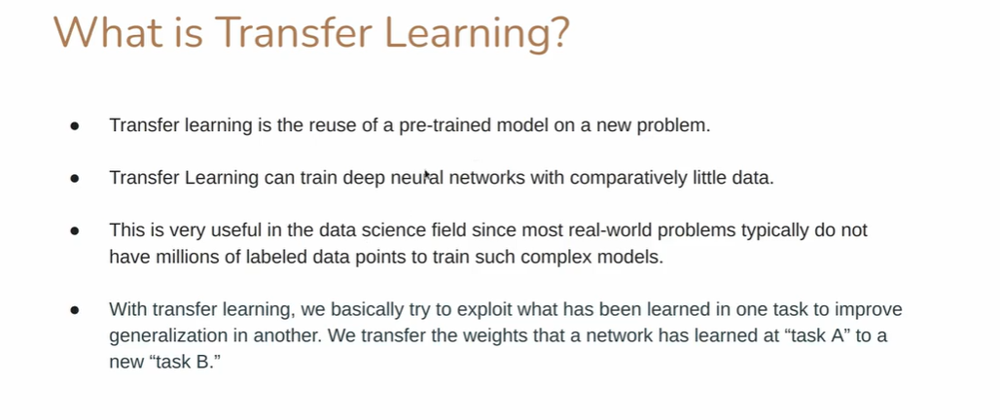
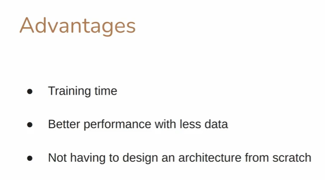

# What is Transfer learning:

## Short definition (one line)

**Transfer learning** is the practice of taking a model (or model parts) trained on one task (the *source task*) and reusing its learned knowledge (weights, features) for a different but related task (the *target task*), so you can train effective models with less data and time.

---

## Explain each term from your notes — detailed summary

* **“Reuse of pre-trained model on a new problem”**
  A *pre-trained model* is a neural network already trained on a (usually large) dataset for a specific task (e.g., ImageNet for images, BERT for language). Reuse means taking that network (or parts of it) and applying it to a new problem so the new model starts with useful features rather than random weights.

* **“Train deep neural networks with comparatively little data”**
  Deep models learn hierarchical features (edges → textures → objects). Pretrained networks have already learned many low- and mid-level features. For a new task you often only need to learn higher-level, task-specific mappings — so you can get good performance even with less labeled data.

* **“Most real-world problems do not have millions of labeled datapoints”**
  Collecting and labeling huge datasets is expensive. Transfer learning leverages large public datasets (or pretraining runs) so practitioners can solve tasks with small-to-moderate datasets.

* **“Exploit what has been learned in one task to improve generalization in another”**
  The idea is that features learned on task A (edges, shapes, language syntax) are useful priors for task B. This improves the **generalization** (performance on unseen examples) of the model when data is limited.

* **“Transfer the weights that a network has learned at task A to a new task B”**
  Model **weights** are the learned parameters (numbers) inside the network. Transfer learning typically copies weights from the pretrained model into the new model (either frozen or as initial values to be fine-tuned).

---

## Two main practical modes of transfer learning (how it’s done)

1. **Feature extraction (freeze backbone)**

   * Keep the pretrained model (the **backbone** or **base**) weights frozen.
   * Remove the original output head and add a new task-specific head (e.g., GlobalAvgPool → Dense → softmax).
   * Train only the new head (few parameters) on the target dataset.
   * Use when target dataset is small or similar low-level features are sufficient.

2. **Fine-tuning (unfreeze and train some/all layers)**

   * Initialize with pretrained weights but **unfreeze** part (or all) of the network and train with a small learning rate.
   * Often: first do feature extraction (train head), then unfreeze last N layers and fine-tune.
   * Use when you have more target data or the target domain differs from the source domain.

---

## Simple ASCII diagram — transfer workflow

```
[ pretrained backbone ]───→ freeze? ──┐
(conv layers learned on source)       │
                                      ├─> attach new head → train on target → predictions
[ remove original head ]──────────────┘
                                      (feature extraction or fine-tuning)
```

More concrete:

```
Source model:  IMAGE  -> Conv blocks (ResNet) -> Dense head -> softmax (1000 ImageNet classes)

Transfer:      IMAGE' -> Conv blocks (same ResNet, weights copied)
                                   ├─ option A: freeze conv blocks -> add new Dense head -> train head only
                                   └─ option B: unfreeze last conv blocks -> train head + some conv layers (fine-tune)
```

---

## Why transfer learning helps (advantages) — explained

1. **Much shorter training time**

   * Pretrained weights provide sensible initial features. Training converges faster because you’re not learning everything from scratch.

2. **Better performance with less labeled data**

   * The model leverages priors learned from a large dataset; it needs fewer examples to reach good accuracy on the new task.

3. **Don’t need to design architecture from scratch**

   * Use proven backbones (ResNet, MobileNet, BERT) and focus on the task head and training strategy.

4. **Lower computational cost / resource requirements**

   * Avoid huge pretraining runs; fine-tuning or head-only training requires fewer GPU hours.

5. **Works across modalities**

   * Vision, NLP, audio — transfer learning is broadly effective (ImageNet pretrained models, BERT-style language models, etc.)

---

## When transfer learning may *not* help — pitfalls & caveats

* **Domain mismatch / distribution shift**
  If the source and target domains are very different (e.g., pretraining on photographs, target is medical X-rays), low-level features might be less useful; careful fine-tuning or different pretraining may be needed.

* **Catastrophic forgetting**
  When fine-tuning incorrectly, the model may “forget” useful pretrained knowledge; use small learning rates and staged unfreezing.

* **Overfitting the small target set**
  Fine-tuning many parameters on tiny datasets can overfit; prefer feature extraction or strong regularization.

* **BatchNorm and transfer**
  BatchNorm layers have running statistics that may need special handling (recompute or adapt) during transfer.

* **Licensing / biases**
  Pretrained models inherit biases and license constraints from their training data — check before using in sensitive applications.

---

## Practical recipe (feature extraction → fine-tuning) — TensorFlow/Keras example

```python
import tensorflow as tf
from tensorflow.keras import layers, models

# 1) Load pretrained backbone (example: MobileNetV2) WITHOUT top classification head
base = tf.keras.applications.MobileNetV2(
    input_shape=(224,224,3),
    include_top=False,        # remove original final classification layers
    weights='imagenet'        # load ImageNet pretrained weights
)

# 2) Freeze base (feature extraction)
base.trainable = False

# 3) Add a new classification head for your task (e.g., 5 classes)
inputs = tf.keras.Input(shape=(224,224,3))
x = tf.keras.applications.mobilenet_v2.preprocess_input(inputs)  # same preprocessing pipeline
x = base(x, training=False)
x = layers.GlobalAveragePooling2D()(x)
x = layers.Dropout(0.2)(x)
outputs = layers.Dense(5, activation='softmax')(x)
model = models.Model(inputs, outputs)

model.compile(optimizer='adam',
              loss='sparse_categorical_crossentropy',
              metrics=['accuracy'])

# Train head only
model.fit(train_dataset, validation_data=val_dataset, epochs=5)

# 4) (Optional) Fine-tune: unfreeze last N layers and re-train with low lr
base.trainable = True
# Freeze earlier layers, unfreeze last blocks:
for layer in base.layers[:-50]:
    layer.trainable = False

model.compile(optimizer=tf.keras.optimizers.Adam(1e-5),  # very small lr
              loss='sparse_categorical_crossentropy',
              metrics=['accuracy'])
model.fit(train_dataset, validation_data=val_dataset, epochs=5)
```

**Why each line?**

* `include_top=False` — we remove the original classifier head because we want to attach a head for our target classes.
* `weights='imagenet'` — load weights learned on ImageNet.
* `base.trainable = False` — freeze base so only the new head learns (prevents destroying pretrained weights).
* `preprocess_input(...)` — use same preprocessing that the backbone expects (scaling, normalization).
* `GlobalAveragePooling2D()` — collapse spatial map to one vector per channel (fewer parameters than flatten + dense).
* `Dropout(0.2)` — regularize the head training.
* `Dense(5, activation='softmax')` — final classifier for 5 target classes.
* Later we unfreeze part of `base` and compile with a *very small learning rate*, because we want to adjust pretrained weights slightly (fine-tune) without overshooting.

---

## Common pretrained backbones & tasks (practical choices)

* **Vision (images):** ResNet, VGG, Inception, EfficientNet, MobileNet, DenseNet.
* **NLP (text):** BERT, RoBERTa, GPT variants, DistilBERT, T5 (use Hugging Face / TF Hub).
* **Audio / speech:** Wav2Vec, YAMNet, OpenL3 embeddings.
* **Task hubs:** TensorFlow Hub, Hugging Face Transformers — repositories of pretrained models for quick reuse.

---

## Quick checklist for doing transfer learning successfully

1. Choose backbone pretrained on data similar to your domain if possible.
2. Use preprocessing matching the backbone (rescale, normalization).
3. Start with **feature extraction** (freeze backbone) and train the head.
4. If more data or needed performance, unfreeze last few blocks and **fine-tune** with small learning rate.
5. Monitor validation performance, watch for overfitting.
6. Handle BatchNorm carefully (you may need to keep it in inference mode or reset stats).
7. Consider data augmentation to expand target dataset variability.
8. Validate model fairness and legal constraints of pretrained data.

---

## Beginner glossary — explain every uncommon/new word

* **Backbone**: the pretrained base network (e.g., ResNet) that produces feature maps; used as the general feature extractor.
* **Head**: the task-specific layers you attach to the backbone (e.g., pooling + Dense + softmax).
* **Pretrained**: model weights obtained by training on a (usually large) dataset prior to your task.
* **Weights / Parameters**: numeric values (matrices/arrays) in neural networks that are learned during training.
* **Fine-tuning**: continuing training of a pretrained model (or some of its layers) on a new task, usually with a small learning rate.
* **Feature extraction**: freezing the pretrained model and training only a new head to map the extracted features to target labels.
* **Domain shift**: when the target data distribution differs from the source/pretraining data distribution.
* **BatchNorm (Batch Normalization)**: layer that stabilizes activations by normalizing across a batch; its running statistics may need special care during transfer.
* **Global Average Pooling**: turns each H×W feature map into one number (its average), reducing parameters and overfitting risk.
* **Catastrophic forgetting**: when a network loses useful pretrained knowledge after aggressive re-training on new data.
* **Regularization**: techniques (Dropout, weight decay) to prevent overfitting.
* **Learning rate**: step size used by optimizers; a very small learning rate is recommended during fine-tuning.
* **Softmax**: final activation that converts logits into probabilities summing to 1 for multi-class classification.
* **Logits**: raw scores before softmax.
* **Transferability**: how well features learned on source data apply to target data.
* **Hugging Face / TF Hub**: popular libraries/repositories that host many pretrained models for NLP and vision.

---

## Final quick summary (two lines)

Transfer learning lets you *reuse* learned features from large pretraining runs to bootstrap new tasks — giving faster training, better accuracy with less labeled data, and fewer architecture-design headaches. Start with feature extraction; progress to careful fine-tuning if you have the data and need extra performance.

---

---

---

---

---


Great — love these concrete examples. Below I’ll expand each one into a clear **transfer-learning scenario**: *what you’d actually do*, *why it works*, *practical tips*, a **copy-pasteable Keras recipe** (feature-extraction → optional fine-tune), recommended hyperparameters, common pitfalls, and finally a small glossary of uncommon words. I’ll also add two extra useful example scenarios at the end.

---

# Scenario A — **Dog detector → retrain for wild animals (wolves & foxes)**

**Idea:** Start from a model pre-trained to recognize dogs (or ImageNet) and adapt it to classify wild animals (wolves, foxes, maybe dogs/other species).

### Why this works

Dog detectors learned many useful low-level (edges, fur textures) and mid-level features (snout/ear shapes). Wolves/foxes share visual patterns with dogs, so the pretrained filters transfer well.

### Steps (practical)

1. **Collect dataset:** images of wolves, foxes, (optionally dogs/other classes). Aim for at least a few hundred images per class; more is better.
2. **Preprocess:** crop/resize to model input size (e.g., 224×224), normalize with the same preprocessing function as the pretrained model.
3. **Feature extraction (first pass):**

   * Load backbone (`include_top=False`, `weights='imagenet'`).
   * Freeze backbone (`base.trainable = False`).
   * Add `GlobalAveragePooling2D` → `Dropout` → `Dense(num_classes, activation='softmax')`.
   * Train only the head (few epochs).
4. **Evaluate:** check validation accuracy; if OK, stop. If not:
5. **Fine-tuning:** unfreeze the last N layers of the backbone (e.g., last 10–30 layers), compile with a *very small* learning rate (1e-5…5e-5), and continue training for a few epochs.
6. **Augmentation:** use flips, random crops, color jitter, random rotations — helps with small datasets.
7. **Test & monitoring:** confusion matrix, per-class recall/precision.

### Example Keras code (feature extraction → fine-tune)

```python
import tensorflow as tf
from tensorflow.keras import layers, models

num_classes = 3  # e.g., wolf, fox, other
input_shape = (224,224,3)

# Base model (backbone)
base = tf.keras.applications.ResNet50(include_top=False, weights='imagenet',
                                      input_shape=input_shape)

# Feature-extraction head
base.trainable = False
inputs = tf.keras.Input(shape=input_shape)
x = tf.keras.applications.resnet.preprocess_input(inputs)
x = base(x, training=False)
x = layers.GlobalAveragePooling2D()(x)
x = layers.Dropout(0.3)(x)
outputs = layers.Dense(num_classes, activation='softmax')(x)
model = models.Model(inputs, outputs)

model.compile(optimizer='adam',
              loss='sparse_categorical_crossentropy',
              metrics=['accuracy'])

# Train head
model.fit(train_ds, validation_data=val_ds, epochs=8)

# Fine-tune: unfreeze last block
base.trainable = True
for layer in base.layers[:-40]:
    layer.trainable = False

model.compile(optimizer=tf.keras.optimizers.Adam(1e-5),
              loss='sparse_categorical_crossentropy',
              metrics=['accuracy'])
model.fit(train_ds, validation_data=val_ds, epochs=5)
```

### Recommended hyperparams (starting point)

* Feature extraction: epochs 5–10, batch_size 16–64, lr 1e-3 (Adam)
* Fine-tune: epochs 3–8, lr 1e-5 to 5e-5
* Dropout 0.2–0.5 when head is small
* Augmentation: horizontal flip, random crop/scale, slight hue/brightness

### Pitfalls

* If source dataset is too different (e.g., dogs trained only indoors vs wild landscapes), low-level features still help but mid/high features may not.
* Class imbalance — use class weights or oversampling.
* BatchNorm layers: when fine-tuning, keep `training=False` for backbone during feature extraction; when unfreezing, use small LR and consider resetting BN running stats if domain strongly different.

---

# Scenario B — **Face detection model → expression / emotion detection**

**Two approaches depending on starting point:**

1. **If you have a face *detector* (object detection model):**

   * Use the detector to crop faces from images (bounding boxes).
   * Feed cropped faces to a classifier head (transfer learning) to predict expressions (happy, sad, angry, etc.).
2. **If you have a face *classification* backbone (e.g., pretrained on VGGFace/face recognition):**

   * Replace final head with emotion classes and fine-tune (often works very well).

### Why this works

Face detectors/finders and face recognition models learn facial feature representations (eyes, mouth, expressions). Those are highly transferable for expression classification.

### Steps

1. **Face crop pipeline:** use detector (MTCNN, OpenCV Haar, or object detector) to extract face regions.
2. **Create dataset:** each face crop labeled with expression.
3. **Feature extraction:** use a pretrained face backbone or ImageNet model, freeze backbone, add head, train.
4. **Fine-tune last layers** if data allows.

### Extra tips

* Expressions may be subtle -> high-quality crops and alignment (eyes level) help.
* Use data augmentation (brightness, small rotations) but avoid distorting expression.
* Consider temporal models (LSTM/3D-CNN) if you have videos (expressions evolve over time).

---

# Scenario C — **Reusing an animal-image architecture for car image classification**

**Meaning:** you take the same model architecture (or a model pretrained on animals/ImageNet) and train it on car dataset.

### Two interpretations & approaches

1. **Reuse *architecture only***: randomly initialize weights but use the same architecture (e.g., ResNet, MobileNet). This is *not* transfer learning — it's just reusing design.
2. **True transfer learning:** load pretrained weights (ImageNet or animal model) and fine-tune for car classes. This leverages learned visual features.

### Steps (recommended)

* Use pretrained ImageNet backbone (cars are in same image domain).
* Feature extraction → fine-tune last blocks.
* If you have many car images, fine-tune more layers. If few, freeze backbone.

---

# Two extra useful examples

### D — Medical imaging: ImageNet → X-ray tumor detection

* Pretrained ImageNet features often help even for medical images, but domain gap can be large. Use heavy fine-tuning and careful validation; typically need more domain-specific augmentation and calibration.

### E — NLP: BERT → sentiment / domain classifier

* Use pretrained BERT; freeze encoder and train a classification head, then unfreeze last transformer blocks for fine-tuning with very low LR.

---

# Practical checklist for any transfer-learning task

1. **Pick an appropriate backbone** (ResNet/EfficientNet/MobileNet for vision; BERT/DistilBERT for NLP).
2. **Match preprocessing** (same resize/scaling/normalization).
3. **Start with feature extraction** (freeze backbone) — train head until validation plateaus.
4. **Then fine-tune** a few last layers with a very small LR if necessary.
5. **Use augmentation** appropriate to problem domain.
6. **Monitor validation metrics** and use early stopping to avoid overfitting.
7. **Test on truly unseen data** to estimate real generalization.

---

# Short, concrete hyperparameter recommendations

* Initial head training: `lr=1e-3` (Adam), `epochs=5–10`, `batch=16–64`
* Fine-tuning: `lr=1e-5` to `5e-5`, `epochs=3–8`
* Dropout head: 0.2–0.5
* Prefer `GlobalAveragePooling2D()` instead of `Flatten()` to reduce FC params

---

# Common pitfalls & how to fix

* **Overfitting small dataset:** use stronger augmentation, freeze more layers, add dropout, use early stopping.
* **Domain mismatch:** try domain-specific pretraining (if possible) or unfreeze more layers.
* **BatchNorm instability:** if fine-tuning, set `BatchNorm` layers to training=False often or reinitialize running stats.
* **Imbalanced classes:** use class weights, focal loss, or sampling strategies.

---

# Quick reusable function (Keras) to attach a head

```python
def build_transfer_model(backbone_name='ResNet50', input_shape=(224,224,3), num_classes=2):
    if backbone_name == 'ResNet50':
        base = tf.keras.applications.ResNet50(include_top=False, weights='imagenet', input_shape=input_shape)
        preprocess = tf.keras.applications.resnet.preprocess_input
    # add other backbones as needed

    base.trainable = False
    inputs = tf.keras.Input(shape=input_shape)
    x = preprocess(inputs)
    x = base(x, training=False)
    x = tf.keras.layers.GlobalAveragePooling2D()(x)
    x = tf.keras.layers.Dropout(0.3)(x)
    outputs = tf.keras.layers.Dense(num_classes, activation='softmax')(x)
    model = tf.keras.Model(inputs, outputs)
    return model
```

---

# Beginner glossary — every uncommon word explained simply

* **Backbone:** pretrained feature extractor (e.g., ResNet), the “body” of the network you reuse.
* **Head:** task-specific final layers you add on top of the backbone.
* **Feature extraction:** freeze backbone, train only the new head.
* **Fine-tuning:** unfreeze some backbone layers and continue training (with small LR) to adapt them.
* **Domain shift / domain mismatch:** when new data distribution differs from the pretraining data distribution (e.g., photos → x-rays).
* **BatchNorm (Batch Normalization):** layer that normalizes activations per batch; has running stats that can complicate transfer.
* **GlobalAveragePooling2D:** collapses H×W feature maps into a vector by averaging each channel — reduces params.
* **Logits:** raw outputs before softmax; not yet probabilities.
* **Softmax:** converts logits to a probability distribution (sums to 1).
* **Class imbalance:** some classes have many fewer examples → can bias training.
* **Data augmentation:** artificially modify images (flip, rotate, crop) to increase dataset diversity.
* **Early stopping:** stop training when validation metric no longer improves to avoid overfitting.
* **Learning rate (LR):** step size for parameter updates — smaller LR is safer during fine-tuning.
* **Overfitting:** model learns training noise instead of general features; performs poorly on new data.
* **Precision / Recall / Confusion matrix:** metrics to evaluate class-wise performance (important when classes are imbalanced).

---

