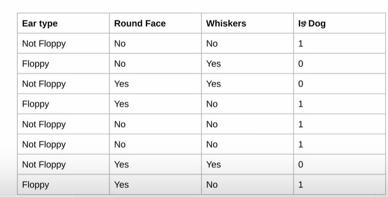
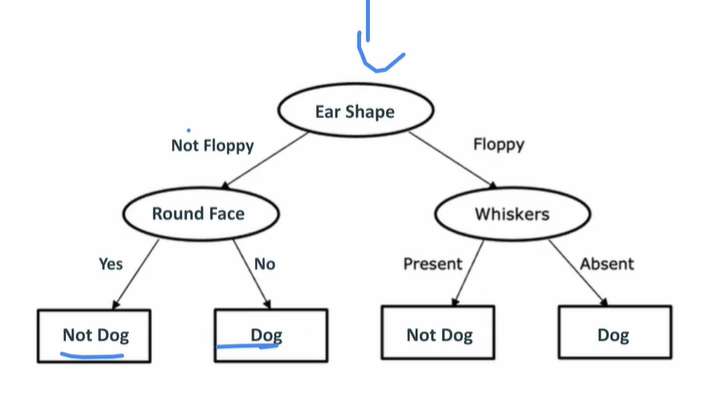

# What is a Decision Tree (high level)

A **decision tree** is a flowchart-like model that repeatedly asks simple questions (tests on feature values) and routes examples down branches until it reaches a **leaf** that gives a prediction.
It is an **acyclic graph** (no loops) with one **root**, internal **decision nodes**, and **leaf nodes** (predictions). It’s equivalent to a nested `if-else` ladder.

---

# Tiny example dataset (toy, binary features)

We have 8 animals with three simple features and a label `is_dog` (1 = dog, 0 = not dog).

| id | ear_shape | face_shape | whiskers | is_dog |           |
| -- | --------- | ---------- | -------- | ------ | --------- |
| 1  | pointy    | elongated  | yes      | 0      | (fox)     |
| 2  | pointy    | elongated  | yes      | 0      | (wolf)    |
| 3  | floppy    | round      | no       | 1      | (dog)     |
| 4  | floppy    | round      | no       | 1      | (spaniel) |
| 5  | pointy    | round      | yes      | 0      | (cat)     |
| 6  | floppy    | elongated  | no       | 1      | (dog)     |
| 7  | pointy    | round      | yes      | 0      | (cat)     |
| 8  | floppy    | round      | no       | 1      | (dog)     |

Count: 4 dogs (ids 3,4,6,8), 4 non-dogs (1,2,5,7).

---

# Build the best split (intuition)

Look at `ear_shape`:

* `floppy` → ids 3,4,6,8 → all **is_dog = 1**
* `pointy` → ids 1,2,5,7 → all **is_dog = 0**

That single test perfectly separates dogs vs non-dogs — a decision tree can be *very* simple here.

---

# The resulting decision tree (ASCII)

```
ROOT: ear_shape == 'floppy' ?
           /                     \
        Yes                      No
       Leaf:                    Leaf:
      Predict=1               Predict=0
      (DOG)                   (NOT DOG)
```

In nested `if-else` form:

```python
if ear_shape == 'floppy':
    predict = 1   # dog
else:
    predict = 0   # not dog
```

Simple, human-readable rules. That’s the core appeal of decision trees.

---

# Why this works (impurity & information gain — the math)

Decision trees pick splits that make child nodes **purer** (more dominated by a single class). Two common impurity measures:

### 1. Entropy (information theory)

For a node with class probabilities (p_0, p_1):

[
\text{Entropy} = - \sum_{c} p_c \log_2 p_c
]

At the **root** (before any split):

* (p(\text{dog}) = 4/8 = 0.5)
* (p(\text{not dog}) = 0.5)

Entropy(_\text{root}) = (-0.5\log_2 0.5 - 0.5\log_2 0.5 = 1.0) bit.

After splitting on `ear_shape`:

* Left child (floppy): 4 dogs, 0 non-dogs → entropy = 0
* Right child (pointy): 0 dogs, 4 non-dogs → entropy = 0

**Information gain** = Entropy(root) − weighted_entropy(children) = 1 − 0 = **1.0** (perfect split).

### 2. Gini impurity

Gini for node = (1 - \sum_c p_c^2).

Root: (1 - (0.5^2 + 0.5^2) = 1 - 0.5 = 0.5.)
Children are pure → Gini = 0. So splitting on `ear_shape` eliminates impurity.

Because this split gives maximal purity, the tree stops (pure leaves).

---

# Training a Decision Tree with scikit-learn (code you can run)

```python
# pip install scikit-learn matplotlib
import pandas as pd
from sklearn.tree import DecisionTreeClassifier, export_text, plot_tree
import matplotlib.pyplot as plt

# 1) Toy dataset
data = [
    ['pointy','elongated','yes',0],
    ['pointy','elongated','yes',0],
    ['floppy','round','no',1],
    ['floppy','round','no',1],
    ['pointy','round','yes',0],
    ['floppy','elongated','no',1],
    ['pointy','round','yes',0],
    ['floppy','round','no',1],
]
df = pd.DataFrame(data, columns=['ear','face','whiskers','is_dog'])

# 2) Encode categorical features simply
X = pd.get_dummies(df[['ear','face','whiskers']])
y = df['is_dog']

# 3) Train tree
clf = DecisionTreeClassifier(criterion='entropy', random_state=0)
clf.fit(X, y)

# 4) Print textual rules
r = export_text(clf, feature_names=list(X.columns))
print(r)

# 5) Visualize
plt.figure(figsize=(6,4))
plot_tree(clf, feature_names=X.columns, class_names=['not_dog','dog'], filled=True, rounded=True)
plt.show()
```

`export_text` will print readable rule(s). Because the dataset separates perfectly on the `ear_floppy` dummy column, the text will show that test at the root.

---

# How a decision is made for a new example (decision path)

Example animal: `ear='floppy', face='round', whiskers='no'`

* Check root: `ear == floppy`? Yes → follow left branch → leaf → predict dog.

In code (decision path printed by sklearn):

```python
clf.decision_path(X_new)
```

You can also print the path as a sequence of node tests.

---

# When trees grow large — overfitting & pruning

If your data is noisy or features are not perfectly separable, trees can grow deep, memorizing training quirks → **overfitting**.

Common controls:

* `max_depth` — max depth of tree (shallow trees generalize better).
* `min_samples_split` — minimum samples needed to split a node.
* `min_samples_leaf` — min samples required in a leaf.
* `ccp_alpha` (cost-complexity pruning) — prune subtrees that don’t improve generalization.

Example: `DecisionTreeClassifier(max_depth=3, min_samples_leaf=5)`

Pruning trades some training accuracy for better test performance.

---

# Pros & Cons of Decision Trees

**Pros**

* Intuitive, human-readable rules (if-else)
* Handle numerical & categorical features (after encoding)
* No scaling required (unlike e.g., k-means/SVM)
* Fast prediction, interpretable decisions

**Cons**

* Tend to overfit if not controlled
* Small changes to data can change tree structure (unstable)
* Trees can be biased toward features with many levels (categorical cardinality)
* Often outperformed by ensembles (Random Forest, Gradient Boosting)

If you need more stable/powerful models, ensemble methods (Random Forest, XGBoost) keep trees’ interpretability while improving accuracy.

---

# Visual / Logical analogy

A decision tree is like a **diagnostic checklist** a vet uses:

```
1) Are the ears floppy?
   -> Yes: It's a dog
   -> No: Not a dog
```

More complex trees are deeper: "If ears not floppy, is face round? If yes... else..." — a nested ladder of checks.

---

# Practical tips when building classification trees

1. **Start simple**: small max_depth (2–5) and increase if underfitting.
2. **Use cross-validation** to pick hyperparameters.
3. **Prune** to avoid overly deep trees.
4. **Inspect feature importance** (`clf.feature_importances_`) to see which features the tree relied on.
5. **Visualize** (`plot_tree`) to communicate rules to stakeholders.
6. **If features are many/noisy**, consider ensemble methods.

---

# Quick manual calculation recap (so it sticks)

* Root class proportions: 4 dogs, 4 non-dogs → p=0.5 each.
* Entropy(root) = −0.5·log₂0.5 −0.5·log₂0.5 = 1.0.
* Split on `ear_shape` yields pure children → entropy children = 0.
* Info gain = 1.0 → perfect split chosen.

---

# Short glossary (beginner-friendly)

* **Root**: top node of the tree where decisions start.
* **Internal node**: a node that tests a feature and splits data.
* **Leaf (terminal node)**: node that gives the final prediction (class label or value).
* **Split**: a test on a feature that partitions the data (e.g., `ear == 'floppy'`).
* **Entropy**: measure of impurity / disorder (0 = pure, higher = mix).
* **Gini impurity**: alternate impurity measure (0 = pure).
* **Information gain**: reduction in impurity after a split — higher is better.
* **Pruning**: removing parts of tree to reduce complexity and avoid overfitting.
* **Decision path**: sequence of tests from root to leaf used to predict a sample.
* **Acyclic graph (tree)**: no loops — data flows from root down to leaves.

---


