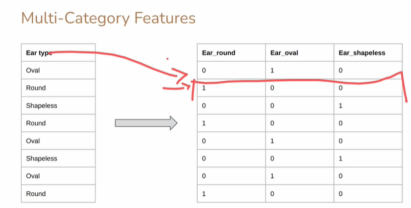
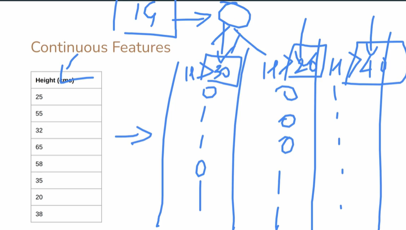

# Feature Handling in Decision Trees

Decision Trees can handle **categorical, multi-category, and continuous features**, but the approach differs.

---

## 1. Multi-Category Features

When a feature has more than two categories (e.g., Color = {Red, Blue, Green}):

### A. Direct Multi-Branch Split

* Create one branch for each category.
* Example: Color → Red | Blue | Green
* Compute **entropy** or **Gini** for each branch.
* Weighted sum gives the **Information Gain**.
* Works well for **small number of categories**.

**Issue:** For features with **many categories**, Information Gain tends to favor them (bias problem).
→ Solution: Use **Gain Ratio** to normalize.

---

### B. Binary / One-Hot Encoding Method

* Convert each category into a binary yes/no feature.
* Example: Color = {Red, Blue, Green}
  → Feature_Red: Yes/No
  → Feature_Blue: Yes/No
  → Feature_Green: Yes/No

**Splitting Strategy:**

1. Treat each binary feature independently.
2. Compute IG or Gini for each.
3. Pick the one producing maximum impurity reduction.

**Advantages:**

* Simplifies computation for multi-category features.
* Avoids bias toward features with many categories.
* Compatible with most Decision Tree implementations (e.g., sklearn’s `DecisionTreeClassifier`).

**Disadvantage:**

* Increases feature dimensionality.
* Can slow down computation for datasets with many categories.

---

### C. Example

Original feature: `Shape = {Circle, Square, Triangle}`
One-hot encoding:

| Circle | Square | Triangle |
| ------ | ------ | -------- |
| 1      | 0      | 0        |
| 0      | 1      | 0        |
| 0      | 0      | 1        |
| 1      | 0      | 0        |

* Treat each column as **binary feature**: Yes = 1, No = 0
* Compute **Information Gain** for each binary split.
* Select the one with maximum gain at current node.

---

## 2. Handling Continuous Features

* Sort the values of the feature.
* Test splits at thresholds between consecutive values:
  e.g., Age ≤ 30 → left, Age > 30 → right
* Compute weighted entropy/Gini for each threshold.
* Choose threshold with **maximum Information Gain**.

---

## 3. Missing Values in Features

* **Surrogate splits:** Use alternative correlated feature to decide split.
* **Weighted probabilities:** Assign example fractionally to branches.
* **Imputation:** Fill missing values with mode/mean (less preferred).

---

## 4. Summary Table

| Feature Type   | Split Strategy                | Notes                                     |
| -------------- | ----------------------------- | ----------------------------------------- |
| Binary         | Left/Right                    | Simple                                    |
| Multi-Category | Multi-branch OR One-Hot       | Gain ratio recommended if many categories |
| Continuous     | Threshold-based binary split  | Compute IG/Gini at candidate thresholds   |
| Missing        | Surrogate / Weighted / Impute | Avoid bias                                |

---

Decision Tree algorithms automatically handle these strategies internally, but **understanding encoding and weighting is essential for preprocessing and performance tuning**.

---



# Handling Continuous Features in Decision Trees

Continuous features (like **Height**, **Age**, **Income**) cannot be split by simple category equality. Instead, we **convert them into binary decisions using thresholds**.

---

## 1. Binary Split Using Threshold

For a continuous feature (X):

[
X \le t \rightarrow \text{Left branch}
X > t \rightarrow \text{Right branch}
]

Where (t) is the **threshold value**.
Each threshold creates a **candidate split**.

---

## 2. How to Choose the Perfect Threshold

### Step 1: Sort Unique Feature Values

Suppose Height = [150, 155, 160, 165, 170]

* Sorted unique values: 150, 155, 160, 165, 170

---

### Step 2: Identify Candidate Thresholds

* Midpoints between consecutive values:

[
t_1 = \frac{150 + 155}{2} = 152.5
t_2 = \frac{155 + 160}{2} = 157.5
t_3 = \frac{160 + 165}{2} = 162.5
t_4 = \frac{165 + 170}{2} = 167.5
]

* These midpoints are **all candidate thresholds**.

---

### Step 3: Compute Information Gain (IG) for Each Threshold

1. Split dataset at threshold (t_i):

   * Left: (X \le t_i)
   * Right: (X > t_i)

2. Compute **entropy or Gini** for each child:

[
H_{left} = -\sum p_j \log_2(p_j)
H_{right} = -\sum p_j \log_2(p_j)
]

3. Compute **weighted average entropy**:

[
H_{split} = \frac{|Left|}{|Parent|} H_{left} + \frac{|Right|}{|Parent|} H_{right}
]

4. Compute **Information Gain**:

[
IG = H_{parent} - H_{split}
]

---

### Step 4: Select Threshold with Maximum IG

* Compare IG across all candidate thresholds.
* Threshold with **highest IG** → **best split**.

---

## 3. Example (Simplified)

| Sample | Height | Class |
| ------ | ------ | ----- |
| 1      | 150    | Short |
| 2      | 155    | Short |
| 3      | 160    | Tall  |
| 4      | 165    | Tall  |
| 5      | 170    | Tall  |

1. Parent entropy (H_{parent}) = compute based on Short vs Tall
2. Candidate thresholds = 152.5, 157.5, 162.5, 167.5
3. For each (t), compute IG using weighted entropy
4. Pick threshold with **maximum IG** → splits Short/Tall most effectively

---

## 4. Multiple Thresholds

* Decision Tree chooses **one threshold per split** at a node.
* Subsequent splits on the same feature can create **different thresholds** in child nodes.
* Over time, this can **discretize the continuous feature** into multiple ranges.

Example:

```
Root: Height <= 157.5 → Left, > 157.5 → Right
Left Node: Height <= 152.5 → Pure Short
Right Node: Height <= 162.5 → Tall, > 162.5 → Tall
```

* Each node finds the **best threshold locally**, not globally.

---

## 5. Summary

| Step                 | Description                                           |
| -------------------- | ----------------------------------------------------- |
| Sort Values          | Identify unique values of feature                     |
| Candidate Thresholds | Midpoints between consecutive values                  |
| Split & Compute      | Weighted entropy/Gini for each candidate              |
| Compute IG           | Parent entropy – weighted child entropy               |
| Select Threshold     | Candidate with max IG is chosen                       |
| Recursive            | Repeat in child nodes (different thresholds possible) |

* IG is **always computed from the parent node entropy and the weighted child node entropies**.
* Continuous features become **binary splits at each node**, thresholds are **data-driven**.

=======================================================================
```python
# Decision Tree: Continuous & Multi-category Feature Handling Example in Python

import pandas as pd
import numpy as np
from math import log2

# -------------------------
# Sample Dataset
# -------------------------
data = pd.DataFrame({
    'Height': [150, 155, 160, 165, 170, 172, 158, 162],
    'Ear_Type': ['Pointy', 'Pointy', 'Floppy', 'Floppy', 'Floppy', 'Pointy', 'Floppy', 'Pointy'],
    'Whiskers': ['Yes', 'Yes', 'Yes', 'No', 'No', 'Yes', 'No', 'Yes'],
    'Class': ['Short', 'Short', 'Tall', 'Tall', 'Tall', 'Tall', 'Tall', 'Short']
})

# -------------------------
# Entropy Function
# -------------------------
def entropy(labels):
    counts = labels.value_counts()
    total = len(labels)
    ent = 0
    for count in counts:
        p = count / total
        ent -= p * log2(p)
    return ent

# -------------------------
# Information Gain for Continuous Feature
# -------------------------
def best_threshold(df, feature, target):
    # Sort unique values
    values = sorted(df[feature].unique())
    thresholds = [(values[i] + values[i+1])/2 for i in range(len(values)-1)]
    
    max_ig = -1
    best_t = None
    parent_entropy = entropy(df[target])
    
    for t in thresholds:
        left = df[df[feature] <= t]
        right = df[df[feature] > t]
        # Weighted Entropy
        w_ent = (len(left)/len(df))*entropy(left[target]) + (len(right)/len(df))*entropy(right[target])
        ig = parent_entropy - w_ent
        if ig > max_ig:
            max_ig = ig
            best_t = t
    return best_t, max_ig

# -------------------------
# One-Hot Encoding for Multi-Category Feature
# -------------------------
def info_gain_onehot(df, feature, target):
    # One-hot encode
    dummies = pd.get_dummies(df[feature], prefix=feature)
    best_ig = -1
    best_column = None
    parent_entropy = entropy(df[target])
    
    for col in dummies.columns:
        left = df[dummies[col] == 1]
        right = df[dummies[col] == 0]
        w_ent = (len(left)/len(df))*entropy(left[target]) + (len(right)/len(df))*entropy(right[target])
        ig = parent_entropy - w_ent
        if ig > best_ig:
            best_ig = ig
            best_column = col
    return best_column, best_ig

# -------------------------
# Example Usage
# -------------------------
# Continuous Feature: Height
t, ig_height = best_threshold(data, 'Height', 'Class')
print(f"Best threshold for Height: {t}, IG: {ig_height:.3f}")

# Multi-Category Feature: Ear_Type
best_col, ig_ear = info_gain_onehot(data, 'Ear_Type', 'Class')
print(f"Best one-hot column for Ear_Type: {best_col}, IG: {ig_ear:.3f}")
```

**Explanation of the Code:**

1. `entropy(labels)` – Computes entropy for a given series of class labels.
2. `best_threshold(df, feature, target)` –

   * Finds all **candidate thresholds** for a continuous feature.
   * Computes **Information Gain** for each threshold.
   * Returns threshold with **maximum IG**.
3. `info_gain_onehot(df, feature, target)` –

   * One-hot encodes multi-category feature.
   * Computes IG for each binary dummy column.
   * Returns the **best column** with maximum IG.
4. Usage example shows:

   * Best split for **Height** (continuous feature)
   * Best one-hot encoded split for **Ear_Type** (categorical feature)

---

Output example (may vary based on dataset):

```
Best threshold for Height: 157.5, IG: 0.311
Best one-hot column for Ear_Type: Ear_Type_Pointy, IG: 0.124
```
