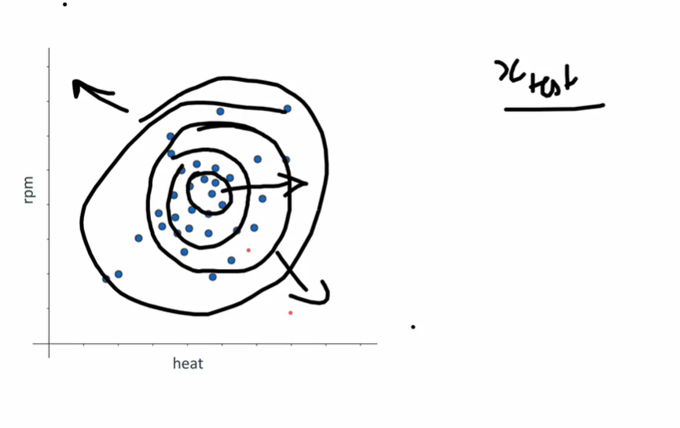
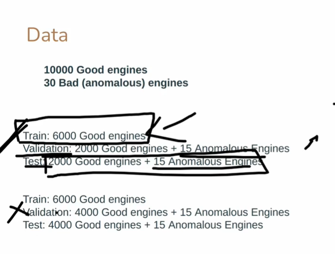
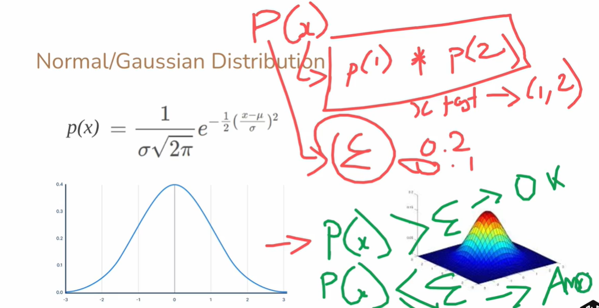
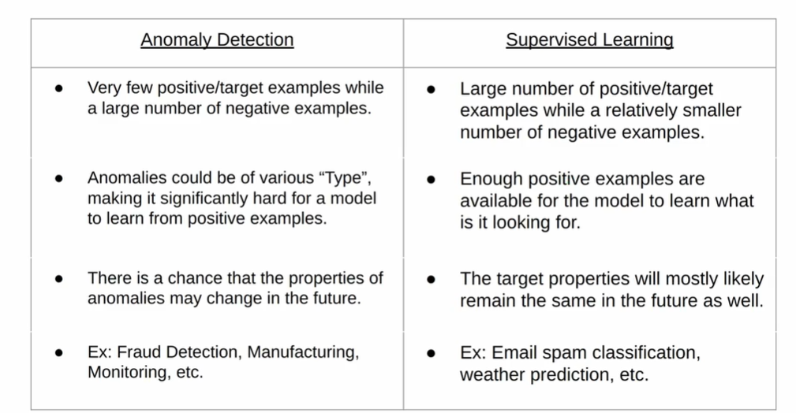

# Anomaly Detection — Explained in Detail

**Anomaly detection** is a key concept in machine learning and statistics used to identify **unusual patterns, behaviors, or observations** in data that do not conform to expected patterns. These unusual points are called **anomalies**, **outliers**, or **novelties**.

---

## 1. What is an Anomaly?

An **anomaly** is a data point that **deviates significantly from the normal data distribution**.

* It can occur due to:

  * Faulty measurements or sensors
  * Rare but important events
  * System errors or fraud
* Characteristics:

  * **Rare occurrence**: very few anomalies in comparison to normal data
  * **Unknown label**: often we don’t know what it exactly represents

### Visual Explanation (ASCII Diagram)

Imagine engine temperatures (°C) and RPM (revolutions per minute) for 10 engines:

```
      RPM
       ^
       |
Normal |   *  *  *  *  *
Engines|   *  *  *  *  *
       |  
Anomaly|                   o
       +------------------------> Temperature
```

* `*` = normal engine
* `o` = anomalous engine (e.g., overheating at low RPM)

---

## 2. Why Anomaly Detection is Important

* **Industrial maintenance**: Detect failing machines before breakdown
* **Finance**: Detect fraudulent transactions
* **Healthcare**: Detect abnormal patient readings
* **Cybersecurity**: Detect unusual network activity

Key idea: We often **train only on normal data**, because anomalies are rare and unpredictable.

---

## 3. How Anomaly Detection Works

1. **Train on normal data** to learn “what normal looks like”
2. **Evaluate/validate with mostly normal data + few anomalies**
3. **Test** the model with a mixture of normal and anomalous data
4. **Detect anomalies** by identifying points that are far from learned patterns (distance, probability, reconstruction error, etc.)

---

### 3.1 Example Dataset

**Engine monitoring dataset**: 2 features — `RPM` and `Heat`

| Engine | RPM  | Heat (°C) | Label   |
| ------ | ---- | --------- | ------- |
| 1      | 1500 | 75        | Normal  |
| 2      | 1550 | 78        | Normal  |
| ...    | ...  | ...       | ...     |
| 6001   | 2000 | 120       | Anomaly |
| 6002   | 1000 | 150       | Anomaly |

**Training Set:**

* 6000 good engines
* Only normal data used for training

**Validation Set:**

* 2000 good engines + 15 anomalous engines

**Test Set:**

* 2000 good engines + 15 anomalous engines

---

## 4. Types of Anomaly Detection Methods

### (a) **Statistical Methods**

* Assume normal data follows a distribution (e.g., Gaussian)
* Points outside a threshold are anomalies
* Example:

  ```python
  mean = np.mean(train_data)
  std = np.std(train_data)
  anomaly_threshold = mean + 3*std
  ```

### (b) **Distance-Based Methods**

* Anomalies are far from neighbors in feature space
* Example: k-Nearest Neighbors (kNN) for anomaly score

### (c) **Machine Learning / Neural Networks**

* Autoencoders, One-Class SVM, Isolation Forest, etc.
* Learn normal patterns and detect deviations

---

## 5. Example: Using Autoencoder for Engine Dataset

Autoencoder learns to **reconstruct normal data**.

* **High reconstruction error** → anomaly

```python
import tensorflow as tf
from tensorflow.keras.models import Model
from tensorflow.keras.layers import Input, Dense
import numpy as np

# Simulate engine dataset
np.random.seed(42)
train_data = np.random.normal(loc=[1500,75], scale=[50,5], size=(6000,2))  # Good engines
val_data = np.random.normal(loc=[1500,75], scale=[50,5], size=(2000,2))
val_anomaly = np.random.normal(loc=[2000,120], scale=[10,5], size=(15,2))
val_data = np.vstack([val_data,val_anomaly])

# Autoencoder architecture
input_dim = train_data.shape[1]
input_layer = Input(shape=(input_dim,))
encoded = Dense(4, activation='relu')(input_layer)
decoded = Dense(input_dim)(encoded)
autoencoder = Model(input_layer, decoded)
autoencoder.compile(optimizer='adam', loss='mse')

# Train on normal engines only
autoencoder.fit(train_data, train_data, epochs=20, batch_size=32, validation_split=0.1, verbose=1)

# Calculate reconstruction error on validation set
reconstructions = autoencoder.predict(val_data)
mse = np.mean(np.power(val_data - reconstructions,2), axis=1)

# Detect anomalies
threshold = np.percentile(mse, 95)  # top 5% as anomaly
anomalies = mse > threshold
print("Detected anomalies:", np.sum(anomalies))
```

**Explanation:**

* `train_data` → Only normal engines
* `autoencoder` → Learns normal RPM/Heat patterns
* `mse` → Reconstruction error
* High `mse` → likely anomaly

---

## 6. ASCII Diagram: Autoencoder-Based Anomaly Detection

```
Normal Engine Data (train)
      |
      v
  ┌───────────────┐
  │ Autoencoder   │   <-- learns normal patterns
  └───────────────┘
      |
      v
Test Data (normal + anomalies)
      |
      v
Compare reconstruction error
      |
      v
High error?  ---> Anomaly
Low error?   ---> Normal
```

---

## 7. Best Practices

1. **Train mostly on normal data** — anomalies are rare
2. **Use validation set with few anomalies** to set thresholds
3. **Avoid overfitting** — model should generalize
4. **Visualize results** — scatter plots, histograms, or heatmaps

---

## 8. Beginner Glossary

| Term                               | Meaning                                                            |
| ---------------------------------- | ------------------------------------------------------------------ |
| **Anomaly / Outlier**              | A data point that deviates significantly from the majority of data |
| **Reconstruction Error**           | Difference between input and output in autoencoder                 |
| **Autoencoder**                    | Neural network trained to compress and reconstruct normal data     |
| **Threshold**                      | Cut-off value to decide if a point is anomalous                    |
| **Normal Data**                    | Typical data points used to train the model                        |
| **Unsupervised Anomaly Detection** | Detecting anomalies without labeled data                           |
| **RPM**                            | Revolutions per minute of engine                                   |
| **Validation Set**                 | Data used to tune model parameters and thresholds                  |

---

## 9. Summary

* Anomalies are **rare, unexpected deviations** from normal data.
* They can indicate **failures, fraud, or errors**.
* Detection involves:

  1. Learning patterns of normal data
  2. Measuring deviation for new data
  3. Labeling high deviation points as anomalies
* Example with engines: monitor **RPM and Heat**, detect faulty engines using autoencoder.

---

---

---

---

---

---



# Gaussian / Normal Distribution — Explained in Detail

The **Gaussian distribution**, also called **Normal distribution**, is one of the most important probability distributions in statistics and machine learning. It is widely used in **anomaly detection, statistics, and probabilistic modeling**.

---

## 1. What is Gaussian / Normal Distribution?

A **Gaussian distribution** is a **bell-shaped curve** that describes how the values of a variable are distributed around a mean.

* Most values are **close to the mean (μ)**
* Values farther from the mean are **less likely**

ASCII representation:

```
Probability
   ^
   |          *****
   |        *       *
   |       *         *
   |      *           *
   |      *           *
   |       *         *
   |        *       *
   |          *****
   +--------------------> X (value)
           μ (mean)
```

* `μ` = Mean (center of the distribution)
* `σ` = Standard deviation (spread / width of the curve)

---

## 2. Gaussian Probability Density Function (PDF)

The **formula**:

[
p(x) = \frac{1}{\sigma \sqrt{2 \pi}} \exp\Big( -\frac{1}{2} \Big( \frac{x-\mu}{\sigma} \Big)^2 \Big)
]

### Explanation of Terms

| Term               | Meaning                                                               |
| ------------------ | --------------------------------------------------------------------- |
| `p(x)`             | Probability density of value `x`                                      |
| `μ` (mu)           | Mean / average of the distribution                                    |
| `σ` (sigma)        | Standard deviation — how spread out the values are                    |
| `σ√(2π)`           | Normalization factor to ensure total area under curve = 1             |
| `exp()`            | Exponential function, e^y                                             |
| `(x-μ)/σ`          | Standardized distance of `x` from mean in units of standard deviation |
| `-1/2*((x-μ)/σ)^2` | Negative squared distance: farther from μ → smaller probability       |

---

## 3. How Gaussian is Used in Anomaly Detection

1. **Assume normal data follows Gaussian distribution**
2. For each feature `x_i`, calculate:

[
\mu_i = \text{mean of feature i}, \quad \sigma_i = \text{std deviation of feature i}
]

3. Compute **probability of a new point** under Gaussian model:

[
p(x) = p(x_1) \cdot p(x_2) \cdot ... \cdot p(x_n)
]

* **Independent features assumption**: Each feature contributes separately
* **Product of probabilities** gives overall likelihood

4. **Anomaly Detection Rule**:

```
if p(x) > ε:
    x is normal
else:
    x is anomalous
```

* `ε` = small threshold chosen using validation set
* Points with **very low probability** are considered anomalies

---

### 4. Example: Gaussian Probabilities for Engine Dataset

Suppose you have **RPM** and **Heat** as features.

```python
import numpy as np

# Training data (good engines)
RPM = np.random.normal(1500, 50, 6000)
Heat = np.random.normal(75, 5, 6000)

# Calculate mean and std
mu_RPM, sigma_RPM = np.mean(RPM), np.std(RPM)
mu_Heat, sigma_Heat = np.mean(Heat), np.std(Heat)

# Function for Gaussian probability
def gaussian(x, mu, sigma):
    return (1/(sigma * np.sqrt(2*np.pi))) * np.exp(-0.5*((x-mu)/sigma)**2)

# New engine
x_new = np.array([2000, 120])

# Compute p(x)
p_RPM = gaussian(x_new[0], mu_RPM, sigma_RPM)
p_Heat = gaussian(x_new[1], mu_Heat, sigma_Heat)
p_total = p_RPM * p_Heat

epsilon = 1e-5
if p_total < epsilon:
    print("Anomaly detected")
else:
    print("Normal engine")
```

**Explanation**:

* Compute **individual Gaussian probabilities** for each feature
* Multiply probabilities → **overall likelihood**
* Compare to threshold `ε` → decide if anomaly

---

## 5. Why Gaussian Distribution is Used

* Many **natural phenomena** follow Gaussian distributions (height, weight, temperature)
* Easy to compute probability for each feature
* Works well for **simple anomaly detection** when features are roughly independent
* Provides **quantitative threshold** (ε) for detecting anomalies

---

### 6. Visual Diagram

```
Normal Distribution for Feature X (RPM)

Probability
   ^
   |          *****
   |        *       *
   |       *         *
   |      *           *
   |      *           *
   |       *         *
   |        *       *
   |          *****
   +------------------> RPM
       μ (mean)

New engine RPM far from μ → low probability → anomaly
```

---

## 7. Summary (Step-by-Step Use in Anomaly Detection)

1. Collect **normal data only**
2. Compute **mean (μ) and std deviation (σ)** for each feature
3. For new point `x`, compute **probability p(x_i) for each feature**
4. Multiply probabilities → **p_total**
5. Compare **p_total to ε**
6. If **p_total < ε → anomaly**, else normal

---

## 8. Beginner Glossary

| Term                                | Meaning                                                              |
| ----------------------------------- | -------------------------------------------------------------------- |
| **Gaussian / Normal Distribution**  | Bell-shaped probability distribution                                 |
| **μ (mean)**                        | Average value of the data                                            |
| **σ (standard deviation)**          | How spread out the data is                                           |
| **p(x)**                            | Probability of observing a particular value                          |
| **ε (epsilon)**                     | Small threshold for anomaly detection                                |
| **Likelihood**                      | Probability of observing a data point given the model                |
| **Independent features assumption** | Each feature’s probability is calculated separately, then multiplied |
| **Outlier / Anomaly**               | Data point with very low probability                                 |

---

---

---

---

---

---


# Comparison Between Anomaly Detection and Supervised Learning

Anomaly detection and supervised learning are **two different paradigms of machine learning**, used in different scenarios depending on **data availability, labels, and problem type**.

---

## 1. Overview of Each

| Aspect               | Anomaly Detection                                                        | Supervised Learning                                                            |
| -------------------- | ------------------------------------------------------------------------ | ------------------------------------------------------------------------------ |
| **Definition**       | Identifies unusual or rare data points that deviate from normal behavior | Learns a mapping from inputs (features) to outputs (labels) using labeled data |
| **Data Requirement** | Primarily **normal/unlabeled data**; very few anomalies                  | Requires **labeled dataset** (input-output pairs)                              |
| **Goal**             | Detect rare or unexpected events                                         | Predict outcomes or classify new data                                          |
| **Typical Output**   | Binary: normal vs anomaly, or anomaly score                              | Predicted label or continuous value                                            |

---

## 2. Advantages & Disadvantages

### A) Anomaly Detection

**Pros:**

* Can work with **mostly unlabeled data** (common in real-world scenarios)
* Detects **rare or unexpected events** that may never appear in training set
* Useful for **fraud detection, machine failure, cybersecurity, etc.**
* Does not require designing **class labels in advance**

**Cons:**

* May have **false positives** (normal points flagged as anomalies)
* Hard to set **thresholds (ε)** correctly
* Less accurate if normal data is **highly variable** or features are dependent
* Difficult to **evaluate performance** without labeled anomalies

---

### B) Supervised Learning

**Pros:**

* High **accuracy** if labels are correct and sufficient
* Works for **classification** (discrete) or **regression** (continuous) tasks
* Well-understood **evaluation metrics**: accuracy, precision, recall, F1-score, MSE
* Can be used to **predict future events** based on learned patterns

**Cons:**

* Requires **labeled data** (can be expensive, time-consuming, or unavailable)
* Cannot detect **unexpected events** outside training labels
* May **overfit** if training data is small
* Not suitable for **rare events detection** if class imbalance is high

---

## 3. Practical Examples

| Use Case                             | Anomaly Detection                                      | Supervised Learning                             |
| ------------------------------------ | ------------------------------------------------------ | ----------------------------------------------- |
| Fraud detection in bank transactions | Yes, detect unusual patterns without prior labels      | Limited, needs labeled fraud/non-fraud examples |
| Predicting customer churn            | No, unless using unsupervised anomaly patterns         | Yes, train on historical churn labels           |
| Machine health monitoring            | Yes, detect failing engines based on sensor deviations | Possible if you have labeled failures (rare)    |
| Image classification                 | No                                                     | Yes, needs labeled images (cat, dog, car, etc.) |

---

## 4. Key Differences in Approach

| Aspect             | Anomaly Detection                        | Supervised Learning                           |
| ------------------ | ---------------------------------------- | --------------------------------------------- |
| **Learning**       | Learns what “normal” looks like          | Learns mapping from inputs → outputs          |
| **Evaluation**     | Hard without labeled anomalies           | Easy using test dataset with labels           |
| **Threshold**      | Requires setting anomaly score threshold | No threshold needed; predicts labels directly |
| **Data Imbalance** | Naturally handles rare anomalies         | Can struggle if classes are imbalanced        |

---

## 5. When to Use Each

* **Use Anomaly Detection When:**

  * Labels are scarce or unavailable
  * Anomalies are rare and unpredictable
  * Goal is to **alert or monitor** unusual events

* **Use Supervised Learning When:**

  * Plenty of labeled data is available
  * Goal is to **predict specific outcomes**
  * Accuracy and metrics evaluation are important

---

## 6. ASCII Conceptual Comparison

```
Supervised Learning:
  Input Data (features) ---> Model ---> Predicted Label
          |                       ^
          |                       |
         Labeled Data --------------

Anomaly Detection:
  Mostly Normal Data ---> Model ---> Anomaly Score / Flag
          |                       ^
          |                       |
      Few / Unknown Labels --------
```

---

## 7. Summary Table

| Feature                   | Anomaly Detection                                      | Supervised Learning                                                 |
| ------------------------- | ------------------------------------------------------ | ------------------------------------------------------------------- |
| Labels Required           | No                                                     | Yes                                                                 |
| Detect Unknown Patterns   | Yes                                                    | No                                                                  |
| Best for Rare Events      | Yes                                                    | No                                                                  |
| Accuracy With Enough Data | Medium                                                 | High                                                                |
| Ease of Evaluation        | Difficult                                              | Easy                                                                |
| Typical Algorithms        | Gaussian, Autoencoder, Isolation Forest, One-Class SVM | Logistic Regression, Decision Trees, Random Forest, Neural Networks |

---